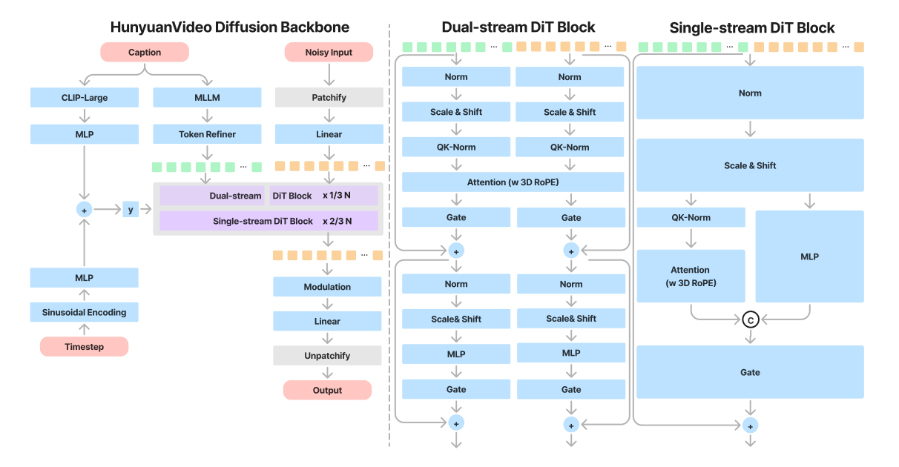
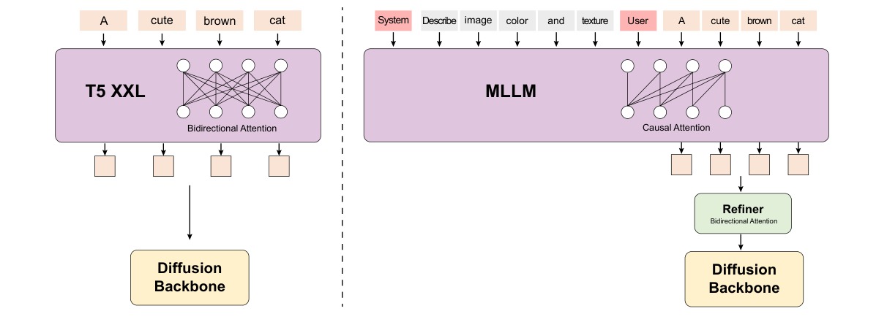
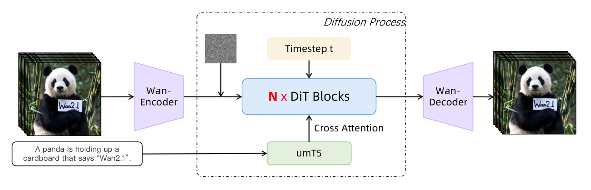
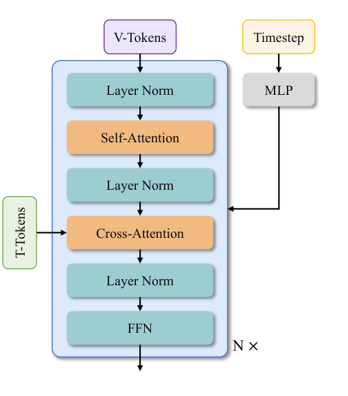

# 04 · HunyuanVideo 与 Wan

<p class="reading-meta">主问题：同样使用 VAE + DiT + Flow Matching，架构究竟差在哪里？ · 基线：HunyuanVideo 初版、Wan 2.1</p>

## 1. 先固定共性，再寻找分叉

两者都先用视频 VAE 压缩时空，再把 latent patchify 成序列，以 Transformer 预测速度，迭代采样后解码。初版 HunyuanVideo 和 Wan 2.1 的 VAE 压缩网格都是 $4\times8\times8$，latent channel 都为 16，patch 都为 $1\times2\times2$。[HunyuanVideo §4][hy]、[Wan §4][wan]

所以比较它们时，最有解释力的问题是：**文本是和视频一起进入同一个 attention，还是作为外部 K/V 被视频读取？主干参数如何分配给不同模态？** 参数量只是这张图的一个数字。

## 2. HunyuanVideo：双流到单流

<figure class="paper-figure" markdown>
[](../../assets/video_generation/hunyuan_fig8.png)
<figcaption markdown="span">论文截图 · HunyuanVideo，Figure 8，PDF 第 7 页。[原文](https://arxiv.org/pdf/2412.03603v1#page=7)。</figcaption>
</figure>

### 2.1 先读最左边的总图

1. **Video latent → Patchify**：生成过程的当前状态变成视觉 tokens。
2. **MLLM → Token Refiner**：文本序列条件整理到可用于主干交互的表示。
3. **CLIP + timestep**：提供全局语义与噪声时间，调制各层计算。
4. **20 个双流块 → 40 个单流块**：先保留图文各自参数，再使用统一处理方式。
5. **Linear → Unpatchify**：仅取需要的视频输出，恢复为 latent 网格形状。[论文 Table 2][hy]、[官方 models.py][hycode]

### 2.2 两路文本特征不是重复劳动

HunyuanVideo 使用经过视觉指令微调的 decoder-only MLLM 提供逐 token 的文本特征，另用 CLIP-Large 的 pooled text representation 提供全局条件。一个侧重序列细节，另一个作为全局调制输入。初版公开代码采用 LLaVA-Llama-3-8B 系列的语言模型部分和 CLIP 文本编码器；不应据此声称 T2V 时还必须加载视觉塔。[论文 §4.3][hy]、[官方文本编码器准备脚本][hyprep]

<figure class="paper-figure" markdown>
[](../../assets/video_generation/hunyuan_fig9.png)
<figcaption markdown="span">论文截图 · HunyuanVideo，Figure 9，PDF 第 9 页。[原文](https://arxiv.org/pdf/2412.03603v1#page=9)。</figcaption>
</figure>

**读图**：左边 T5 的文本 tokens 可以互相读取；右边 MLLM 编码器本身的注意力是因果的，后面增加 bidirectional refiner，让条件特征进一步融合全文信息。它不是再次生成一句提示词。Prompt rewrite 是另一条改变输入文字的处理流程。[HunyuanVideo §4.3、4.6][hy]

### 2.3 双流块：参数分开，但 attention 联合

设视觉特征为 $X_v$、文本特征为 $X_t$。双流块有各自的归一化、调制、QKV 投影、输出投影与 MLP，然后拼接

$$
Q=[Q_v;Q_t],\quad K=[K_v;K_t],\quad V=[V_v;V_t],
$$

$$
[Y_v;Y_t]=\operatorname{Attention}(Q,K,V).
$$

所以视觉 query 可以读文本 key，文本 query 也可以读视觉 key。Attention 之后再拆回两路，做各自的残差和 MLP。**“双流”不是“互不交流”，而是模态参数分开、在 attention 中交流。** 官方 `MMDoubleStreamBlock.forward` 中的三次 `torch.cat` 能直接验证这一点。[官方实现][hycode]

这可以理解为：相机拍到的视觉表示和语言描述先用不同的参数处理，再让它们彼此沟通。这个比喻用于说明参数组织，并不意味着网络被明确监督成两个认知角色。

### 2.4 单流块：把图文放进同一条残差序列

进入单流阶段后，图文 hidden states 拼成一条序列。块内用共享投影处理 QKV 与 MLP 分支，融合后加回残差。这里不应照搬普通“attention 完了才 FFN”的串行草图，论文图和代码的单流分支具有并行组织。[Figure 8][hy]、[MMSingleStreamBlock][hycode]

单流阶段文本 hidden states 随每层的图文交互而改变，但文本本身仍是条件，不需要被解码成新句子。末尾仅抽出视频对应位置用于速度预测。

### 2.5 关键尺寸

| 项目 | HunyuanVideo 初版 13B |
| --- | ---: |
| 双流 / 单流块数 | 20 / 40 |
| hidden dimension | 3072 |
| attention heads / head dimension | 24 / 128 |
| FFN dimension | 12288 |
| 3D RoPE 通道分配 $(t,h,w)$ | $(16,56,56)$ |
| VAE channels / patch | 16 / $(1,2,2)$ |

表中主干参数来自论文 Table 2，patch 配置由公开源码确认。[论文][hy]、[模型配置][hycode]

## 3. Wan 2.1：视频主序列读取文本条件

<figure class="paper-figure" markdown>
[](../../assets/video_generation/wan_fig9.png)
<figcaption markdown="span">论文截图 · Wan，Figure 9，PDF 第 13 页。[原文](https://arxiv.org/pdf/2503.20314v1#page=13)。</figcaption>
</figure>

**读图**：主路径仍然是 VAE → latent → DiT → decoder。底下的 umT5 是文本条件，它通过 cross-attention 进入 DiT，而不是像 HunyuanVideo 那样把图文双方都放进 joint attention 更新。[Wan §4.2.1][wan]

### 3.1 一层 Wan block 逐步做什么

<figure class="paper-figure portrait" markdown>
[](../../assets/video_generation/wan_fig10.png)
<figcaption markdown="span">论文截图 · Wan，Figure 10，PDF 第 14 页。[原文](https://arxiv.org/pdf/2503.20314v1#page=14)。</figcaption>
</figure>

从上到下读：

1. **视频 self-attention**：视频 token 之间汇总时空信息，使用 3D RoPE；T2V 默认窗口配置为 full attention。
2. **文本 cross-attention**：$Q=X_vW_Q$，$K=E_tW_K$，$V=E_tW_V$。把提示词信息写进视频表示，条件 $E_t$ 在此步骤不被回写。
3. **FFN**：对各视频 token 做通道变换，残差保留已有信息。
4. **时间调制**：噪声时间经过 MLP，产生 self-attention 和 FFN 的 shift、scale、gate。[WanAttentionBlock][wancode]

这里的每个 block 结构比较均匀，没有 HunyuanVideo 的“前 20 层双流、后 40 层单流”切换。umT5-XXL 负责文本表示，论文使用最长 512-token 的文本条件。[Wan §4.2.1–4.2.2][wan]

### 3.2 Wan 的 AdaLN 为什么值得注意

Wan 用共享的 timestep MLP 预测 6 组调制向量，每个 block 再加自己学习的偏置。这样不用在每层都重复放置同样大的条件预测 MLP。[Wan §4.2.1、4.7.2][wan]

示意公式：

$$
m_\ell(t)=m_{\mathrm{shared}}(t)+b_\ell,
\qquad m_\ell(t)\in\mathbb R^{6D}.
$$

“共享时间调制 MLP”不等于“所有层共享 attention 或 FFN 权重”。各层仍有自己的主干参数，只是这条条件分支使用了特定共享方式。[WanAttentionBlock 与 WanModel][wancode]

### 3.3 1.3B 和 14B 是什么关系

| 配置 | Wan 2.1 T2V-1.3B | Wan 2.1 T2V-14B |
| --- | ---: | ---: |
| blocks | 30 | 40 |
| hidden dimension | 1536 | 5120 |
| heads | 12 | 40 |
| head dimension（推导） | 128 | 128 |
| FFN dimension | 8960 | 13824 |
| VAE channels | 16 | 16 |
| patch | $(1,2,2)$ | $(1,2,2)$ |

它们属于相同的主干组织方式，但层数与宽度不同。表来自官方任务配置，不是默认构造函数中的占位参数。[1.3B 配置][wan13]、[14B 配置][wan14]、[VAE 论文说明][wan]

### 3.4 T2V 和 I2V 也不能混为一行

Wan 2.1 I2V 在文本条件外加入参考图像表示及视觉 latent / mask 条件。它属于基于同一基础设计的条件扩展；不能把 I2V 的输入通道数、视觉 cross-attention 分支直接写成 T2V 的默认配置。[Wan §5.1、Figure 18][wan]

本章先比较 T2V 主干，避免“模型更强”实际上只是任务输入更丰富。

## 4. Wan 2.2：两条不同的升级路线

### 4.1 A14B：按噪声阶段切换专家

Wan 2.2 A14B 使用两个专家模型：高噪声阶段侧重整体布局，低噪声阶段细化细节。官方给出的总参数量约 27B，每步激活约 14B。[Wan 2.2 官方技术说明][wan22]

```text
高噪声 latent → 高噪声专家 → 跨过时间边界 → 低噪声专家 → 最终 latent
```

**这里主要按去噪时刻选择一个专家，不是给每个 token 的 FFN 做常见 LLM 式 top-k 路由。** T2V-A14B 配置显式列出 `high_noise_model`、`low_noise_model` 和切换边界；它仍使用 `Wan2.1_VAE.pth` 与 $4\times8\times8$ stride。[A14B 配置][a14]

每步激活 14B 不意味着两个专家的权重存储和部署显存自动与单模型完全相同；是否同时常驻、如何 offload 会影响实际资源成本。不要把“active parameters”当作整个系统必须存储的参数量。

### 4.2 TI2V-5B：更小主干、更高压缩

TI2V-5B 是 dense 模型，不是 A14B 的两专家版本。它统一支持 T2V/I2V，使用新的 Wan2.2-VAE，stride 为 $4\times16\times16$；再做 $1\times2\times2$ patchify 后，有效视频 token stride 为 $4\times32\times32$。主干为 30 blocks、hidden 3072、24 heads。[官方说明][wan22]、[TI2V-5B 配置][ti5]

因此不能写“Wan 2.2 全部用了新 VAE”或“Wan 2.2 全部是 MoE”。**A14B 的重点是噪声专家分工，TI2V-5B 的重点是更小模型与更高压缩，两条路线要分别记录。**

## 5. 把区别落实到一段信息流

设提示词是“穿红色外套的人抬手，镜头向右移动”。

- **HunyuanVideo**：文本的局部表征经 refiner 进入图文联合注意力，CLIP 全局条件参与调制；双流阶段和单流阶段都可以让图文交换信息。
- **Wan 2.1**：视频 tokens 在 self-attention 中建立跨帧联系，再通过 cross-attention 从固定文本条件中读取动作、外观与镜头要求。
- **两者共同点**：每一层是在当前 noisy latent 上做特征计算；执行完所有层，只得到这一次生成步骤的预测，采样还要继续。[主干依据：HunyuanVideo][hycode]、[Wan][wancode]

上面是基于架构的信息流讲解，不意味着能指定“红衣服固定由某个 head 负责”。架构图说明信息可以如何传递，不直接证明每个注意力头学到了哪种语义。

??? question "自测：Wan 的文本条件固定，Hunyuan 的文本 hidden 会更新，这能直接断言谁更强吗？"
    不能。它们是两种条件融合设计，最终效果还取决于数据、训练目标、规模、训练预算、推理设置和任务。结构上的差异可以用于解释计算路径，不能替代对齐设置下的实验比较。

下一章：[MiniMax-H3](minimax_h3.md)。需要更细源码形状时，继续读[已有 HunyuanVideo 推导](hunyuan_video.md)。

## 延伸阅读与视频

- 论文：补读[Video Diffusion Models](paper_reading.md#video-diffusion)和[Stable Video Diffusion](paper_reading.md#stable-video-diffusion)，观察时间层和视频训练流程怎样引入。
- 视频：[MIT Lecture 4](video_courses.md#mit-4)提供条件生成的背景；阅读视频模型时再逐项核对其实际架构。

[hy]: https://arxiv.org/html/2412.03603v1#S4
[hycode]: https://github.com/Tencent-Hunyuan/HunyuanVideo/blob/main/hyvideo/modules/models.py
[hyprep]: https://github.com/Tencent-Hunyuan/HunyuanVideo/blob/main/hyvideo/utils/preprocess_text_encoder_tokenizer_utils.py
[wan]: https://arxiv.org/html/2503.20314v1
[wancode]: https://github.com/Wan-Video/Wan2.1/blob/main/wan/modules/model.py
[wan13]: https://github.com/Wan-Video/Wan2.1/blob/main/wan/configs/wan_t2v_1_3B.py
[wan14]: https://github.com/Wan-Video/Wan2.1/blob/main/wan/configs/wan_t2v_14B.py
[wan22]: https://github.com/Wan-Video/Wan2.2#introduction-of-wan22
[a14]: https://github.com/Wan-Video/Wan2.2/blob/main/wan/configs/wan_t2v_A14B.py
[ti5]: https://github.com/Wan-Video/Wan2.2/blob/main/wan/configs/wan_ti2v_5B.py
