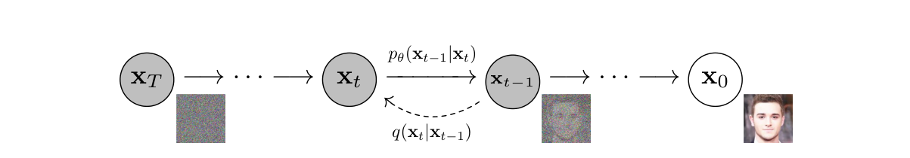
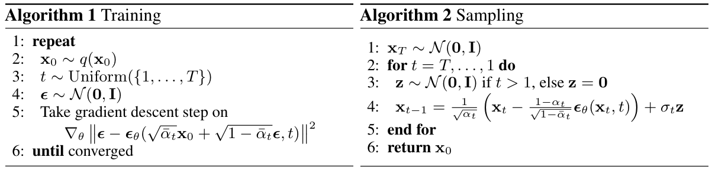

# 01 · Diffusion 与 Flow Matching

主问题：模型如何学会从随机噪声生成内容？ · 前置：向量、均值、方差、导数

## 1. 先从一道能自动出答案的习题开始

假设训练集里有一张干净图片 $x_0$。我们自己采样噪声 $\epsilon$，将两者混合，得到一张被污染的图片 $x_t$，然后让网络猜加了什么噪声。**因为噪声是自己加的，所以训练答案已知。** 对视频 latent 做同样的事，就得到高维版本的这道题。[DDPM §2–3][ddpm]

这不是“随机噪声里本来藏着一段视频”。训练使网络学到数据的规律，生成时依靠这些规律把随机输入逐渐变成合理样本。同一个提示词和不同初始噪声可以对应不同的结果。

<figure class="paper-figure" markdown>

<figcaption markdown="span">论文截图 · DDPM，Figure 2，PDF 第 2 页。[原文](https://arxiv.org/pdf/2006.11239v2#page=2)。</figcaption>
</figure>

**读图**：干净样本 $x_0$ 在右，纯噪声 $x_T$ 在左。$q(x_t\mid x_{t-1})$ 是人为规定的加噪过程；$p_\theta(x_{t-1}\mid x_t)$ 是要学的反向转移。

## 2. DDPM 的三个关键公式

### 2.1 一步加一点噪声

$$
q(x_t\mid x_{t-1})=
\mathcal N\!\left(\sqrt{1-\beta_t}\,x_{t-1},\beta_t I\right).
$$

$\beta_t$ 控制这一步加入的噪声方差；乘上 $\sqrt{1-\beta_t}$ 是同步缩小已有信号。$\mathcal N(\mu,\Sigma)$ 表示均值为 $\mu$、协方差为 $\Sigma$ 的高斯分布。连续执行后，原始结构逐渐消失。[DDPM Eq. 2][ddpm]

### 2.2 训练时可以直接跳到任意时刻

令 $\alpha_t=1-\beta_t$，$\bar\alpha_t=\prod_{i=1}^{t}\alpha_i$，则

$$
x_t=\sqrt{\bar\alpha_t}\,x_0+
\sqrt{1-\bar\alpha_t}\,\epsilon,
\qquad \epsilon\sim\mathcal N(0,I).
$$

例如 $\bar\alpha_t=0.25$ 时，系数为 $0.5$ 和 $\sqrt{0.75}\approx0.866$。这里两个系数的**平方和**为 1，不是普通的两项权重相加为 1。训练一个样本时不必先运行前面所有加噪步骤，可以随机选一个 $t$，直接造出这道习题。[DDPM Eq. 4][ddpm]

### 2.3 用预测误差更新网络
$$
\mathcal L_{\mathrm{simple}}=
\mathbb E_{x-0,t,\epsilon}
\left[\left|\epsilon-
\epsilon_\theta(x_t,t,c)\right|_2^2\right]
$$

$\theta$ 是网络参数，$c$ 表示额外条件，例如提示词。本式是在原始 DDPM 简化噪声预测目标上补上条件记号；原论文基础实验并不是现代文本生成视频系统。$t$ 必须送进网络，因为轻噪声和重噪声需要不同的修正方式。[DDPM Eq. 14][ddpm]

<figure class="paper-figure" markdown>

<figcaption markdown="span">论文截图 · DDPM，Algorithm 1 / 2，PDF 第 4 页。[原文](https://arxiv.org/pdf/2006.11239v2#page=4)。</figcaption>
</figure>

**读图**：左侧每次训练随机抽 $t$，算一次预测误差；右侧生成有一个从 $T$ 到 1 的循环。不要把“训练一次只抽一个时刻”误解为“生成也只需要一次网络调用”。

## 3. 生成时到底反复做什么

以 DDPM 噪声预测为例，反向更新为

$$
x_{t-1}=
\frac{1}{\sqrt{\alpha_t}}
\left(x_t-\frac{\beta_t}{\sqrt{1-\bar\alpha_t}}
\epsilon_\theta(x_t,t,c)\right)+\sigma_t\eta,
\quad \eta\sim\mathcal N(0,I).
$$

其中 $\sigma_t$ 由反向方差设置确定，最后一步通常不再加随机项。网络负责**预测**，公式所对应的采样器负责**更新状态**。因此网络架构和采样算法是两个选择维度。[DDPM Algorithm 2][ddpm]

DDIM 则构造了另一族与 DDPM 训练目标兼容的采样过程；其中 $\eta=0$ 的常见设置可以确定性采样，并使用较少离散时刻。这里“确定性”是指固定初始噪声和条件后的采样路径，不是所有 seed 都生成相同图片。[DDIM §3–4][ddim]

## 4. Flow Matching：直接学习移动速度

HunyuanVideo 和 Wan 2.1 的基础模型采用 Flow Matching。为避免和 DDPM 的 $x_0$ 混淆，本节用 $z_{\mathrm{data}}$ 表示干净 latent，用 $\epsilon$ 表示噪声，并规定 **$s=0$ 为噪声、$s=1$ 为数据**。[HunyuanVideo §4.5][hy]、[Wan §4.2.2][wan]

选最容易理解的线性路径：

$$
z_s=(1-s)\epsilon+s z_{\mathrm{data}}.
$$

对 $s$ 求导，得到这个训练样本对的目标速度：

$$
u_s=\frac{d z_s}{d s}=z_{\mathrm{data}}-\epsilon.
$$

然后回归它：

$$
\mathcal L_{\mathrm{FM}}=
\mathbb E_{s,z_{\mathrm{data}},\epsilon,c}
\left\|v_\theta(z_s,s,c)-(z_{\mathrm{data}}-\epsilon)\right\|_2^2.
$$

**直觉**：不是问“你看见了多少噪声”，而是问“当前状态下一小步应该往哪里走”。这里 $v_\theta$ 和 $z_s$ 一样大，每一个 latent 分量都有自己的速度。[Flow Matching §3][fm]、[Wan Eq. 1–3][wan]

推理时求解常微分方程（ODE）：

$$
\frac{d z_s}{d s}=v_\theta(z_s,s,c),\qquad z_0\sim\mathcal N(0,I).
$$

最简单的 Euler 离散更新：

$$
z_{s+\Delta s}=z_s+\Delta s\,v_\theta(z_s,s,c).
$$

比如某个标量分量是 $0.4$，预测速度为 $0.7$，步长为 $0.1$，下一步就是 $0.47$。这是解释数值积分的玩具例子，不代表真实视频 latent 只有一个维度。

!!! warning "代码里的时间方向可能相反"
    有些实现以大 timestep 表示高噪声，采样从大到小；此时目标速度可能写成 $\epsilon-z_{\mathrm{data}}$，积分步长也为负。先核对插值端点，再核对导数和更新式。不能只见符号相反就判断论文或代码错了。

### 4.1 线性训练路径为什么还要走很多步

对某一对 $(\epsilon,z_{\mathrm{data}})$，监督速度确实是常量。但网络输入只有当前状态、时间、条件，并不知道这条训练路径的两个端点。平方误差最优预测对应给定输入下目标速度的条件平均。**不同位置的平均速度可以不同，学习出的生成轨迹不保证是直线。** 因而线性插值训练并不自动意味着一步生成。[Flow Matching 关于条件与边际向量场的讨论][fm]

### 4.2 Diffusion 与 Flow Matching 是竞争架构吗

它们首先属于生成过程与训练目标的层次，和“网络用 U-Net 还是 Transformer”不是同一个问题。现代文献有时把 flow 模型也宽泛称为 diffusion 模型；精确阅读时应写清楚使用哪条概率路径、预测哪个量、如何采样。Rectified Flow 与线性路径 Flow Matching 密切相关，但 Flow Matching 框架还允许更一般的路径；不要把它们当成处处可互换的术语。[Flow Matching][fm]、[Rectified Flow][rf]

## 5. CFG：让预测更偏向提示词

记有条件预测为 $f_c$，空条件预测为 $f_\varnothing$，常见写法是

$$
f_{\mathrm{guided}}=f_\varnothing+
w\,(f_c-f_\varnothing).
$$

网络同时学有条件和空条件的情形，推理时沿条件带来的差异方向加强引导。按此记号，$w=1$ 是普通有条件预测。$f$ 可以是与具体模型和采样器一致的噪声或速度预测。更强的引导会改变质量、多样性和条件遵循之间的取舍，不能理解为 $w$ 越大越好。[Classifier-Free Diffusion Guidance][cfg]

标准 CFG 需要两路预测，可以合并 batch，也可以分别 forward。Guidance distillation / embedded guidance 是另一种机制：通过训练把引导行为教给模型；看到 `guidance_scale` 字段时要查实现，不能假定总是两次 forward。[HunyuanVideo 官方推理入口][hysample]

## 6. 三个互不相同的“时间”

| 时间 | 表示什么 | 例子 |
| --- | --- | --- |
| 视频时间 | 第几帧、事件先后 | 人在第 20 帧抬手 |
| 噪声时间 | 当前状态有多接近噪声端点 | $s=0.2$ 的 noisy latent |
| 运行时间 | 程序实际耗时 | 一次 attention 花了多少毫秒 |

视频的所有帧可以处在同一个噪声时刻。一次去噪迭代可以同时更新整段视频，而不是只生成一帧。多模态模型还可以为视频和音频设置不同噪声时间，后面读 H3 时会用到这个区别。

??? question "自测：训练已经给出干净视频，为什么生成时不需要它？"
    干净视频只用于训练阶段构造监督信号、更新网络参数。推理阶段使用学到的参数，根据初始噪声和条件求解生成过程；无需为当前生成任务提供训练目标。图生视频中的参考图像属于额外条件，不能与训练目标混为一谈。

下一章：[Transformer 与 DiT](transformer_dit.md)。[全部论文与图源](sources.md)。

## 延伸阅读与视频

- 论文：[DDPM 导读](paper_reading.md#ddpm)与[Flow Matching 导读](paper_reading.md#flow-matching)，重点对照训练和采样算法。
- 视频：先选[中文入门](video_courses.md#chinese)，需要系统推导时看[MIT Lecture 1–3](video_courses.md#mit)。

[ddpm]: https://arxiv.org/pdf/2006.11239v2
[ddim]: https://arxiv.org/abs/2010.02502
[fm]: https://arxiv.org/abs/2210.02747
[rf]: https://arxiv.org/abs/2209.03003
[cfg]: https://arxiv.org/abs/2207.12598
[hy]: https://arxiv.org/html/2412.03603v1#S4.SS5
[wan]: https://arxiv.org/html/2503.20314v1#S4.SS2
[hysample]: https://github.com/Tencent-Hunyuan/HunyuanVideo/blob/main/sample_video.py
