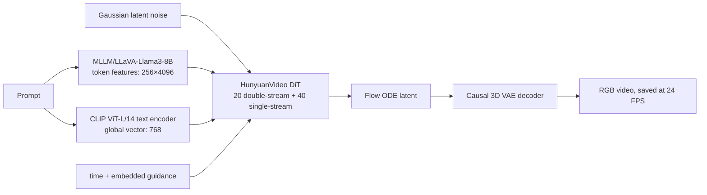

# HunyuanVideo 模型结构与数学原理

> 学习基线：HunyuanVideo 原始开源 T2V 模型，对照用户 fork 的提交 `e748c73ac064728bf6bd15b1cdb8161e55a4f331` 阅读。本笔记记录的是该版本的原理与推理实现，不等同于后续 HunyuanVideo-I2V、1.5 或社区改版。资料截止日期：2026-07-27。

## 1. 先给模型定位

HunyuanVideo 是腾讯混元开源的、参数规模超过 **13B** 的文本生成视频基础模型。它在 Causal 3D VAE 的潜空间内用 Transformer 建模，联合训练图像和视频，再用 3D VAE 解码回像素空间。原论文和官方仓库均将它定位为 large video generation foundation model。[HunyuanVideo 论文][paper]

需要先澄清：**它不应不加限定地称为“长时长视频生成模型”**。当前 fork 默认生成 129 帧，保存时固定为 24 FPS，时长是

$$
\frac{129}{24}\approx 5.375\ \text{s}.
$$

这是约 5.4 秒的短片段，而不是分钟级、长程叙事或可无限延展的生成系统。它的“长”更准确地说是 **高分辨率视频在潜空间仍会形成巨大的时空 token 序列**。例如 720×1280×129 会得到 118,800 个视觉 token，这才是 FlashAttention 和序列并行必要的根本原因。帧数默认值及 24 FPS 可见 [config.py][fork-config] 与 [sample_video.py][fork-sample]。

## 2. 总体数据流



从工程角度看，一次生成只做三件核心事：先把 prompt 编码成条件；再用 DiT 预测 flow velocity，数值积分把高斯潜变量变成视频潜变量；最后用 3D VAE 解码。官方总览与此一致。[HunyuanVideo 官方仓库][official-repo]

这个架构可以统一图像和视频：图像只是 $T'=1$ 的特殊视频，因此 VAE、patch embedding、DiT 和解码器不需要换一套主干。论文中的渐进训练会先训低分辨率图像，再提高图像分辨率，随后加入视频并扩大规模，最后做高质量数据微调。这解释了为什么它称为“统一图像-视频生成架构”，但也要注意：开源仓库主要提供推理而非完整大规模训练代码，所以训练日程、数据清洗和损失权重应以论文为准，不能从 `sample_video.py` 反推出来。[HunyuanVideo 论文 §4.6][paper]

## 3. 双文本编码器：序列语义 + 全局语义

### 3.1 MLLM/LLaVA-Llama3-8B 分支

论文使用经过视觉指令微调的 decoder-only MLLM 作为主文本编码器，理由是它对细节描述、复杂推理和系统指令的表征更强。但 decoder-only 编码是因果注意力，所以 DiT 前又加了两层 bidirectional **SingleTokenRefiner**。[HunyuanVideo 论文 §4.2][paper]

当前 fork 下载 `xtuner/llava-llama-3-8b-v1_1-transformers` 后，预处理脚本只保存 `model.language_model` 和 tokenizer；因此推理时不会加载视觉塔或输入图像，“MLLM”指的是它来自视觉指令训练后的语言模型表征。这一点由 [preprocess_text_encoder_tokenizer_utils.py][fork-preprocess] 直接确认。

对视频 prompt，源码在用户文本前加入系统指令，要求描述主题、物体属性、动作和时序、环境、镜头运动等。总 token 长度是 $256+95=351$，编码后删掉前 95 个指令 token，保留最多 256 个 prompt token；默认取倒数第 3 层 hidden state（`hidden_state_skip_layer=2`）。得到

$$
E_{\text{LLM}}\in\mathbb{R}^{B\times 256\times 4096},
$$

然后经两层 token refiner 投影到 DiT 宽度 3072，作为可与视觉 token 共同做 attention 的文本序列。模板和裁剪见 [constants.py][fork-constants]，编码路径见 [text_encoder/__init__.py][fork-text]。注意：**prompt template 是固定指令包装，不是另一个 LLM 在改写 prompt**；官方另外的 Prompt Rewrite 模型才是真正的改写步骤。

### 3.2 CLIP 分支

第二路是 CLIP ViT-L/14 的文本编码器，最大长度 77，当前代码取 `pooler_output`：

$$
e_{\text{CLIP}}\in\mathbb{R}^{B\times768}.
$$

它不作为 77 个 joint-attention token，而是经 MLP 投影到 3072 维，与 timestep embedding 相加，作为全局调制向量。论文把它描述为对全局视频特征的补充。[CLIP 原论文][clip-paper] [models.py][fork-models]

## 4. Causal 3D VAE：先把时空压缩到 latent

输入视频记为

$$
x\in\mathbb{R}^{B\times3\times F\times H\times W}.
$$

当前 `884-16c-hy` VAE 使用时间压缩 4、空间压缩 8、latent channel 16；因果时间卷积只在时间轴左侧 padding，避免当前帧依赖未来帧。[VAE 配置与实现][fork-vae] 对满足 $F=4k+1$ 的视频，潜空间尺寸由源码推导为

$$
T'=\left\lfloor\frac{F-1}{4}\right\rfloor+1,\qquad
H'=\frac{H}{8},\qquad W'=\frac{W}{8},
$$

$$
z\in\mathbb{R}^{B\times16\times T'\times H'\times W'}.
$$

因为首帧在因果下采样中单独保留，时间维不是简单的 $F/4$。DiT 再用 kernel/stride 为 $1\times2\times2$ 的 Conv3D patch embedding，所以视觉 token 数是

$$
N=T'\cdot\frac{H'}{2}\cdot\frac{W'}{2}
=\left(\left\lfloor\frac{F-1}{4}\right\rfloor+1\right)\frac{H}{16}\frac{W}{16}.
$$

用你已经跑过的 $544\times960\times17$ 代入：

$$
T'=5,\quad H'=68,\quad W'=120,
$$

$$
N=5\times34\times60=10200,
$$

恰好对应日志中的 `n_tokens: 10200`。作为对比，720×1280×129 的 $N=33\times45\times80=118800$，而 full attention 的计算量与 $N^2$ 成比，这是主要扩展瓶颈。

VAE 的“V”来自变分建模。编码器预测对角高斯后验

$$
q_\phi(z\mid x)=\mathcal N\!\left(\mu_\phi(x),
\operatorname{diag}(\sigma_\phi^2(x))\right),
$$

并用重参数化 $z=\mu_\phi(x)+\sigma_\phi(x)\odot\epsilon$，$\epsilon\sim\mathcal N(0,I)$ 取样。通用 VAE 目标包含重建项和 KL 正则：

$$
\mathcal L_{VAE}=\mathcal L_{rec}
+\beta D_{KL}\!\left(q_\phi(z\mid x)\,\|\,\mathcal N(0,I)\right),
$$

视频 VAE 通常还会加感知/对抗项以提高视觉质量。这些是理解 latent 语义的通用公式；当前开源代码在推理时只使用已训好的 encoder/decoder，本次文生视频路径更是直接在 latent 里采样，最后只调用 decoder。当前 `DiagonalGaussianDistribution` 与 decoder 入口可在 [VAE 实现][fork-vae] 核对，训练损失组成则见 [HunyuanVideo 论文 §4.3][paper]。

“Causal”也不等于“逐帧自回归生成”。CausalConv3D 通过时间轴的非对称 padding，保证第 $t$ 个输出的感受野只来自 $x_{\le t}$；但整个 5D tensor 仍可以在 GPU 上并行卷积。DiT 也是一次接收整段 noisy latent，不是像语言模型那样生成一帧再输回一帧。因果设计主要让图像和任意时长视频共用稳定的编解码边界，而不是将整个生成过程改造为帧级 autoregressive model。[CausalConv3D 源码][fork-vae-blocks]

## 5. HunyuanVideo DiT 主干

### 5.1 硬配置与 patch embedding

当前 fork 的默认模型是 `HYVideo-T/2-cfgdistill`：20 个双流块、40 个单流块，hidden size 3072，24 个 attention heads，因此 $d_{head}=3072/24=128$；MLP 扩展比 4，patch 为 $[1,2,2]$，并开启 guidance embedding。这些值可直接在 [HUNYUAN_VIDEO_CONFIG][fork-models-config] 核对。

每个 patch 包含 $16\times1\times2\times2=64$ 个潜变量数，Conv3D 完成线性投影：

$$
h^{v}_{tij}=W_p\,\mathrm{vec}\!\left(z_{:,t,i:i+2,j:j+2}\right)+b_p
\in\mathbb{R}^{3072}.
$$

### 5.2 双流块：分开参数，联合 attention

双流阶段为视觉和文本保留各自的 LayerNorm、QKV、MLP 和调制参数，但将两路 $Q,K,V$ 沿序列维拼接后做一次 joint attention：

$$
Q=[Q_v;Q_t],\quad K=[K_v;K_t],\quad V=[V_v;V_t],
$$

$$
\operatorname{Attn}(Q,K,V)
=\operatorname{softmax}\!\left(\frac{QK^\top}{\sqrt{128}}\right)V.
$$

结果再切回 video/text 两路。因此“双流”不意味着模态完全不交互，而是 **投影和调制参数分开，attention map 已是多模态的**。实现见 [MMDoubleStreamBlock][fork-double]，其设计脉络与 MMDiT 相关。[Stable Diffusion 3 / MMDiT 论文][sd3-paper]

设文本有效长度为 $L$，那么联合 attention 的序列长度是 $S=N+L$，一层核心 attention 计算约为 $O(S^2d)$。在 720p 场景中 $N=118800$ 远大于 $L\le256$，所以文本序列本身不是主要开销；真正昂贵的是视频 token 之间的全时空交互。但语义上文本仍很重要，因为每一个视频 query 都可以直接关注 prompt token，而不是只在网络开头注入一次条件。

### 5.3 单流块：彻底融合

20 层后直接令 $h=[h_v;h_t]$，40 个单流块对联合序列使用共享的线性层。第一个线性层同时产生 QKV 和 MLP 输入，attention 输出与激活后的 MLP 分支拼接，再经第二个线性层回到 3072 维。最后丢弃 text 位置，只把 video token unpatchify 成 velocity tensor。[MMSingleStreamBlock 及 forward][fork-single]

### 5.4 归一化、条件调制和残差门

代码的主序列预归一化是无 affine 的 LayerNorm；RMSNorm 用在每个 attention head 的 $Q,K$ 上：

$$
\operatorname{RMSNorm}(x)
=\gamma\odot\frac{x}{\sqrt{\frac1d\sum_{j=1}^{d}x_j^2+\epsilon}}.
$$

调制向量为

$$
c=e_{time}(t)+e_{CLIP}+e_{guidance}(g),
$$

其中 guidance 项只在 cfg-distilled 版本存在。网络从 $c$ 生成 shift、scale、gate，执行

$$
\widetilde h=(1+s)\odot\operatorname{LN}(h)+b,\qquad
h\leftarrow h+g_r\odot F(\widetilde h).
$$

双流块对每个模态分别生成 attention/MLP 两组 $(b,s,g_r)$，单流块生成一组。公式与当前 [modulate_layers.py][fork-modulate] 一致。

### 5.5 3D RoPE

RoPE 将位置 $p$ 编码为作用在 $Q,K$ 二维分量对上的旋转。一维概念式是

$$
q'_p=R(p)q_p,\qquad k'_p=R(p)k_p,
$$

使点积自然依赖相对位置 $p-q$。[RoFormer/RoPE 原论文][rope-paper] HunyuanVideo 把每个 head 的 128 维分配给时间、高、宽三轴：

$$
d_t,d_h,d_w=[16,56,56],\qquad d_t+d_h+d_w=128,
$$

相当于 $R_{3D}=R_t\oplus R_h\oplus R_w$，当前默认 $\theta=256$。由源码可见，RoPE 只应用于视觉 $Q,K$，文本 token 不使用这个时空网格旋转。[posemb_layers.py 与 models.py][fork-rope]

### 5.6 用张量形状读一个 Transformer block

对本次 17 帧例子，patchify 后的视觉状态是

$$
h_v:[1,10200,3072],\qquad h_t:[1,256,3072].
$$

每路 QKV 在 reshape 后的末三维分别是 $[S,24,128]$，拼接后的联合序列长度最大约为 10,456。如果真的显式保存每个 head 的 attention score，单 head 就约有

$$
10456^2\approx1.09\times10^8
$$

个元素，24 heads 还要再乘 24；720p 的 118,800 视觉 token 更会让概念上的单 head score matrix 超过 140 亿元素。实际 kernel 不会把所有分数同时常驻显存，这正是 FlashAttention 重要的原因。双流 block 输出后依然是两个同宽度 tensor；进入单流 block 时变成 $[1,10456,3072]$；最终层只取前 10,200 个视觉位置，投影回每 patch $16\times1\times2\times2=64$ 个数，再 unpatchify 回 $[1,16,5,68,120]$。这条 shape 链可以作为阅读源码时的主索引。[models.py forward][fork-models]

## 6. Flow Matching 与 ODE 采样

### 6.1 通用数学形式

Flow Matching 学习一个随时间变化的速度场 $v_\theta(x,t,c)$，使连续归一化流 ODE

$$
\frac{dx_t}{dt}=v_\theta(x_t,t,c)
$$

把易采样的先验分布搬运到数据分布。对最简单的线性/OT 条件路径，取 $x_0\sim p_{noise}$、$x_1\sim p_{data}$：

$$
x_t=(1-t)x_0+t x_1,\qquad u_t=\frac{dx_t}{dt}=x_1-x_0,
$$

$$
\mathcal L_{FM}
=\mathbb E_{t,x_0,x_1}\left[
\left\|v_\theta(x_t,t,c)-(x_1-x_0)\right\|_2^2
\right].
$$

这是用于理解的通用公式；Flow Matching 原论文的 Conditional Flow Matching 对更一般的高斯概率路径也成立。[Flow Matching 原论文][fm-paper] Rectified Flow 同样以直线插值和速度回归建立运输 ODE，但“Flow Matching”是更广的概率路径训练框架，二者不应当作完全同义词。[Rectified Flow 原论文][rf-paper]

严格地说，训练时可以计算的是给定终点样本的 conditional velocity $u_t(x\mid x_1)$，而真正推动边缘分布 $p_t(x)$ 的速度场是对后验条件速度求期望：

$$
u_t(x)=\mathbb E\left[u_t(x\mid x_1)\mid x_t=x\right].
$$

Conditional Flow Matching 的关键是：直接回归可计算的 conditional target，在梯度上与匹配不可直接观测的 marginal field 等价，因而训练时不必先数值求解 ODE。推理时才需要 Euler 等 solver 沿学到的向量场积分。这个“训练无仿真、采样要积分”的区分，是理解 Flow Matching 为何可扩展到 13B DiT 的关键。[Flow Matching 原论文][fm-paper]

### 6.2 当前代码的时间约定

HunyuanVideo 论文的基础介绍常写成 $t=0$ 噪声、$t=1$ 数据；但当前推理代码使用了“噪声水平” $\sigma$ 的反向记号。传入 `--flow-reverse` 时，调度器从 $\sigma=1$ 积分到 $\sigma=0$，即从噪声到数据。用

$$
x_\sigma=(1-\sigma)x_{data}+\sigma\epsilon,qquad
\frac{dx_\sigma}{d\sigma}=\epsilon-x_{data}
$$

就能与代码约定对齐；它与上节只差变量代换 $\sigma=1-t$，不是两种不同生成原理。

当前 solver 只实现显式 Euler：

$$
x_{i+1}=x_i+v_\theta(x_i,\sigma_i,c)\,
(\sigma_{i+1}-\sigma_i).
$$

代码变量名仍叫 `noise_pred`，但在这个 flow scheduler 中它被当作 velocity 积分，不应按 DDPM 的“纯噪声 $\epsilon$ 预测”理解。[scheduling_flow_match_discrete.py][fork-scheduler]

`flow_shift=s` 把均匀网格经过

$$
\phi_s(\sigma)=\frac{s\sigma}{1+(s-1)\sigma}.
$$

当 $s=7$ 时，例如 $\phi_7(0.5)=0.875$，即把中间时刻推向更高噪声区。该 fork 虽然把 `n_tokens` 传给 scheduler，但它未参与 shift 计算；当前实现是固定 shift，而非随分辨率自适应。这是**由源码推导**的结论。该分式来源脉络可参考 SD3 的 shifted timestep schedule。[SD3 论文][sd3-paper]

## 7. 普通 CFG 与 embedded guidance/CFG distillation

普通 Classifier-Free Guidance 需要有条件和无条件两个速度预测：

$$
\widehat v=v_{uncond}+w\left(v_{cond}-v_{uncond}\right).
$$

为了节省两次前向的成本，HunyuanVideo 又训练 CFG-distilled 变体：将 teacher 的 guided velocity 作为目标，让 student 显式接收 guidance scale $g$ 并用单次前向逼近它。[HunyuanVideo 论文 §4.5][paper] 在当前模型中，$g$ 先乘 1000，经正弦 timestep-style embedding，再加到调制向量 $c$ 中。[pipeline_hunyuan_video.py][fork-pipeline]

可以把蒸馏目标概念化地写为

$$
v_{teacher}^{(g)}(x_t,t,c)
=v_u(x_t,t)+g\bigl(v_c(x_t,t,c)-v_u(x_t,t)\bigr),
$$

$$
\mathcal L_{distill}
=\mathbb E\left\|v_{student}(x_t,t,c,g)
-v_{teacher}^{(g)}(x_t,t,c)\right\|_2^2.
$$

第一式需要 teacher 的 cond/uncond 结果，第二式将这个行为压入带 $g$ 条件的 student。上式是对论文蒸馏思路的概念表达；当前开源推理仓库不包含该训练 loop，可直接观察的是 student 结构的 `guidance_embed=True` 及单次前向路径。[models.py 配置][fork-models-config]

因此你的日志

```text
guidance_scale: 1.0
embedded_guidance_scale: 6.0
neg_prompt: ['']
```

表示：

- `guidance_scale=1.0`：代码判定 `do_classifier_free_guidance=False`，不拼接 unconditional batch，也不计算上式的差值；负面 prompt 会被清空。
- `embedded_guidance_scale=6.0`：模型收到数值 6000 的 guidance embedding，使用蒸馏学到的单次 guided velocity。

两个 scale 不是重复参数：前者控制显式两分支 CFG，后者是 cfg-distilled DiT 内部条件。普通 CFG 的原始方法见 [Classifier-Free Diffusion Guidance][cfg-paper]。

## 8. 从一次推理日志反推执行过程

以 `544×960×17, infer_steps=2, guidance_scale=1, embedded=6` 为例：

1. 输入尺寸已是 16 的倍数，帧数满足 $4k+1$，因此通过检查。
2. 两个冻结文本编码器分别生成 $256\times4096$ 的 token 特征和 768 维全局特征。
3. VAE 尺度公式得到 latent grid $5\times68\times120$，patchify 后得到日志的 10,200 个视觉 token。
4. 指定 seed 的 generator 创建形状 $[1,16,5,68,120]$ 的高斯 latent。
5. scheduler 创建两个 shifted flow 步；每步 DiT 只前向一次，因为普通 CFG 已关闭，但 guidance=6 已通过模型内部调制生效。
6. Euler 用 velocity 更新 latent；2 步后得到的只是冒烟测试质量，不能用于评判模型上限。
7. Causal 3D VAE 把 latent 解码回 17 帧 RGB，并以 24 FPS 写成约 0.71 s 的 MP4。
8. `huggingface/tokenizers ... forked` 警告发生在视频编码子进程启动时，与 DiT/VAE 生成成功与否无关。

## 9. 工程加速与显存：不要当作模型结构创新

### 9.1 FlashAttention

FlashAttention 对上述的**精确** scaled dot-product attention 做 IO-aware tiling，避免在 HBM 中完整物化 $N\times N$ attention matrix，使访存显著降低；它不是线性 attention，理论算术量仍是 $O(N^2)$。[FlashAttention][flash1-paper] [FlashAttention-2][flash2-paper] 当前 fork 默认调用 `flash_attn_varlen_func`，因此它是 kernel/内存实现优化，不应列为 HunyuanVideo 的模型结构创新。[attenion.py][fork-attn]

### 9.2 xDiT/USP 序列并行

USP 把两种正交的序列并行组合成二维进程网格：Ulysses 使用 all-to-all 在序列与 attention head 布局之间重排；Ring Attention 让各 rank 保留一段 query，并在环上传递 K/V block。[USP 论文][usp-paper] [xDiT 官方仓库][xdit-repo]

当前 HunyuanVideo fork 强制

$$
\text{world size}=d_{ulysses}\times d_{ring},
$$

并且在 patch 后的高或宽中必须有一轴能被 world size 整除，否则在进入 attention 前就抛错。[parallelize_transformer][fork-parallel] 所以 720p 的 token 网格是 $33\times45\times80$，7 既不整除 45，也不整除 80；544p 的 $5\times34\times60$ 也一样。这就是“有 7 张卡却不能简单全用”的直接原因；同时 Ulysses degree 还要与 24 个 heads 的布局相容。官方表中 720p 的 5 卡组合是 `ulysses=1, ring=5`，而非随意写成 `ulysses=5`。[HunyuanVideo README 并行配置][official-repo]

### 9.3 FP8 和 CPU offload

以 BF16 存储 13B 权重理论上就约需 26 GB，还不包括 activation、QKV、VAE 解码峰值和 CUDA workspace。FP8 权重可把主体存储接近减半，但必须区分“FP8 权重存储”和“FP8 Tensor Core 原生矩阵计算”。

当前 fork 将 double/single blocks 中 Linear 的权重保存为 `torch.float8_e4m3fn`，但每层 forward 又用 scale 把权重反量化到 `original_dtype`（你的配置为 BF16），再调用 `F.linear`。因此当前路径的主要收益是权重常驻显存减少，**不是原生 FP8 matmul**。[fp8_optimization.py][fork-fp8] A100 属于 Ampere，支持 TF32/BF16/FP16/INT8 Tensor Core；FP8 Transformer Engine 是 Hopper 引入的能力。[NVIDIA A100 架构][a100] [NVIDIA Hopper 架构][hopper]

`--use-cpu-offload` 则把文本编码器、VAE 等在需要时才搬到 GPU；当前 pipeline 的 offload 序列是 `text_encoder -> text_encoder_2 -> transformer -> vae`，且显式把 transformer 排除在 offload 外。所以它主要降低附加模型/VAE 的显存重叠，并以 CPU↔GPU 传输延迟为代价；多卡分布式路径明确禁止它。[inference.py 与 pipeline][fork-inference]

## 10. 源码导航表

| 文件 | 阅读目的 |
|---|---|
| [`hyvideo/config.py`][fork-config] | 命令行默认值：帧数、两路文本维度、flow、CFG、并行度 |
| [`hyvideo/constants.py`][fork-constants] | 视频 prompt template、`crop_start=95`、模型路径 |
| [`hyvideo/text_encoder/__init__.py`][fork-text] | LLM/CLIP 实际输出、hidden-state 选择和 template 裁剪 |
| [`hyvideo/modules/models.py`][fork-models] | 20+40 主干、joint attention、条件调制、unpatchify |
| [`hyvideo/modules/posemb_layers.py`][fork-rope] | 3D RoPE 的 meshgrid、分轴维度和旋转实现 |
| [`hyvideo/vae/autoencoder_kl_causal_3d.py`][fork-vae] | VAE 时空压缩、causal conv、tiling 解码 |
| [`hyvideo/diffusion/schedulers/scheduling_flow_match_discrete.py`][fork-scheduler] | shift 公式、$\sigma$ 方向和 Euler 更新 |
| [`hyvideo/diffusion/pipelines/pipeline_hunyuan_video.py`][fork-pipeline] | 文本编码、CFG、latent 形状、去噪循环、VAE 解码 |
| [`hyvideo/inference.py`][fork-inference] | 整体组装、token 计数、CPU offload、xDiT 分片 |
| [`hyvideo/modules/fp8_optimization.py`][fork-fp8] | FP8 权重格式与真实计算 dtype |

## 11. 推荐学习顺序

1. 先从本次 17 帧日志出发，手算 VAE/patch 后的 shape，再在 pipeline 中逐行跟踪 tensor shape。
2. 只阅读 `models.py` 的一个 double block、一个 single block 和总 forward，先弄清文本是何时与视频融合的。
3. 用 10200 token 估算 attention matrix 规模，再读 FlashAttention，理解为什么“算法等价但访存差异巨大”。
4. 独立学习 Flow Matching 的 $x_t$、velocity 和 ODE，然后回来对齐代码的 $\sigma=1\to0$ 时间约定。
5. 最后再学 CFG distillation、FP8 与 USP：它们分别解决前向次数、权重显存和跨卡长序列问题，不要与基础生成目标混为一谈。

## 12. 容易混淆的概念

| 容易误解的说法 | 更准确的理解 |
|---|---|
| “129 帧就是长视频” | 24 FPS 下只有约 5.4 s；长的是时空 token 序列 |
| “3D VAE 后帧数就是 $F/4$” | 因果压缩保留首帧，是 $\lfloor(F-1)/4\rfloor+1$ |
| “双流块里文本和视频没交互” | 两路参数分开，但 QKV 拼接做 joint attention |
| “Flow Matching 就是 DDPM 预测噪声” | 它回归概率路径的 velocity；`noise_pred` 只是代码变量名 |
| “flow-reverse 和论文的 $t$ 冲突” | 一个是 data-time，一个是 noise-level，用 $\sigma=1-t$ 即可对齐 |
| “CFG=1 就没有任何 guidance” | 普通双分支 CFG 关闭，但 embedded guidance=6 仍在 cfg-distilled 模型内生效 |
| “FlashAttention 把 attention 变成线性复杂度” | 它是精确 attention 的 IO 优化，算术量仍近似 $O(N^2)$ |
| “加了 `--use-fp8` 就在 A100 上做原生 FP8 matmul” | 当前 fork 逐层反量化到 BF16 后 `F.linear`，主要节省权重存储 |
| “7 张 GPU 就应该用 7-way sequence parallel” | 世界大小必须与 token 网格可整除维度、Ulysses/Ring 布局同时相容 |

## 参考文献与一手资料

1. Weijie Kong et al., *HunyuanVideo: A Systematic Framework For Large Video Generative Models*, arXiv:2412.03603, 2024. [论文][paper]
2. Tencent Hunyuan, *HunyuanVideo official implementation*. [官方仓库][official-repo]
3. Sushidesu486, *HunyuanVideo fork*, commit `e748c73ac064728bf6bd15b1cdb8161e55a4f331`. [当前实现][fork-root]
4. Yaron Lipman et al., *Flow Matching for Generative Modeling*, ICLR 2023 / arXiv:2210.02747. [论文][fm-paper]
5. Xingchao Liu, Chengyue Gong, Qiang Liu, *Flow Straight and Fast: Learning to Generate and Transfer Data with Rectified Flow*, arXiv:2209.03003. [论文][rf-paper]
6. Patrick Esser et al., *Scaling Rectified Flow Transformers for High-Resolution Image Synthesis*, ICML 2024 / arXiv:2403.03206. [论文][sd3-paper]
7. Jonathan Ho, Tim Salimans, *Classifier-Free Diffusion Guidance*, arXiv:2207.12598. [论文][cfg-paper]
8. Jianlin Su et al., *RoFormer: Enhanced Transformer with Rotary Position Embedding*, arXiv:2104.09864. [论文][rope-paper]
9. Tri Dao et al., *FlashAttention: Fast and Memory-Efficient Exact Attention with IO-Awareness*, NeurIPS 2022 / arXiv:2205.14135. [论文][flash1-paper]
10. Tri Dao, *FlashAttention-2: Faster Attention with Better Parallelism and Work Partitioning*, ICLR 2024 / arXiv:2307.08691. [论文][flash2-paper]
11. Fangcheng Fu et al., *USP: A Unified Sequence Parallelism Approach for Long Context Generative AI*, arXiv:2405.07719. [论文][usp-paper]
12. Alec Radford et al., *Learning Transferable Visual Models From Natural Language Supervision*, ICML 2021 / arXiv:2103.00020. [论文][clip-paper]
13. NVIDIA, *NVIDIA A100 Tensor Core GPU Architecture* 与 *NVIDIA Hopper Architecture In-Depth*. [Ampere][a100] [Hopper][hopper]

[paper]: https://arxiv.org/abs/2412.03603
[official-repo]: https://github.com/Tencent-Hunyuan/HunyuanVideo
[fork-root]: https://github.com/Sushidesu486/HunyuanVideo/tree/e748c73ac064728bf6bd15b1cdb8161e55a4f331
[fork-config]: https://github.com/Sushidesu486/HunyuanVideo/blob/e748c73ac064728bf6bd15b1cdb8161e55a4f331/hyvideo/config.py
[fork-sample]: https://github.com/Sushidesu486/HunyuanVideo/blob/e748c73ac064728bf6bd15b1cdb8161e55a4f331/sample_video.py
[fork-constants]: https://github.com/Sushidesu486/HunyuanVideo/blob/e748c73ac064728bf6bd15b1cdb8161e55a4f331/hyvideo/constants.py
[fork-preprocess]: https://github.com/Sushidesu486/HunyuanVideo/blob/e748c73ac064728bf6bd15b1cdb8161e55a4f331/hyvideo/utils/preprocess_text_encoder_tokenizer_utils.py
[fork-text]: https://github.com/Sushidesu486/HunyuanVideo/blob/e748c73ac064728bf6bd15b1cdb8161e55a4f331/hyvideo/text_encoder/__init__.py
[fork-models]: https://github.com/Sushidesu486/HunyuanVideo/blob/e748c73ac064728bf6bd15b1cdb8161e55a4f331/hyvideo/modules/models.py
[fork-models-config]: https://github.com/Sushidesu486/HunyuanVideo/blob/e748c73ac064728bf6bd15b1cdb8161e55a4f331/hyvideo/modules/models.py#L742-L759
[fork-double]: https://github.com/Sushidesu486/HunyuanVideo/blob/e748c73ac064728bf6bd15b1cdb8161e55a4f331/hyvideo/modules/models.py#L21-L252
[fork-single]: https://github.com/Sushidesu486/HunyuanVideo/blob/e748c73ac064728bf6bd15b1cdb8161e55a4f331/hyvideo/modules/models.py#L255-L393
[fork-modulate]: https://github.com/Sushidesu486/HunyuanVideo/blob/e748c73ac064728bf6bd15b1cdb8161e55a4f331/hyvideo/modules/modulate_layers.py
[fork-rope]: https://github.com/Sushidesu486/HunyuanVideo/blob/e748c73ac064728bf6bd15b1cdb8161e55a4f331/hyvideo/modules/posemb_layers.py
[fork-vae]: https://github.com/Sushidesu486/HunyuanVideo/blob/e748c73ac064728bf6bd15b1cdb8161e55a4f331/hyvideo/vae/autoencoder_kl_causal_3d.py
[fork-vae-blocks]: https://github.com/Sushidesu486/HunyuanVideo/blob/e748c73ac064728bf6bd15b1cdb8161e55a4f331/hyvideo/vae/unet_causal_3d_blocks.py
[fork-scheduler]: https://github.com/Sushidesu486/HunyuanVideo/blob/e748c73ac064728bf6bd15b1cdb8161e55a4f331/hyvideo/diffusion/schedulers/scheduling_flow_match_discrete.py
[fork-pipeline]: https://github.com/Sushidesu486/HunyuanVideo/blob/e748c73ac064728bf6bd15b1cdb8161e55a4f331/hyvideo/diffusion/pipelines/pipeline_hunyuan_video.py
[fork-attn]: https://github.com/Sushidesu486/HunyuanVideo/blob/e748c73ac064728bf6bd15b1cdb8161e55a4f331/hyvideo/modules/attenion.py
[fork-parallel]: https://github.com/Sushidesu486/HunyuanVideo/blob/e748c73ac064728bf6bd15b1cdb8161e55a4f331/hyvideo/inference.py#L40-L105
[fork-fp8]: https://github.com/Sushidesu486/HunyuanVideo/blob/e748c73ac064728bf6bd15b1cdb8161e55a4f331/hyvideo/modules/fp8_optimization.py
[fork-inference]: https://github.com/Sushidesu486/HunyuanVideo/blob/e748c73ac064728bf6bd15b1cdb8161e55a4f331/hyvideo/inference.py
[fm-paper]: https://arxiv.org/abs/2210.02747
[rf-paper]: https://arxiv.org/abs/2209.03003
[sd3-paper]: https://arxiv.org/abs/2403.03206
[cfg-paper]: https://arxiv.org/abs/2207.12598
[rope-paper]: https://arxiv.org/abs/2104.09864
[flash1-paper]: https://arxiv.org/abs/2205.14135
[flash2-paper]: https://arxiv.org/abs/2307.08691
[usp-paper]: https://arxiv.org/abs/2405.07719
[xdit-repo]: https://github.com/xdit-project/xDiT
[clip-paper]: https://arxiv.org/abs/2103.00020
[a100]: https://developer.nvidia.com/blog/nvidia-ampere-architecture-in-depth/
[hopper]: https://developer.nvidia.com/blog/nvidia-hopper-architecture-in-depth/
