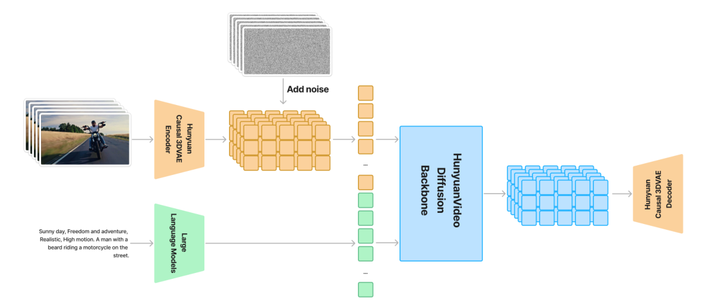

# 视频生成 · 学习地图

基础 → 论文架构 → 源码 · 核对日期 2026-09-10

**先把“生成方法”“神经网络”“压缩表示”分开，你就能读懂这些模型的大半架构图。** Diffusion / Flow Matching 规定如何学会从噪声生成样本；Transformer 是处理序列的网络；DiT 是用 Transformer 做扩散建模；VAE 把视频转成更小的连续潜变量。这些组件可以同时出现在一个系统里。[DDPM][ddpm]、[DiT][dit]、[LDM][ldm] 分别给出了这些层次的经典实例。

配套材料：[8 篇论文导读](paper_reading.md) · [视频课程与作者报告](video_courses.md)

## 先认出一条完整数据流

<figure class="paper-figure" markdown>

<figcaption markdown="span">论文截图 · HunyuanVideo，Figure 5，PDF 第 5 页。来源：[2412.03603v1](https://arxiv.org/pdf/2412.03603v1#page=5)。</figcaption>
</figure>

从左向右看这张图，先只找五个位置：

1. **视频 → VAE encoder**：训练时把真实视频压缩成 latent。文生视频推理时没有真实视频，这一支不需要执行。
2. **文字 → text encoder**：把提示词变成条件表示。这里输出的是数值向量，不是最终视频。
3. **噪声 → diffusion backbone**：训练时加噪构造习题，推理时从随机噪声开始解题。
4. **反复调用主干**：每次网络输出一个更新方向，采样器据此修改当前 latent。同一个网络会被调用很多次。
5. **latent → VAE decoder**：最后才把较小的潜变量还原成 RGB 视频。[HunyuanVideo §4][hy]

图把训练与生成画在一起，因此不能将左边所有箭头都理解成“用户点生成之后会执行的步骤”。这也是阅读此类论文图时最容易混淆的地方。

## 阅读顺序

1. [**Diffusion 与 Flow Matching**](diffusion_flow.md) · 约 25 分钟

    噪声怎样成为训练信号，为什么生成要迭代

2. [**Transformer 与 DiT**](transformer_dit.md) · 约 30 分钟

    Q/K/V、注意力、条件调制与视频 token

3. [**VAE 与视频潜空间**](video_vae.md) · 约 25 分钟

    压缩倍率、因果卷积、张量形状与 token 数

4. [**HunyuanVideo 与 Wan**](architectures.md) · 约 35 分钟

    从每一条条件分支读出主干的区别

5. [**MiniMax-H3**](minimax_h3.md) · 约 30 分钟

    视频、音频、文本怎样进入同一个 Transformer

6. [**对比与自测**](comparison_lab.md) · 约 20 分钟

    版本对照、术语速查、张量计算和检验理解

阅读时间是学习建议，不是论文数据。第一遍先读图和直觉，第二遍再核对公式与源码入口。

## 笔记、论文、视频怎样搭配

不必先看完所有材料。每读完一章，选一篇对应论文和一段讲解，再用导读中的问题检查理解。

| 当前阶段 | 论文导读 | 配套视频 |
| --- | --- | --- |
| 加噪、训练与采样 | [DDPM](paper_reading.md#ddpm)、[Flow Matching](paper_reading.md#flow-matching) | [中文入门](video_courses.md#chinese)、[MIT Lecture 1–3](video_courses.md#mit) |
| 注意力与模型主干 | [DiT](paper_reading.md#dit) | [3Blue1Brown](video_courses.md#transformer) |
| 潜空间与条件生成 | [LDM](paper_reading.md#ldm) | [VAE 课程](video_courses.md#vae)、[MIT Lecture 4](video_courses.md#mit-4) |
| 从图像走向视频 | [Video Diffusion Models](paper_reading.md#video-diffusion)、[Stable Video Diffusion](paper_reading.md#stable-video-diffusion) | 回看条件生成课程，再对照视频论文中的时间层与训练阶段 |
| 因果视频与长序列 | [Diffusion Forcing](paper_reading.md#diffusion-forcing)、[Self Forcing](paper_reading.md#self-forcing) | [Boyuan Chen 作者报告](video_courses.md#diffusion-forcing) |

HunyuanVideo 与 Wan 的模型导读仍在[架构笔记](architectures.md)中；完成视频建模部分后，再进入[自回归推理效率](ar_video_diffusion_efficiency.md)。

## 论文版本

| 本系列名称 | 实际范围 | 为什么这样选 |
| --- | --- | --- |
| HunyuanVideo | 2024 年原始 13B T2V，论文 v1 | 架构公开完整；可衔接已有源码笔记 |
| Wan | Wan 2.1 T2V 1.3B / 14B；另外解释 Wan 2.2 A14B、TI2V-5B | 2.1 适合学基础；2.2 用来解释专家分工和更高压缩 |
| MiniMax-H3 | 官方 2026-07-31 发布的开源 Omni 模型及固定源码版本 | 与本地 H3 推理研究对应；不是早期 Hailuo 产品的泛称 |

Hunyuan 与 Wan 都是模型家族名称。本系列不是“截至今天所有版本”的盘点，不能将初版参数直接用于新 checkpoint。[HunyuanVideo][hy]、[Wan 2.1][wan]、[Wan 2.2 官方仓库][wan22]、[H3 官方发布][h3]

## 阅读后你应该能够回答

- DiT 的一次 forward 为什么不是完整的一次生成？
- 文本的 token、视频的 token、latent channel、hidden dimension 为什么是四个不同概念？
- Causal VAE 为什么不意味着 DiT 必须逐帧生成？
- HunyuanVideo 双流块是否允许图文交流？Wan 的文本是不是也变成生成目标？
- H3 的三种模态进入一个序列之后，能不能直接套用 LLM 的 KV cache？

答案在各章末尾和[对比自测](comparison_lab.md)。进一步读实现时，再进入原有的 [HunyuanVideo 源码与数学推导](hunyuan_video.md)与[自回归视频扩散推理效率](ar_video_diffusion_efficiency.md)。

[ddpm]: https://arxiv.org/abs/2006.11239
[dit]: https://arxiv.org/abs/2212.09748
[ldm]: https://arxiv.org/abs/2112.10752
[hy]: https://arxiv.org/html/2412.03603v1#S4
[wan]: https://arxiv.org/html/2503.20314v1#S4
[wan22]: https://github.com/Wan-Video/Wan2.2
[h3]: https://github.com/MiniMax-AI/MiniMax-H3
