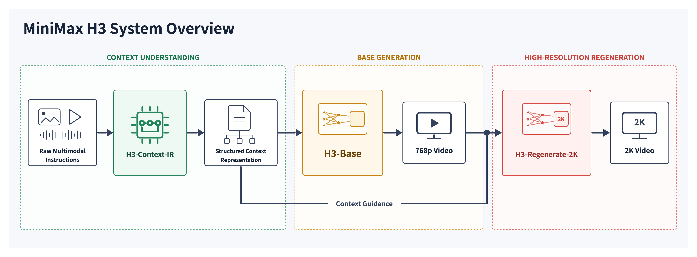

# 05 · MiniMax-H3：原生音视频联合生成

<p class="reading-meta">基线：官方 H3-Base 发布配置与 SGLang dense 推理路径 · 核对日期 2026-09-10</p>

**H3 最重要的变化，是把音频也作为待生成的连续 latent，与视频和条件放进同一个多模态 Transformer。** 它不是先让视频模型生成静音短片，再简单接一套配音工具。[MiniMax 官方架构说明][readme]

!!! note "本章的证据边界"
    官方 2026-07-31 博客称技术报告将随后发布。本次查阅官方博客、仓库、模型卡，未找到正式 H3 technical report 的论文/PDF 入口。下面的图是**官方仓库原图，不是论文截图**。配置使用 MiniMax 仓库 commit `d21241f0a4b3acbb34c97dae47fa417b7065e438`；实现细节使用官方推荐框架 SGLang 的 commit `12771786f23190b1845db33366eba09cb5eacf41`。推理代码不能证明尚未公开的完整训练配方。[官方博客][blog]、[官方模型卡][card]

## 1. 先分清完整产品系统和开源生成主干

<figure class="paper-figure" markdown>
[](../../assets/video_generation/h3_overview.png)
<figcaption markdown="span">官方仓库原图，非论文截图 · MiniMax H3 `assets/overview.png`。[固定版本来源][overview]。© 2026 MiniMax；[随附许可](../../assets/video_generation/h3_license.txt)。</figcaption>
</figure>

从左到右看三件事：

1. **H3-Context-IR** 组织用户的文字、参考图像、音频等材料之间的关系，把意图变成生成器能使用的上下文。官方描述是依赖多个模型和服务的预处理系统，不等于下面的 H3-Encoder。
2. **H3-Base** 生成基础分辨率的音视频；官方将这一阶段称为 768p。
3. **H3-Regenerate-2K** 利用低分辨率结果与原始上下文做 in-context regeneration。官方没有把它描述成普通独立超分网络。[官方系统说明][readme]

本次开源版本不包含完整 Context-IR 和 Regenerate-2K 服务。因此可本地运行 Base，不等于已经复现完整 2K 产品流程。下面集中讲可核验的 Base 主干。

## 2. 一张图看懂 H3-Base

<figure class="paper-figure" markdown>
[](../../assets/video_generation/h3_architecture.png)
<figcaption markdown="span">官方仓库原图，非论文截图 · MiniMax H3 `assets/full-arch.png`。[固定版本来源][architecture]。© 2026 MiniMax；[随附许可](../../assets/video_generation/h3_license.txt)。</figcaption>
</figure>

### 2.1 顶部：不同输入走不同编码器

- **文字 → H3-Encoder**：形成语义条件。
- **视觉参考 → H3-Encoder 和 VisualVAE**：前者提供语义表示，后者保留可用于生成和重建的视觉 latent。
- **音频参考 → AudioVAE**：形成声音的连续 latent。

官方 H3-Encoder 使用 Qwen3-VL-32B 的完整预训练权重，读取第 50 层 hidden states，并配套修改过的 tokenizer。这是“编码器取哪一层”，与“生成主干有 50 层”是两件独立的事。[官方 H3-Encoder 说明][readme]

### 2.2 中间：条件和生成目标放进同一条序列

图中 `condition context` 是已有信息，`generation targets` 是等待生成的音视频 noisy latent。不同输入先经各自投影映射到共同 hidden dimension，再作为 packed multimodal sequence 处理。[官方 Base 架构说明][readme]

一个简化记号是

$$
X=[X_{\mathrm{text}};X_{\mathrm{visual\ ref}};
X_{\mathrm{audio}};X_{\mathrm{video}}].
$$

这是教学抽象，不是所有任务都固定使用同一长度与排列。已核对的 SGLang FL2VA 路径使用文本、视觉条件、音频、目标视频和 padding 等区间，并保存各区间的索引。[packed sequence 实现][packed]

### 2.3 底部：同一个主干输出两类预测

H3-Omni-Transformer 同时预测视频和音频 latent 的更新方向。采样器反复更新生成目标，结束后分别调用视频 decoder 与音频 decoder，得到 RGB 帧和立体声音频。[官方架构][readme]、[SGLang scheduler][scheduler]

“原生联合生成”提供音画之间在主干内部交换信息的路径；这不等于每个样本都被数学保证严格同步。同步质量仍需用实际样本或专门指标评价，不能只看一张结构图。

## 3. 单流共享主干，模态专属调制

H3-Omni-Transformer 是官方标称 **33B dense single-stream Transformer**。Attention 和 FFN 没有各模态专属的独立网络；模态专属参数集中在输入/输出投影和 AdaLN 分支。[官方 Omni-Transformer 说明][readme]

```text
三模态 token
  → 归一化 + 模态/时间 shift、scale
  → 共享 self-attention + 模态 gate + 残差
  → 归一化 + 模态/时间 shift、scale
  → 共享 gated FFN + 模态 gate + 残差
```

对视频、音频、文本分别预测调制参数，但 attention/FFN 的核心权重共享。这区别于把三种模态各放进一个完整 Transformer，也区别于 HunyuanVideo 前半段为图文保留独立 QKV/MLP。[官方说明][readme]、[SGLang 主干实现][ditcode]

### 3.1 三组调制怎样落到 token 上

每种模态在 attention 和 FFN 分支各需要 shift、scale、gate，共 $6D$ 个调制数。三种模态合计

$$
3\times6\times5376=96768,
$$

与原始配置的 `adaln_out_features` 一致。实际应用时按照 token 区间选择对应模态的参数，不是给每个 token 单独放一个 96768 维的可训练向量。[FL2VA 配置][flconfig]、[SGLang AdaLN 实现][ditcode]

### 3.2 为什么配置中 5376 不等于 56 × 128

| 配置 | 数值 | 含义 |
| --- | ---: | --- |
| 主干 blocks | 50 | 处理多模态主序列 |
| text refiner blocks | 2 | 文本进入主干前的整理 |
| hidden dimension | 5376 | token 残差流宽度 |
| attention heads | 56 | 注意力头数 |
| head dimension | 128 | 每个头 Q/K/V 的宽度 |
| attention inner dimension | 7168 | $56\times128$，由配置推导并由投影代码验证 |
| gated FFN intermediate dimension | 14336 | FFN 中间分支宽度 |
| text input dimension | 5120 | 编码器特征进入主干前的维度 |

数据来自发布配置；SGLang 实现明确给出 QKV 与输出投影关系。[FL2VA 配置][flconfig]、[转换格式配置][config]、[MiniMaxH3Attention][ditcode]

$$
\mathbb R^{5376}
\xrightarrow{W_Q,W_K,W_V}
\mathbb R^{7168}\text{（各一路）}
\xrightarrow{56\ \mathrm{heads}}
\mathbb R^{7168}
\xrightarrow{W_O}\mathbb R^{5376}.
$$

所以不是算错了，也不是 56 个 head 每个都必须分到 $5376/56$ 维。输入/输出投影让 attention 的内部宽度可以与残差流不同。该实现还对 Q/K 做按头 RMSNorm，再施加位置编码；FFN 使用 $\operatorname{SiLU}(\mathrm{gate})\odot\mathrm{up}$ 的门控形式。[SGLang 主干][ditcode]

## 4. 视频与音频 latent 的粒度

### 4.1 VisualVAE：f16t4d24

官方命名表示：空间高、宽各压缩 16 倍，时间压缩 4 倍，latent channel 为 24。随后做 $1\times2\times2$ patchify，视频 token 的有效空间步幅为 32。[官方 VisualVAE 说明][readme]

每个视觉 patch 投影前的宽度为

$$
24\times1\times2\times2=96.
$$

这是连续数值特征的维度，不是 96 个离散词。给定相同有效视频尺寸，忽略边界与 padding，其视觉 token 数约为初版 HunyuanVideo / Wan 2.1 的四分之一：空间每维少一半，总数少四倍。**这只是 token 网格推导，不能推出 H3 整体快十六倍**，因为主干宽度、层数、额外条件和音频序列均不同。

### 4.2 这里真的有 ViT decoder

官方在训练 VisualVAE encoder 之后，另外训练了一个 ViT-based decoder；发布配置包括 36 个 decoder blocks、32 heads、head dim 64 和 4 个 register tokens。[官方说明][readme]、[VisualVAE 配置][vaeconfig]

这正是“VAE 的解码部分可以采用 Transformer”的具体例子。但这个 decoder 的工作是 **把生成完成的视觉 latent 解码成视频**，不是代替上面的 50 层 Omni-Transformer 反复预测速度。即使系统里出现两个 Transformer，它们的职责也不同。

### 4.3 AudioVAE：32 kHz → 每声道 40 Hz latent

左右声道共享同一套 encoder/decoder 权重，但分别处理，最后合并成立体声。每声道 32 kHz 音频被压缩成每秒 40 个 latent tokens，每个 token 有 32 个 latent channels。[官方 AudioVAE 说明][readme]、[AudioVAE 配置][audioconfig]

推导例子：理想化 5 秒音频，每声道约 $5\times40=200$ 个 token，双声道约 400 个；实际长度仍需核对 padding、时间对齐和 pipeline。**32 kHz 是原始采样率，40 Hz 是 latent 时间粒度，32 channels 是每个 latent 的特征宽度。**

## 5. Attention mask 与更新 mask 是两件事

官方说明采用三维 MM-RoPE 表示时间与空间位置。已核对的 SGLang dense 基线路径设 `causal=False`，有效多模态 tokens 通过一个非因果 self-attention 交流，padding 则通过序列边界单独处理。[官方说明][readme]、[attention 实现][ditcode]、[packed sequence][packed]

另一个 `update_mask` 用于区分哪些 latent 是生成目标、哪些是固定参考条件。它不等于 attention 的可见性 mask。

例如参考图像 latent 在外层采样时保持不变，但其对应 token 在第 10 层的 hidden state 仍可能已经读取了 noisy 视频/音频信息。因此，**固定条件输入不能自动推出各层 K/V 在所有去噪步骤完全相同**。这是一条从 attention 依赖关系得到的推论，对做 H3 缓存研究尤其重要。[packed sequence 与主干 forward][packed]、[主干实现][ditcode]

!!! note "dense 模型与 full attention 不是同一个概念"
    官方首发说明是 full-attention 推理，训练后期加入的原生 sparse attention 另行公开；本次 SGLang 版本也已经存在可选稀疏后端代码。本章只解释明确核对过的 dense 基线路径，不声称所有 H3 框架、版本和后端都只有 full attention。[官方说明][readme]、[框架源码][ditcode]

## 6. 两种噪声时间与速度采样

视频与音频拥有分别配置的 scheduler；公开配置的 shift 分别为 12 和 3。这不意味着两者的采样步骤数或噪声水平完全相同。[video scheduler 配置][vscheduler]、[audio scheduler 配置][ascheduler]

SGLang 对其 RF velocity 输出采用如下 clean latent 转换：

$$
\sigma=1-t,\qquad
\hat x_{\mathrm{clean}}=x_t+\sigma v_\theta(x_t,t,c).
$$

随后按相应时间安排做 Euler 更新，音频与视频分别接收对应预测。因此可以把前面“连续 latent 上的速度场与数值积分”的概念用在这个公开推理路径上。局部变量叫 `noise_pred` 也不代表数学预测目标必然是 DDPM 的 $\epsilon$。[scheduler 实现][scheduler]

官方发布的 Omni-Transformer checkpoint **经过 CFG distillation**。不过完整的训练损失、音视频噪声耦合策略、同步损失、蒸馏算法尚不能从这些推理文件中确定。本笔记不会把通用 Flow Matching loss 冒称为 H3 已公开的完整训练公式。[官方部署说明][readme]

## 7. 对你的推理研究意味着什么

| 看到的结构 | 可以提出的问题 | 不能直接作出的推断 |
| --- | --- | --- |
| 约 13B 参数在 AdaLN 分支 | 固定时间日程的调制输出能否预计算并缓存？ | 任意配置都能无条件删除这些权重 |
| 固定的参考输入 | 输入编码能否复用？哪些层状态仍受生成目标影响？ | 所有层的条件 KV 永远不变 |
| 高压缩视觉 latent | token 网格变小后 attention 占比怎样变化？ | 更少 tokens 就一定有更低端到端延迟 |
| 音视频共享 attention | 哪类模态交互对同步和细节更敏感？ | 模态独立裁剪、缓存一定不影响质量 |

第一行来自官方 AdaLN 预计算说明，其余是根据上述架构提出的研究问题，不是已验证的加速结论。Encoder、VAE 与其他权重也要计算资源，33B 主干不能代表完整部署参数量。[官方说明][readme]

??? question "自测：H3 single-stream 是否意味着三种模态完全共享参数？"
    否。Attention 和 FFN 共享；输入/输出投影及 AdaLN 分支保留模态专属参数。可以把它概括为“共享主要计算网络、按模态调整输入和计算状态”。

下一章：[三模型对照与自测](comparison_lab.md)。[图源与固定源码版本](sources.md)。

[readme]: https://github.com/MiniMax-AI/MiniMax-H3/blob/d21241f0a4b3acbb34c97dae47fa417b7065e438/README.md
[blog]: https://www.minimax.io/blog/minimax-h3
[card]: https://huggingface.co/MiniMaxAI/MiniMax-H3
[overview]: https://github.com/MiniMax-AI/MiniMax-H3/blob/d21241f0a4b3acbb34c97dae47fa417b7065e438/assets/overview.png
[architecture]: https://github.com/MiniMax-AI/MiniMax-H3/blob/d21241f0a4b3acbb34c97dae47fa417b7065e438/assets/full-arch.png
[config]: https://github.com/MiniMax-AI/MiniMax-H3/blob/d21241f0a4b3acbb34c97dae47fa417b7065e438/transformer/config.json
[flconfig]: https://github.com/MiniMax-AI/MiniMax-H3/blob/d21241f0a4b3acbb34c97dae47fa417b7065e438/FL2VA/transformer/config.json
[vaeconfig]: https://github.com/MiniMax-AI/MiniMax-H3/blob/d21241f0a4b3acbb34c97dae47fa417b7065e438/vae/config.json
[audioconfig]: https://github.com/MiniMax-AI/MiniMax-H3/blob/d21241f0a4b3acbb34c97dae47fa417b7065e438/audio_vae/config.json
[vscheduler]: https://github.com/MiniMax-AI/MiniMax-H3/blob/d21241f0a4b3acbb34c97dae47fa417b7065e438/scheduler/scheduler_config.json
[ascheduler]: https://github.com/MiniMax-AI/MiniMax-H3/blob/d21241f0a4b3acbb34c97dae47fa417b7065e438/audio_scheduler/scheduler_config.json
[ditcode]: https://github.com/sgl-project/sglang/blob/12771786f23190b1845db33366eba09cb5eacf41/python/sglang/multimodal_gen/runtime/models/dits/minimax_h3.py
[packed]: https://github.com/sgl-project/sglang/blob/12771786f23190b1845db33366eba09cb5eacf41/python/sglang/multimodal_gen/runtime/pipelines_core/stages/model_specific_stages/minimax_h3/packed_sequence.py
[scheduler]: https://github.com/sgl-project/sglang/blob/12771786f23190b1845db33366eba09cb5eacf41/python/sglang/multimodal_gen/runtime/models/schedulers/scheduling_minimax_h3_euler_ancestral.py
