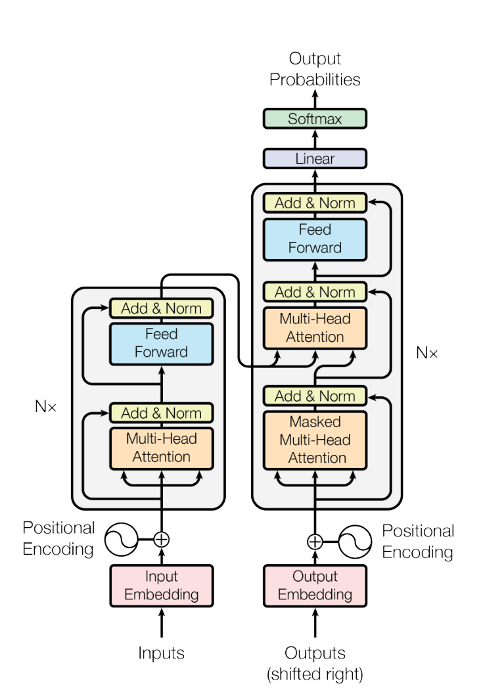
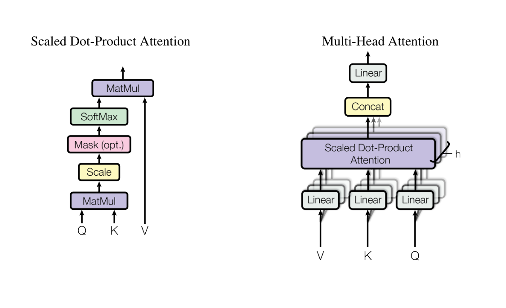
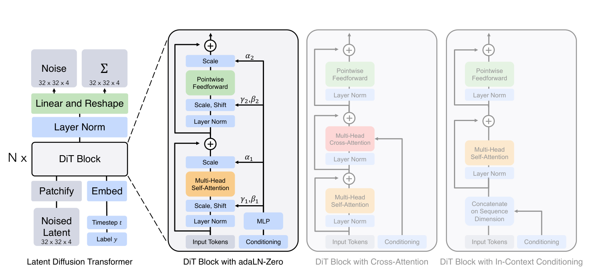

# 02 · Transformer 与 DiT

主问题：网络如何让不同时间、位置、模态交换信息？ · 前置：矩阵乘法与上一章

## 1. Transformer 的输入不是只能是文字

Transformer 接收一列向量。文本中一个 token 可以对应子词；图像中可以对应一个 patch；视频中可以对应 latent 的一块时空区域。它们都能被投影成 $D$ 维向量，堆成

$$
X\in\mathbb R^{B\times N\times D}.
$$

$B$ 是 batch size，$N$ 是序列长度，$D$ 是 hidden dimension。**“共有多少个 token”和“每个 token 有多少个数”要分开。** 将视频变成这种序列是视频 DiT 的输入步骤。[Transformer §3][tf]、[DiT §3][dit]

<figure class="paper-figure portrait" markdown>

<figcaption markdown="span">论文截图 · Attention Is All You Need，Figure 1，PDF 第 3 页。[原文](https://arxiv.org/pdf/1706.03762v7#page=3)。</figcaption>
</figure>

**读图**：左边是 encoder，右边是 decoder。右边底部的 masked attention 限制未来 token；中间一层 attention 从左边读取条件。现代 DiT 借用 attention、FFN、残差等组件，并不是把这整张翻译模型架构原封不动搬过去。

## 2. Q、K、V：一次有选择的信息汇总

忽略 batch，令 $X\in\mathbb R^{N\times D}$：

$$
Q=XW_Q,\quad K=XW_K,\quad V=XW_V.
$$

可以把每个位置的 $Q$ 理解为“我在找什么”，$K$ 理解为“我有哪些可被检索的特征”，$V$ 理解为“实际拿来聚合的内容”。这只是帮助理解的类比，三者都是训练得到的线性投影。[Transformer §3.2][tf]

单个头计算

$$
A=\operatorname{softmax}\!\left(
\frac{QK^\top}{\sqrt{d_k}}+M\right),
\qquad Y=AV.
$$

- $QK^\top$ 得到每个 query 对所有 key 的相似度，形状为 $N\times N$。
- $\sqrt{d_k}$ 缩放点积，缓解维数增大导致 softmax 过于极端的问题。
- $M$ 是 mask；允许的位置通常加 0，不允许的位置加 $-\infty$。
- softmax 沿 key 方向归一化，每个 query 对应一组求和为 1 的权重。
- $AV$ 根据这些权重加权汇总 value。[Transformer Eq. 1][tf]

例如某个 query 对三个 value 的权重为 $(0.7,0.2,0.1)$，输出就是 $0.7V_1+0.2V_2+0.1V_3$。注意力得到的是混合信息，不是只能选中一个位置。

<figure class="paper-figure" markdown>

<figcaption markdown="span">论文截图 · Attention Is All You Need，Figure 2，PDF 第 4 页。[原文](https://arxiv.org/pdf/1706.03762v7#page=4)。</figcaption>
</figure>

**读图**：左图从底部 Q/K/V 向上读。右图的多个头是不同的投影和信息汇总，最后拼接，再经输出投影回到残差分支需要的维度。常见设置有 $D=h d_{\mathrm{head}}$，但这是配置选择，不是数学定律；H3 正好是后面会遇到的反例。

## 3. 三种 attention 不要混称

| 类型 | Q 来自哪里 | K/V 来自哪里 | 输出更新谁 |
| --- | --- | --- | --- |
| 视频 self-attention | 视频 tokens | 同一批视频 tokens | 视频 |
| 文本 cross-attention | 视频 tokens | 文本条件 | 视频 |
| 图文 joint attention | 图文各自投影后拼接 | 图文各自投影后拼接 | 图文都可以更新 |

Self-attention 描述 Q/K/V 来自同一序列，并不表示只能看同一帧。将视频 token 展平成一个序列后，full self-attention 可以连通不同帧与不同空间位置。Cross-attention 中，视频 token 读取文本，但文本条件序列通常不会因为这个操作而被更新。[Transformer §3.2.3][tf]、[HunyuanVideo Figure 8][hy]、[Wan Figure 10][wan]

还要区分两个轴：

- **full / sparse**：允许连接哪些 token，实际计算哪些连接？
- **causal / bidirectional**：是否禁止当前位置读取未来？

全连接的视频注意力通常是双向的。经典语言模型的 causal attention 则限制未来文本 token。名字里都有 Transformer，并不能推断二者的 mask 相同。

## 4. Attention 之外还有什么

一个简化的 pre-norm Transformer block 可以写为

$$
H=X+\operatorname{Attn}(\operatorname{LN}(X)),
\qquad
Y=H+\operatorname{FFN}(\operatorname{LN}(H)).
$$

这是便于理解现代主干的 pre-norm 示意；原始 Transformer Figure 1 画的是另一种归一化位置，不要逐箭头对应。LayerNorm 整理每个 token 的特征尺度；FFN 在每个 token 内做通道变换；残差保留输入通路。**Attention 负责位置之间交换信息，FFN 负责各位置内部的非线性变换。**[Transformer §3.1、3.3][tf]、[DiT Figure 3][dit]

如果只有 attention 而没有位置信息，网络难以区分把同一组 tokens 重新排列后的空间或时间结构。视频常用 **3D RoPE**：把 query/key 的部分通道分别用于编码时间、高、宽三个坐标。RoPE 改变点积里的相对位置信息，不会自己限制 attention 可见范围。[RoFormer][rope]、[HunyuanVideo §4.2][hy]

## 5. DiT：让 Transformer 做扩散预测

原始 DiT 论文将 latent diffusion 的 U-Net 主干替换为 Transformer。它的核心路径是

$$
\text{noisy latent}\to\text{patchify}\to
\text{Transformer blocks}\to\text{输出投影与 unpatchify}.
$$

原始 DiT 主要研究类别条件图像生成，并在 DDPM 设置下预测噪声和协方差相关输出；后来的视频 DiT 可以改成 Flow Matching 速度预测，并加入文本和视频设计。因此 **“DiT”不意味着一定用某一个采样器，也不意味着输出一定是噪声。**[DiT §3][dit]

<figure class="paper-figure" markdown>

<figcaption markdown="span">论文截图 · Scalable Diffusion Models with Transformers，Figure 3，PDF 第 3 页。[原文](https://arxiv.org/pdf/2212.09748v2#page=3)。</figcaption>
</figure>

**读图顺序**：左边从底部的 noisy latent 开始，经过 patchify，进入重复 $N$ 次的块。这里图里的 $N$ 表示层数，与本章公式的 token 数 $N$ 不同。再看中央的 adaLN-Zero：时间和类别条件进入 MLP，产生缩放、平移与门控，影响每个残差分支。右边是论文比较过的其他条件注入方案。

### 5.1 时间条件怎样影响每个 token

把噪声时间嵌入成向量 $e_t$，从它和其他条件预测参数：

$$
\operatorname{AdaLN}(h;c)=
(1+\gamma(c))\odot\operatorname{LN}(h)+\beta(c).
$$

再对残差分支门控，例如

$$
h_{\mathrm{out}}=h+g(c)\odot F(\operatorname{AdaLN}(h;c)).
$$

$\gamma,\beta,g$ 沿 token 维广播，所以条件不用变成额外的海量视频 token，也能影响全部位置。adaLN-Zero 的关键还包括初始化：让相关残差分支的初始贡献为零，从而有利于训练。不能把所有叫 AdaLN 的实现都默认成相同初始化。[DiT §3、Figure 3][dit]

### 5.2 为什么视频这么贵

Attention 的两个主要矩阵乘法需要约 $O(N^2D)$ 运算，线性层和 FFN 则大致按 $O(ND^2)$ 增长。视频增加时间轴，会大幅增加 $N$。[Transformer Table 1][tf]、[Wan §4.3.1][wan]

**推导例子**：帧数近似翻倍、分辨率不变，token 数近似翻倍，注意力交互数量近似四倍。若高和宽都翻倍，token 数四倍，注意力交互数量变成十六倍。这些是复杂度比例，不是端到端实测加速比。

FlashAttention 通过分块、融合及在线 softmax 避免把完整注意力矩阵写到显存，计算的是精确 attention（允许浮点误差），并不是自动改成 sparse attention。它显著减少数据搬运和中间存储，但不会从数学上消除 dense attention 的二次配对量。[FlashAttention][flash]

??? question "自测：cross-attention 比 full self-attention 便宜，是不是 Wan 就没有二次项？"
    不是。视频读取文本的 cross-attention 约有 $N_vN_t$ 对连接；Wan 的视频 self-attention 仍有 $N_v^2$。文本通常短得多，cross-attention 便宜并不代表整个主干不受长视频序列的二次成本影响。

下一章：[VAE 与视频潜空间](video_vae.md)。[全部论文与图源](sources.md)。

## 延伸阅读与视频

- 论文：[DiT 导读](paper_reading.md#dit)，带着 patch 数和条件调制这两个问题读 Figure 3–4。
- 视频：[3Blue1Brown 的 Transformer 与 Attention](video_courses.md#transformer)，先建立数据流直觉。

[tf]: https://arxiv.org/pdf/1706.03762v7
[dit]: https://arxiv.org/pdf/2212.09748v2
[hy]: https://arxiv.org/html/2412.03603v1#S4.SS2
[wan]: https://arxiv.org/html/2503.20314v1#S4
[rope]: https://arxiv.org/abs/2104.09864
[flash]: https://arxiv.org/abs/2205.14135
