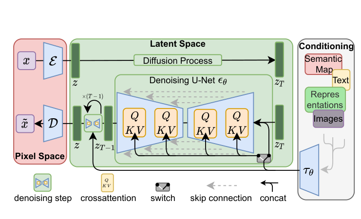
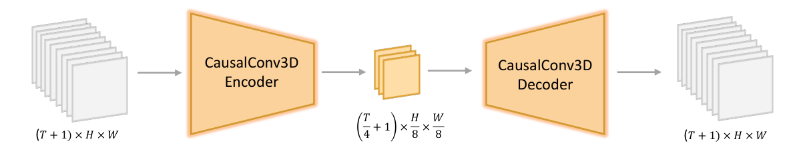
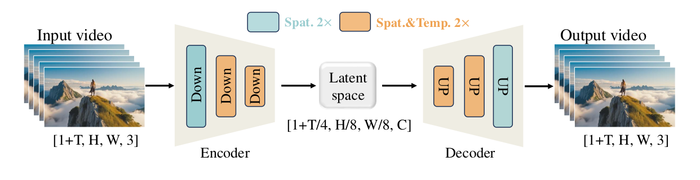
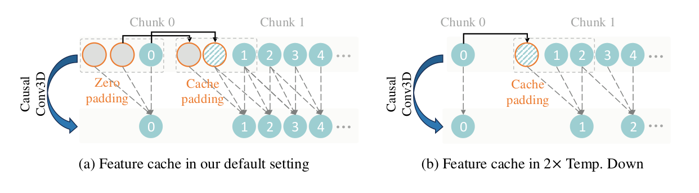

# 03 · VAE 与视频潜空间

主问题：一段视频如何变成 Transformer 能承担的序列？ · 前置：高斯分布与张量形状

## 1. 为什么先压缩再生成

原始视频有 $B\times3\times F\times H\times W$ 个数。直接对高分辨率像素序列做反复生成代价很高。Latent diffusion 先训练一个 autoencoder，把像素 $x$ 编码成较小的 $z$，在 $z$ 空间训练生成模型，最后解码。[LDM §3][ldm]

<figure class="paper-figure" markdown>

<figcaption markdown="span">论文截图 · High-Resolution Image Synthesis with Latent Diffusion Models，Figure 3，PDF 第 4 页。[原文](https://arxiv.org/pdf/2112.10752v2#page=4)。</figcaption>
</figure>

**读图**：左边粉色区域是像素空间，$\mathcal E$ 和 $\mathcal D$ 是编码器与解码器；中央绿色区域才是反复执行 diffusion 的地方；右边是条件分支。图中生成主干是 U-Net，视频 DiT 会换掉这一部分，保留“先压缩、在 latent 中生成、再解码”的组织方式。

Latent 不是缩小尺寸的 RGB 缩略图。其通道是网络学习的特征，没有“一定是红、绿、蓝”这样的固定解释。压缩也不是免费：编码丢掉的信息不可能靠确定性解码保证完全还原。因此视频模型的细节表现同时受生成主干和 VAE 重建能力影响。

## 2. VAE 比普通 AE 多了什么

普通 autoencoder 可以直接输出 $z=E(x)$。经典 VAE 则用编码器近似后验分布：

$$
q_\phi(z\mid x)=\mathcal N
\left(\mu_\phi(x),\operatorname{diag}(\sigma_\phi^2(x))\right).
$$

为了让随机采样能参与梯度训练，采用重参数化：

$$
z=\mu_\phi(x)+\sigma_\phi(x)\odot\epsilon,
\qquad \epsilon\sim\mathcal N(0,I).
$$

随机性来自参数无关的 $\epsilon$，梯度可以经过 $\mu,\sigma$ 回到编码器。[Auto-Encoding Variational Bayes §2][vae]

常见负 ELBO 目标写为

$$
\mathcal L=-\mathbb E_{q_\phi(z\mid x)}\log p_\psi(x\mid z)
+D_{\mathrm{KL}}\!\left(q_\phi(z\mid x)\,\|\,p(z)\right).
$$

第一项要求能重建数据，第二项把后验约束到先验附近。若先验为标准高斯，对角高斯的 KL 可展开为

$$
D_{\mathrm{KL}}=\frac12\sum_j
\left(\mu_j^2+\sigma_j^2-\log\sigma_j^2-1\right).
$$

当 $\mu=0,\sigma=1$ 时 KL 为 0；但若对所有输入都这样，编码器可能不再携带足够信息，所以还需要重建项来平衡。[VAE Appendix B][vae]

!!! note "视频 VAE 的工程目标往往更丰富"
    HunyuanVideo 还加入像素 L1、LPIPS 感知损失与 GAN 对抗损失，并给 KL 很小的权重。这样的重建目标不能直接等同于最简单的“像素 MSE + KL”。本文的通用公式用于建立概念，实际损失以各模型论文为准。[HunyuanVideo §4.1.1][hy]

## 3. 两处高斯噪声不是同一件事

| 噪声 | 出现在哪里 | 目的 |
| --- | --- | --- |
| VAE 重参数化噪声 | 编码后验 $q_\phi(z\mid x)$ | 训练随机编码器与正则化表示 |
| Diffusion / Flow 初始噪声 | 生成模型的状态空间 | 从简单分布出发生成新 latent |

纯 T2V 推理中，通常不需要先给 VAE encoder 喂一段真实视频。模型从符合其 latent 形状及归一化约定的高斯噪声开始，生成最终 latent 后再送入 decoder。图生视频、视频编辑才会额外编码已有视觉条件。[HunyuanVideo §4–6][hy]、[Wan §4–5][wan]

## 4. Causal 3D VAE 的形状账本

<figure class="paper-figure" markdown>

<figcaption markdown="span">论文截图 · HunyuanVideo，Figure 6，PDF 第 6 页。[原文](https://arxiv.org/pdf/2412.03603v1#page=6)。</figcaption>
</figure>

HunyuanVideo 初版与 Wan 2.1 都采用时间约 $4\times$、高与宽各 $8\times$ 压缩，latent channel 为 16。为兼容首帧和图像，时间形状应写为

$$
T'=1+\frac{F-1}{4},\quad H'=\frac H8,\quad W'=\frac W8,
$$

$$
z\in\mathbb R^{B\times16\times T'\times H'\times W'}.
$$

这里明确假设 $F=4k+1$，$H,W$ 满足空间整除要求。任意尺寸如何补齐或裁剪应查 pipeline，不能无条件把小数尺寸丢进公式。[HunyuanVideo §4.1][hy]、[Wan §4.1.1][wan]

### 4.1 一个可以手算的例子

取 $F=17,H=544,W=960,B=1$：

| 步骤 | 张量或序列形状 | 怎么算 |
| --- | --- | --- |
| RGB 视频 | $1\times3\times17\times544\times960$ | 原始输入 |
| VAE latent | $1\times16\times5\times68\times120$ | $1+(17-1)/4=5$ |
| patch 网格 | $5\times34\times60$ | 再以 $1\times2\times2$ patchify |
| token 序列 | $1\times10200\times D$ | $5\cdot34\cdot60=10200$ |

每个 patch 在投影前含 $16\cdot1\cdot2\cdot2=64$ 个数，再映射为 $D$ 维。**64 是 patch 的输入维度，$D$ 是主干 hidden dimension；16 则是 VAE channel。** 三者不是同一个配置。[模型形状依据：HunyuanVideo §4.1–4.2][hy]

### 4.2 压缩倍率不等于文件压缩倍率

$4\times8\times8=256$ 描述时空网格的大致压缩倍率；由于通道从 3 变成 16，标量数量压缩比在长视频极限下约为 $3\times256/16=48$，还受首帧边界影响。这不是 MP4 文件大小或码率的压缩比。Patchify 进一步减少 token 网格，却又把特征投影到很宽的 hidden dimension，所以也不能直接拿 token 减少倍率当显存减少倍率。

## 5. “Causal”到底约束谁

时间因果卷积要求当前位置的输出不依赖未来输入；实现上可通过时间轴左侧 padding、限制卷积感受野等方式满足。它利于图像与视频统一编码，以及分块处理时保持一致边界。[HunyuanVideo §4.1][hy]、[Wan §4.1][wan]

**这不是整套模型的生成顺序。** Causal VAE 可以与整段双向注意力 DiT 配套。DiT 仍然可以在每个去噪时刻同时更新全片 latent；VAE 的局部因果性不意味着整个系统变成逐帧 autoregressive。

<figure class="paper-figure" markdown>

<figcaption markdown="span">论文截图 · Wan，Figure 5，PDF 第 10 页。[原文](https://arxiv.org/pdf/2503.20314v1#page=10)。</figcaption>
</figure>

**读图**：橙色块同时压缩时空，另一种颜色仅压缩空间；先看图例再乘倍率。Wan 2.1 使用 RMSNorm 替换可能破坏该设计中时间因果性的 GroupNorm，并使用特征缓存帮助分块推理。这里的结论针对论文的具体归一化和实现，不是“所有 GroupNorm 都在时间维混合”。[Wan §4.1.1][wan]

<figure class="paper-figure" markdown>

<figcaption markdown="span">论文截图 · Wan，Figure 6，PDF 第 11 页。[原文](https://arxiv.org/pdf/2503.20314v1#page=11)。</figcaption>
</figure>

**读图**：后一个 chunk 的左边界需要前一个 chunk 的历史特征，用 cache 代替重复编码。右图展示时间下采样时的缓存处理。这里缓存的是 **VAE 卷积所需的边界特征**，与 Transformer 的 KV cache、跨去噪步复用输出的 TeaCache 是不同机制。

## 6. Transformer VAE 与 DiT + VAE 的区别

| 表达 | 网络负责什么 | 是否等同于 DiT |
| --- | --- | --- |
| 卷积 VAE | 用卷积等层编码和解码 latent | 否 |
| Transformer VAE | 用 Transformer 实现变分编码器或解码器的部分/全部 | 否 |
| DiT + VAE | VAE 做表示压缩；另一个 Transformer 做扩散/速度预测 | 这是本系列的主要系统结构 |

VAE 是概率建模与训练目标，Transformer 是网络构件，二者可以组合。但不能因为一个系统同时写着 Transformer 和 VAE，就断言“它的 VAE 是 Transformer 架构”。本系列引用的 HunyuanVideo、Wan 视频 VAE 图应按其具体卷积设计读。[VAE][vae]、[HunyuanVideo Figure 6][hy]、[Wan Figure 5][wan]

H3 则提供一个具体的组合实例：官方 VisualVAE 在编码器训练后，另行训练 ViT-based decoder。它是解码视频的 Transformer，与反复进行生成预测的 Omni-Transformer 分属不同模块，详见 [H3 的 ViT decoder](minimax_h3.md#42-vit-decoder)。

## 7. 改变尺寸会发生什么

<label>帧数 F<input type="number" min="1" max="1025" step="4" value="17" required aria-label="视频帧数"></label>
<label>高度 H<input type="number" min="32" max="4096" step="16" value="544" required aria-label="视频高度"></label>
<label>宽度 W<input type="number" min="32" max="4096" step="16" value="960" required aria-label="视频宽度"></label>

<label>空间 token 步幅<select aria-label="空间 token 步幅"><option value="16">16 = VAE 8 × patch 2 · Hunyuan 初版 / Wan 2.1</option><option value="32">32 = VAE 16 × patch 2 · H3 / Wan 2.2 TI2V-5B</option></select></label>

视觉 token 数 N<output></output>

单头理论配对数 N²<output></output>

计算器使用 $N=(1+(F-1)/4)(H/s)(W/s)$，只计算满足整除条件的视觉网格，忽略文本、音频、padding 和上下文输入。`G` 表示十亿个配对，**不是 GFLOPs、显存或实测延迟**。不同模型允许的实际生成尺寸由各自实现决定；这里是形状推导工具。[形状依据汇总](sources.md)

??? question "自测：把 16 个 latent channel 改成 24，token 数一定变多吗？"
    不一定。如果时空网格和 patch 大小不变，token 数不变，只是每个 patch 投影前的输入维度增大。反过来，增大空间压缩倍率会减少 token 数，但可能损失重建细节，不能只看速度收益。

下一章：[HunyuanVideo 与 Wan](architectures.md)。

## 延伸阅读与视频

- 论文：[LDM 导读](paper_reading.md#ldm)，区分压缩模型与潜空间生成模型的训练。
- 视频：[Stanford VAE 课程](video_courses.md#vae)补概率基础，[MIT Lecture 4](video_courses.md#mit-4)连接条件生成。

[vae]: https://arxiv.org/abs/1312.6114
[ldm]: https://arxiv.org/pdf/2112.10752v2
[hy]: https://arxiv.org/html/2412.03603v1#S4
[wan]: https://arxiv.org/html/2503.20314v1#S4
