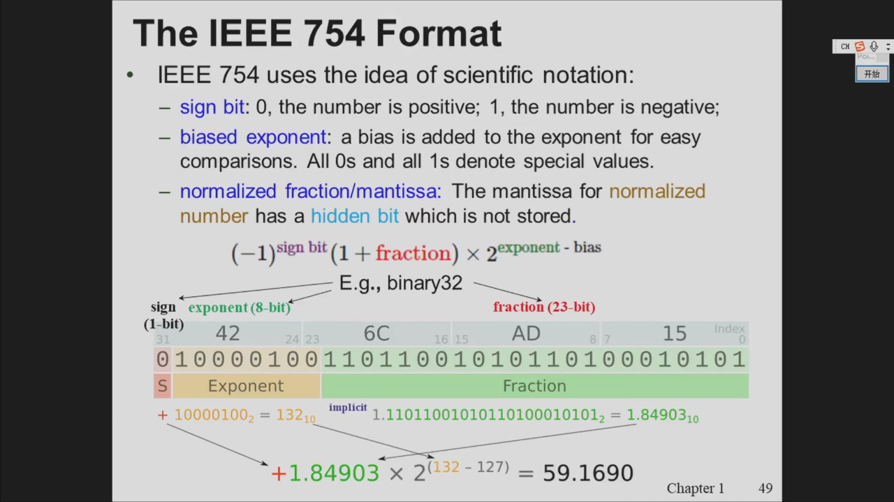
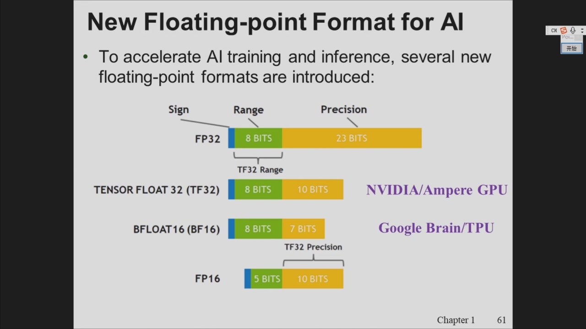

# Introduction to the Microprocessor and Computer

!!! note 核心知识
    - 微处理器发展史：存储程序思想 (von Neumann) → 4004 → x86 家族 → Intel 64 (IA-32e)
    - **IEEE 754 浮点表示**（本次课重点）：格式三部分、特殊值、subnormal、舍入模式、浮点运算三步、经典精度陷阱
    - 教材：Brey《The Intel Microprocessors》8th Edition，第一章一次课讲完（很多内容大家已有基础）

## 本章概览

- 存储程序 (stored program)：von Neumann 率先提出把指令存入内存的系统——比重新接线编程高效得多，可编程机器由此催生了程序与编程语言
- 4004（第一款微处理器）：P-channel MOSFET 工艺，50 KIPs（千指令/秒）；对比 1946 年 30 吨的 ENIAC 的 100,000 指令/秒——差别是 4004 重量不足一盎司；4 位微处理器最早用于游戏机与小型控制系统
- 性能演进技术：superscalar（超标量）利用指令级并行，但后续指令往往相互依赖、第二条流水线利用率低 → **乱序执行 (Out-of-order Execution)**：按数据流图而非程序顺序执行，在指令窗口中向前查找就绪指令
- Intel 64 架构：线性地址空间 64 位、物理地址空间最高 52 位；引入 IA-32e 模式，含两个子模式——Compatibility mode（64 位系统直接运行旧 32 位软件）与 64-bit mode

## IEEE 754 浮点表示

### 三部分构成

IEEE 754 采用科学计数法的思想，由三部分组成：

- **sign bit**：0 为正，1 为负
- **biased exponent**：指数加偏移 (bias) 便于比较；**全 0 与全 1 被保留**用于特殊值
- **normalized fraction / mantissa**：规格化数的尾数有一个不存储的 **hidden bit**（隐含的 1）

$$(-1)^{\text{sign}} \times (1 + \text{fraction}) \times 2^{\text{exponent} - \text{bias}}$$

以 binary32（单精度）为例：sign 1 位 + exponent 8 位 + fraction 23 位，bias = 127。



### 为什么浮点数不用补码？

- 定点整数用**二进制补码**表示，而浮点数改用**符号-数值分离法**，原因：
    - 补码基于**模运算**原理，要求数字**定长**；浮点数是**不定长**的，补码的基本前提不存在
    - 浮点数基本上没有无符号数，都是带符号的，干脆把符号位单独拿出来
    - 补码表示中 0 只有一种表示（非对称）；符号-数值分离可以表示 **+0 和 −0 两个 0**——在微积分求极限时"趋向 0⁺ 还是 0⁻"是有意义的，浮点计算里有价值

### 特殊值 (Special Values)

| 类型 | 指数部分 | 尾数部分 | 说明 |
| --- | --- | --- | --- |
| $\pm 0$ | 全 0 | 全 0 | 符号位可 0 可 1 → 正零/负零 |
| $\pm\infty$ | 全 1 | 全 0 | 指数用尽、尾数无 → 数足够大/小，符号定方向 |
| NaN | 全 1 | ≠ 0 | Not a Number：0/0、负数开根号等不存在的结果 |
| Normal number | 非 0 且非全 1 | 任意 | 正常数，隐含 1 |
| Subnormal number | 全 0 | ≠ 0 | 极小数，见下 |

### Subnormal Numbers（非规格化数）

- 介于最小 normal number（$1.0 \times 2^{-126}$）与 0 之间的数
- 表示：指数全 0、尾数非全 0，**不加隐含 1**：
  $$\text{subnormal} = (-1)^{\text{sign}} \times \text{fraction} \times 2^{1-\text{bias}} \quad (\text{single: } 2^{-126})$$
- 设计意图：按此公式计算的 subnormal 与最小的 normal number **衔接最紧密、最平滑**——差在最末一个 bit，IEEE 委员会（图灵奖得主，数值计算专家）的精细设计
- 两种下溢处理策略（Abrupt Underflow vs Gradual Underflow）：
    - **Motorola**：flush to zero——小到一定程度突然当作 0，**保性能、降精度**
    - **Intel**：gradual underflow——subnormal 仍是数、仍可计算、精度保留，但用软件模拟的方式执行，**保精度、降性能**（速度慢 10 倍以上）
    - 真实案例：早期 Matlab 解偏微分方程，解到一半速度突然慢 10 倍——就是掉进了 subnormal 区间；知道这个知识就可以调整算法跳出去

### 舍入模式（5 种）

IEEE 754 明确定义了 5 种舍入，统一舍入保证不同实现的浮点结果一致：

| 模式 | +11.5 | +12.5 | −11.5 | −12.5 |
| --- | --- | --- | --- | --- |
| to nearest, ties to even（**默认**） | +12.0 | +12.0 | −12.0 | −12.0 |
| to nearest, ties away from zero | +12.0 | +13.0 | −12.0 | −13.0 |
| toward 0 | +11.0 | +12.0 | −11.0 | −12.0 |
| toward +∞ | +12.0 | +13.0 | −11.0 | −12.0 |
| toward −∞ | +11.0 | +12.0 | −12.0 | −13.0 |

- 默认 roundTiesToEven：往末尾变成偶数的方向舍（11.5 → 12，12.5 → 12）
- 伏笔：做除法有两种手段——除法指令和移位；负数时两者结果有差异，本质就是**舍入方式不同**；懂这个原理就能用算法补偿，让结果一致

### 浮点运算的三个步骤

两个浮点数做加法：

1. **指数对齐**：往大的指数对齐
2. **尾数运算**：对齐后对尾数部分做计算
3. **舍入/截断**：中间结果精度超出表示范围（如 single 尾数 23 位）时必须舍入

### 经典精度陷阱 (Accuracy Problem)

```c
float sum = 0.0f, x = 1.0f;
for (int i = 0; i < N; i++) sum += x;
```

- N = 3×10⁶ 时 sum = 3×10⁶，正确
- N = 3×10⁷ 时 sum = **16777216 = 2²⁴**，加不动了
- 原因：到 2²⁴ 后再 +1，指数对齐后这个 1 排在第 24 位，而有效尾数只有 23 位，**第 24 位的 1 被直接丢掉**
- 解决：换更高精度（double）、分段求和等——知道道理就有很多办法；数值计算优化（自动做等价变换保精度/提性能）是一个专门且稀缺的研究方向

### AI 中的浮点格式

AI 训练/推理对精度不敏感（不像科学计算对精度和边界条件敏感），因此**降精度换性能**：

| 格式 | 指数 | 尾数 | 说明 |
| --- | --- | --- | --- |
| FP32 | 8 | 23 | 传统单精度 |
| TF32 | 8 | 10 | NVIDIA Ampere：表示范围不变，精度降下来 |
| BF16 | 8 | 7 | Google Brain/TPU：更狠地砍尾数 |
| FP16 | 5 | 10 | 指数也缩，范围变小 |

A100 上 TF32 相比 FP32 推理性能大幅提升。此外 IEEE 754-2019 还有十进制浮点的讨论（用十进制表示十进制、精度更高），但因巨大商业价值未形成共识——当年 Intel 敢把 8087 的标准推向全球也是同样的商业逻辑。



!!! note 课程信息
    - 教材只有一本：Brey《The Intel Microprocessors》8th Edition
    - 课件与作业答案都发布在 QQ 群，作业不需要提交，自己对照答案即可
    - 助教（上一届学长）已拉进钉钉群和 QQ 群，有问题可问助教或老师
    - 周五的实验不需要去实验室，自己做就行
