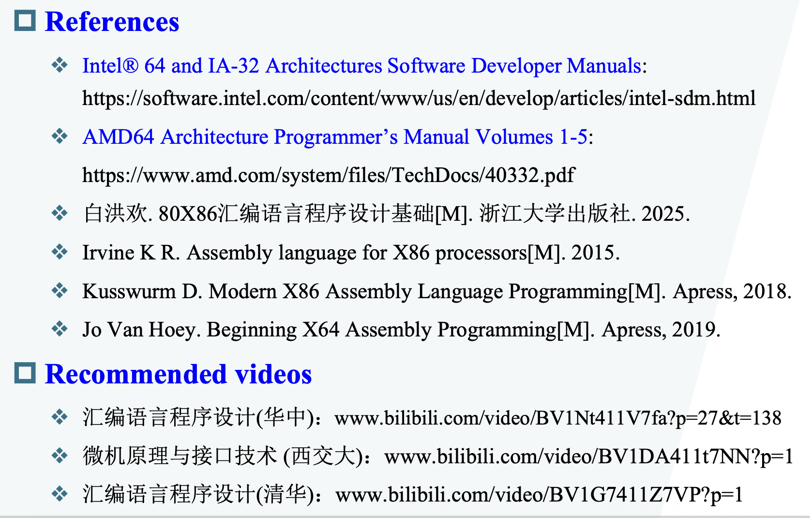
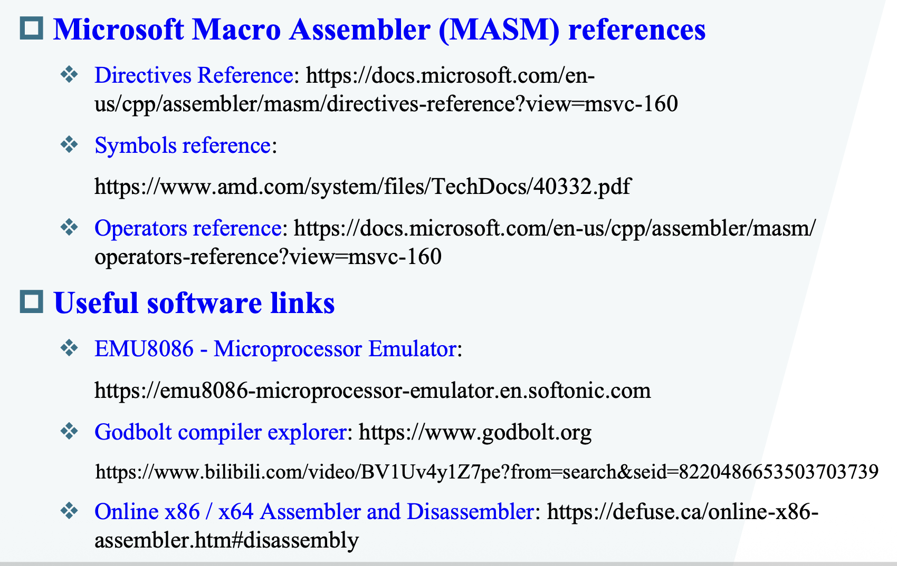

# Intro

## 汇编

>   - Q：汇编你学了之后有什么用？
    - <s> cm：没什么用。</s>
    然后一直再提白老师的 8086 汇编课

但其实日后关注于 efficient & system 
!!! tip Reference
    
    

## 接口

> 接口曾作为计组课程内容。<s>这门课越看越像考古课了</s>

接口最简单分类：
- 通信(Communication)
    - 通信接口又分为串行和并行，串行的抗干扰能力强，频率可以做到更高，使得传输速率更快。
- 控制(Control)
    - interruput controller, timer

## Topics
> 重点貌似是在 Basic Interface 章节，说是要用这个考察是否听课。前半段课涉及汇编与编译原理内容。

## Project
> 不用去实验室

### 1. Abstraction Through Assembly
    去探索高级语言的一种抽象机制。
    How:
    - Narrow down the question
    - Observation -> assumption -> method -> evaluation
    - Intergrate the pre-learned knowleadge for comprehensive understanding
    - use tools for efficient
    - Get your hands dirty with code
    Req:
    - Work independent
    - Report
    - Deadline (Nov.10)

### 2.  Evaluating LLMs on Code Decompilation (tentative)
    大语言模型反编译和一般的反编译差别。
    - Req:
    - Deadline (Dec.12)