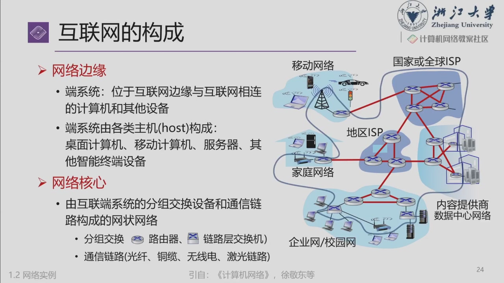
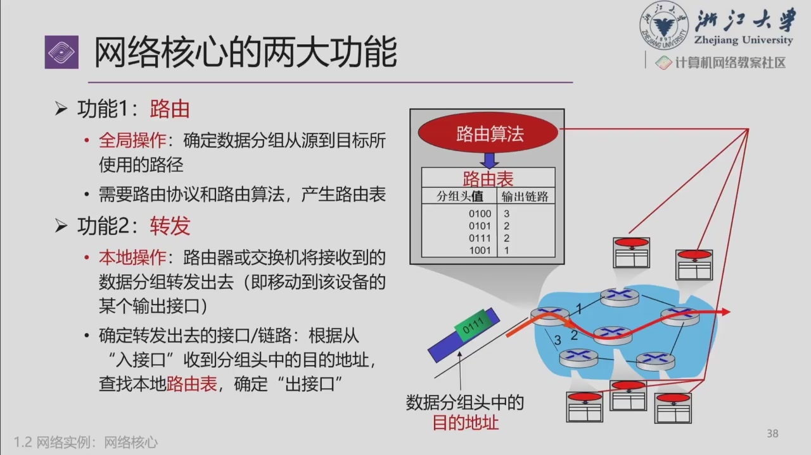
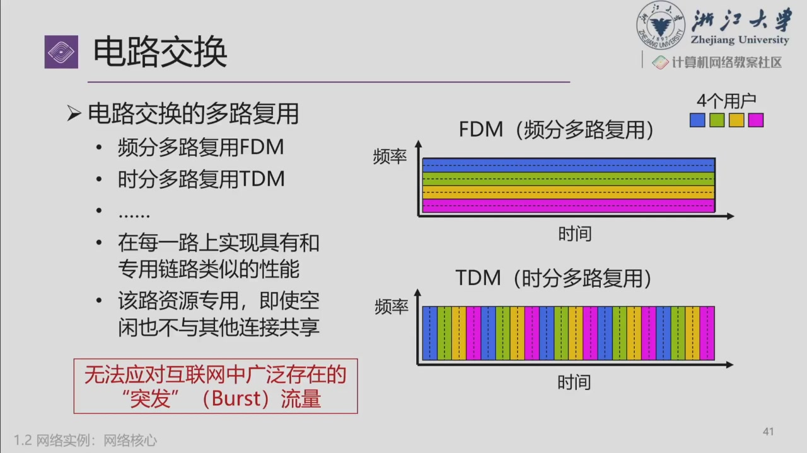
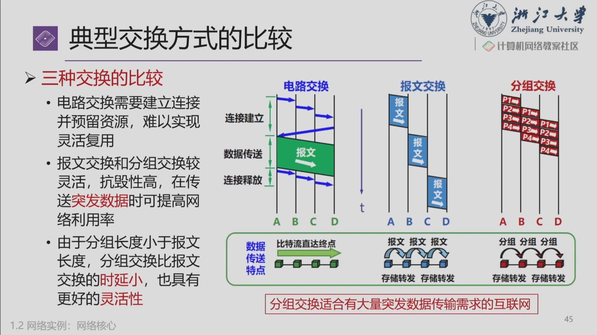
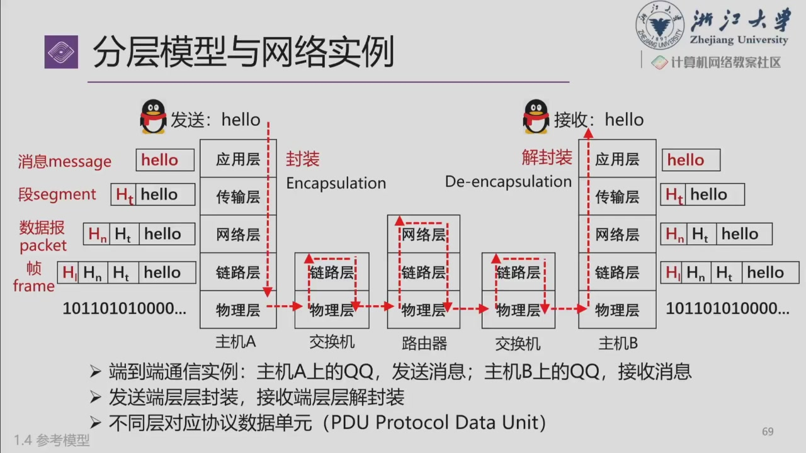
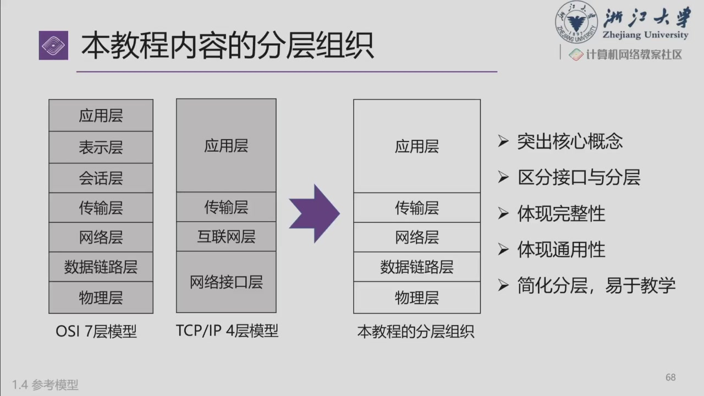

# 第一章：网络组成、交换与分层

!!! info "本次范围与续写位置"
    来源：智云课堂“计算机网络 - 韩劲松”，2026-09-16 第 3–5 节，course ID `87579`，sub ID `1968231`。本页整理约 **21:42–146:01** 的概述内容，时间均为录像内时间。

    课末跳到第六章的 Socket 编程引入，另见 [Socket 笔记](socket_programming.md)。第一章中的网络度量只提到传输与传播时延的区别，安全、标准化与历史尚未展开。

## 网络提供什么服务？

> 21:42–37:30；课件 `ppt_020`–`ppt_033`。

网络最基本的任务是**传递信息**。看待一个网络时，不仅问“能否连通”，还要问它能提供怎样的服务：

- **功能**：连接哪些设备，支持怎样的通信与应用？
- **性能**：可传输的数据量、延迟、丢失情况如何？
- **可靠性与安全性**：发生故障或干扰时，信息能否按要求送达并受到保护？
- **接口**：应用通过什么方式使用网络？

视频、文件下载、远程控制对服务的要求不同。例如文件下载往往关注吞吐量与完整性，交互式控制还特别关注时延。不能用一个“网速快”概括所有需求。

课堂用远程医疗、无人系统、直播、物联网等说明网络的基础设施作用；产业排名、用户规模和设备速率是课件中的背景示例，不作为需要背诵的固定参数。

## 网络的分类与组成

> 37:30–56:19；课件 `ppt_035`–`ppt_041`。

### PAN、LAN、MAN 与 WAN

| 类型 | 英文全称 | 典型范围与例子 |
| --- | --- | --- |
| PAN（个域网） | Personal Area Network | 个人周围的设备，如手机与蓝牙耳机 |
| LAN（局域网） | Local Area Network | 家庭、办公室、楼宇或局部园区，以太网和 Wi-Fi 是常见技术 |
| MAN（城域网） | Metropolitan Area Network | 城市范围的网络 |
| WAN（广域网） | Wide Area Network | 跨地区、跨国家连接网络 |

这是按地域规模理解网络的分类，不是协议分层。课堂用“一臂距离”帮助理解 PAN，但实际覆盖范围取决于技术和环境，不是固定的物理边界。

### Internet 与 internet

- **internet**：泛指多个网络互联构成的网络。
- **Internet**：教材约定中特指运行 TCP/IP 协议族的全球互联网，是前者的一个具体实例。

学习重点是**网络的网络（network of networks）**，而不是仅凭日常文本中的首字母大小写推断技术差异。

### ISP 的互联关系

**ISP（Internet Service Provider）**提供互联网接入或传输等服务。课件用骨干、区域、本地 ISP 描绘互联网的组织层次，并引入 **IXP（Internet Exchange Point，互联网交换点）**。

这种层次图帮助理解不同规模网络之间的互联：用户接入本地网络，网络再通过互联关系到达其他网络。**实际互联网不是一棵严格的树**，同层网络之间也可以互联；Tier-1 / Tier-2 等称谓也不能简单按“国家公司 / 省公司”机械判定。

### 网络边缘与网络核心

| 部分 | 由什么组成？ | 主要作用 |
| --- | --- | --- |
| 网络边缘（edge） | 主机、终端系统，如电脑、手机、服务器 | 运行应用，产生、发送和接收数据 |
| 接入网（access network） | 将终端连接到网络边缘路由器的设施 | 让主机进入网络 |
| 网络核心（core） | 互联的路由器、分组交换设备与通信链路 | 将分组逐跳送向目的地 |

“边缘”是网络通信角色，不是“性能较弱”的同义词。数据中心服务器也可以是通信的端系统；它不因算力强就自动变成网络核心中的转发设备。

## 接入网：主机怎样连进来？

> 56:19–71:09；课件 `ppt_042`–`ppt_050`。

接入网把主机连到其通往外部网络路径上的边缘路由器。家庭和校园通常混合使用有线、无线技术。

| 接入方式 | 基本思路 | 关键概念 |
| --- | --- | --- |
| FTTH（Fiber To The Home） | 光纤延伸到用户侧 | 光纤到户、光网络终端 |
| DSL（Digital Subscriber Line） | 利用电话铜线传输数据 | 用户侧 modem、运营商侧 DSLAM；ADSL 的上下行速率不对称 |
| Cable / HFC | 利用有线电视相关设施，结合光纤与同轴电缆 | 多用户共享接入段资源 |
| Ethernet（以太网） | 通过以太网链路接入交换网络 | 家庭、校园、企业中的有线接入 |
| Wi-Fi / WLAN | 通过无线接入点连接局域网 | 无线局域网，不等于互联网本身 |
| 蜂窝接入 | 通过运营商基站及其网络接入 | 4G / 5G 等，覆盖与移动性是重要特点 |

**上行（uplink）**是用户向网络发送，**下行（downlink）**是网络向用户发送。不对称速率是某些接入技术或套餐的设计，不能推广成所有 DSL 或所有网络的必然属性。

### 光纤到户与 PON

课件介绍 **PON（Passive Optical Network，无源光网络）**：运营商侧的 **OLT** 与用户侧的 **ONU / ONT** 通过光纤和无源分光器连接。“无源”描述中间的光分配部分，不能理解为两端设备不需要供电。

家中的“光猫”负责光接入；家用无线路由器常把路由、交换、无线接入等多种功能集成到一台设备。具体启用桥接还是路由模式，会影响功能落在哪台设备上。

!!! note "补充辨析：接入技术、介质、设备是三个维度"
    以太网是一组网络技术；双绞线、光纤是介质；交换机、路由器、无线 AP 是设备或功能角色。以太网不只运行在铜线上，光猫也不一定承担 IP 路由。分析网络时，要看它正在执行的功能，不能只看外壳名称。

## 物理介质与数据单位

> 71:09–81:49；课件 `ppt_051`–`ppt_055`。

网络中的比特由物理信号承载。**比特是信息单位，电、光或电磁波是承载信息的物理形式**。

| 介质 | 信号怎样传播？ | 理解重点 |
| --- | --- | --- |
| 双绞线（twisted pair） | 电信号沿导线传输 | 成对绞合有助于降低干扰；常见以太网线含四对线 |
| 同轴电缆（coaxial cable） | 沿同轴导体结构传输 | 内导体、绝缘层、外导体等形成传输结构 |
| 光纤（fiber） | 光信号沿光纤传输 | 适合高速、远距离传输，不受作用于铜导线的电磁干扰影响 |
| 无线介质 | 电磁波经空间传播 | 受遮挡、反射、衰减、干扰等影响 |

前三者是 **guided media（导引型介质）**，无线属于 **unguided media（非导引型介质）**。课堂用“有光为 1、无光为 0”说明信息编码的思想；实际调制编码并不局限于这一种形式。

### bit、Byte 与速率

- **1 Byte = 8 bits**，注意 `B` 与 `b` 的大小写。
- 数据传输速率通常用 **bit/s（bps）**，例如 100 Mbps 表示每秒 $10^8$ bit。
- `MB` 与 `MiB` 需要区分：十进制的 1 MB 是 $10^6$ Byte；二进制的 1 MiB 是 $2^{20}$ Byte。不要把所有存储单位都默认按 1024 换算。
- 100 Mbps 除以 8 得到 12.5 MB/s，这是单位换算；实际应用数据速率还受协议开销、瓶颈和其他流量影响。

课件中的各代设备速率是示例；比较接入方式时应看具体标准、套餐和链路条件，不能把“Wi-Fi 一定比蜂窝快”或“同轴只能百兆”当作普遍结论。

## 网络核心：路由与转发

> 81:49–93:17；课件 `ppt_056`–`ppt_060`。

**分组（packet）**是网络中传输的数据单元。主机把要传输的信息组织为分组，网络中的节点把分组逐跳送向目的地。

| 功能 | 要回答的问题 | 作用范围 |
| --- | --- | --- |
| Routing（路由） | 数据怎样从源到目的地，下一步应该通向哪里？ | 根据网络信息和算法形成路径选择与路由信息 |
| Forwarding（转发） | 这个到达输入端口的分组，应从哪个输出端口发出？ | 单台设备上的本地处理 |

典型转发流程：**接收分组 → 检查首部 → 查询转发表 → 选择出口 → 排队并发送**。课堂统称“查路由表”；实现中路由信息与供快速转发使用的表可以分开组织。

用寄信理解：地址让中间节点知道该往哪里送，但中间节点不需要理解信件正文。路由解决“向哪里走”，转发落实到每一跳的动作。

同一对主机的不同分组**可以**经过不同路径，不代表它们**必须**各走不同路径。路径由转发状态等因素决定；分组到达顺序和发送顺序也未必一致。

## 三种交换方式

> 93:23–121:12；课件 `ppt_061`–`ppt_066`。

### 电路交换（Circuit Switching）

传统电话是课堂例子：先建立端到端通路，为通信预留资源，再传输，结束后释放。

- 预留的是沿途的容量或时隙等资源，不一定是每通电话独占一根物理导线。
- 资源预留后，在通信期间可得到相对确定的服务；即使暂时没有数据，相应资源也可能闲置。
- 建立连接需要时间，路径上的故障可能中断通信；具体系统可另有保护与恢复机制。

### FDM 与 TDM：怎样划分共享资源？

| 方式 | 划分维度 | 直观理解 |
| --- | --- | --- |
| FDM（Frequency Division Multiplexing） | 频率 | 不同通信使用不同频带，可以同时传输 |
| TDM（Time Division Multiplexing） | 时间 | 不同通信在不同的时隙使用链路 |

复用让多路通信共享物理设施；固定分配时，即使某一路暂时没有数据，它的资源也未必能被其他路立即使用。这是面对**突发流量（bursty traffic）**时需要考虑的利用率问题。

### 报文交换与分组交换

- **报文交换（message switching）**：中间节点收齐整个报文，再存储转发到下一节点。
- **分组交换（packet switching）**：把较大的信息拆成较小分组，各分组分别转发；不同用户的分组共享链路和节点。
- **统计复用（statistical multiplexing）**：按实际到来的分组使用资源，而非始终为每个用户保留固定份额。

| 方式 | 传输前是否预留端到端资源？ | 中间节点的基本处理 | 主要取舍 |
| --- | --- | --- | --- |
| 电路交换 | 典型情况下需要 | 沿已建立通路传送 | 服务较确定，但空闲时资源利用率可能低 |
| 报文交换 | 通常不需要 | 存下整个报文再转发 | 灵活，但大报文需要较大缓存、等待时间较长 |
| 分组交换 | 数据报方式通常不需要 | 以分组为单位处理和转发 | 适合共享与突发流量，但可能排队、丢失或乱序 |

分组交换中的流水线是指：前一个分组已经在后续链路传播时，源主机可以在前一条链路发送下一个分组。**不是同一条串行链路在同一时刻无条件发送多个完整分组**。

!!! note "补充辨析：交换方式与是否面向连接要分开"
    分组交换既可以支持无连接的数据报服务，也可以有面向连接的组织方式。TCP 就是在 IP 分组网络之上提供面向连接服务；TCP 建连不会自动在沿途路由器预留独占带宽。因此“面向连接 = 电路交换”不成立。参见 [RFC 9293 §2.1–2.2](https://www.rfc-editor.org/rfc/rfc9293.html#section-2.1)。

### 存储转发与时延

课堂采用 **store-and-forward（存储转发）**模型：节点先收到完整分组，再从下一条链路发送。这里用于建立计算模型，不意味着所有交换设备都只支持这一种实现。

发送 $L$ bit 的分组到速率为 $R$ bit/s 的链路，**传输时延**为：

\[
d_{\mathrm{trans}} = \frac{L}{R}
\]

课件 `ppt_063` 的例子：$L=10^4$ bit，$R=100$ Mbps，故 $d_{\mathrm{trans}}=10^{-4}$ s，即 **0.1 ms**。

| 时延 | 时间花在哪里？ | 主要取决于 |
| --- | --- | --- |
| 处理（processing） | 检查首部、确定转发动作等 | 设备实现、处理工作量 |
| 排队（queueing） | 等待出口可用 | 到达流量、队列与调度 |
| 传输（transmission） | 把分组各比特依次送上链路 | 分组长度 $L$、链路速率 $R$ |
| 传播（propagation） | 信号沿介质从一端到另一端 | 距离 $d$、传播速度 $v$，为 $d/v$ |

**提高带宽能缩短传输时延，不会按同样比例缩短传播时延。**本讲只作引入，网络度量部分以后展开。

??? example "补充例题：两条链路的存储转发"
    一个 $L$ bit 分组通过两条速率均为 $R$ 的链路，中间有一个存储转发路由器。忽略传播、处理与排队时延，接收端收齐分组需要 **$2L/R$**。

    若连续发送 $N$ 个同样大小的分组，在无竞争、可充分流水线化的条件下，最后一个分组到达需要 **$(N+1)L/R$**。第一个分组付出两跳发送时间，后面每个分组再增加一个 $L/R$。这解释了小分组流水线的收益；实际还需计算每个分组的首部开销。

## 网络协议与分层

> 121:12–141:50；课件 `ppt_068`–`ppt_088`。

### 协议的三要素

**Network protocol（网络协议）**是通信实体共同遵循的规则和约定。

| 要素 | 规定什么？ | 例子 |
| --- | --- | --- |
| Syntax（语法） | 数据格式如何组织 | 字段位置、长度、编码方式 |
| Semantics（语义） | 信息表示什么、接收后做什么 | 请求建立连接，或报告某个错误 |
| Timing / ordering（时序） | 操作的顺序和时间关系 | 先请求再响应，超时后采取什么动作 |

“双方说同一种语言”只是起点。协议还可能需要处理可靠性、资源分配、拥塞、异构环境与安全等问题。

### 为什么分层？

底层可能是 Wi-Fi、蜂窝、以太网或光链路，上层可能是聊天、视频、邮件等。如果每种应用都为每种底层网络重做完整系统，复杂度会迅速增加。

分层的思路是：**各层承担相对明确的功能，通过接口使用下层服务，再为上层提供服务**。只要接口和服务要求保持兼容，一层的实现变化可以尽量不影响其他层。

- **分层结构**：把复杂问题拆成可理解、可实现的部分。
- **统一协议与接口**：让不同设备和实现能够互通。
- **模块独立**：隐藏不必暴露的内部细节，便于升级。

分层并不保证性能和行为完全不受底层影响；例如无线丢包和时延变化仍会影响应用体验。

### 协议、服务与接口

| 概念 | 关系方向 | 作用 |
| --- | --- | --- |
| 协议（protocol） | **水平**：不同系统的对等实体 | 约定同层实体如何交换信息 |
| 服务（service） | **垂直**：下层向上层 | 描述这一层能为上一层做什么 |
| 接口（interface） | 同一系统内相邻层之间 | 描述上层如何使用下层能力 |
| 服务原语（service primitive） | 通过接口发起的操作或事件 | 如请求建立连接、发送、接收、断开 |

**Peer（对等实体）**指处于同一层的通信实体；**protocol stack（协议栈）**描述分层组织的协议集合。逻辑上同层对话，实际数据仍需通过下层逐级传送。

服务原语是对服务交互的抽象描述，不能把它与某个编程库的具体函数名完全等同。Socket API 是应用使用通信服务的一种具体接口。

### 封装、解封装与 PDU

1. 发送端应用产生消息，向下交给传输层。
2. 各层按照本层协议组织数据，加入需要的控制信息；链路层还可能增加尾部。
3. 物理层通过信号传输比特。
4. 接收端逐层解释本层控制信息，把载荷交给上层，最终交给应用。

**PDU（Protocol Data Unit，协议数据单元）**是某层对等实体交换的数据单位。

| 层次 | 常见叫法 |
| --- | --- |
| 应用层 | Message（消息 / 报文） |
| 传输层 | TCP segment（报文段）；UDP datagram（数据报） |
| 网络层 | IP packet / datagram（分组 / 数据报） |
| 数据链路层 | Frame（帧） |
| 物理层 | 传输比特的物理信号 |

不同资料可能泛称所有单位为 packet，做题时应结合层次判断。上一层的 PDU 通常成为下一层的载荷，但还可能发生分段、分片等操作，不要把示意图当作所有情况下都严格一对一。

!!! note "补充辨析：图中的交换机与路由器"
    课件中的二层交换机主要处理链路层转发；IP 路由器需要根据网络层信息选择下一跳。字幕在这里把部分接入设备统称为“边缘路由器”，应按图中实际角色区分。

    路由器接收一跳的链路帧，处理其中的 IP 分组，再为下一跳组织新的链路封装；它通常不需要把普通转发流量交给自己的应用层。IP 首部中的某些字段也会在转发时变化，因此不能理解为沿途所有比特完全不变。

## 参考模型：OSI、TCP/IP 与五层教学模型

> 141:50–146:01；课件 `ppt_089`–`ppt_098`。

| OSI 七层 | 主要职责 | TCP/IP 常见四层划分 | 本课程五层划分 |
| --- | --- | --- | --- |
| 应用层 | 为网络应用提供协议与服务 | 应用层 | 应用层 |
| 表示层 | 数据表示、编码转换等 | 应用层 | 应用层 |
| 会话层 | 会话建立、管理与同步等 | 应用层 | 应用层 |
| 传输层 | 端系统中进程之间的数据传送 | 传输层 | 传输层 |
| 网络层 | 跨网络寻址、路由与分组转发 | 互联网层 | 网络层 |
| 数据链路层 | 相邻节点间的帧传送与介质访问 | 链路 / 网络接口层 | 数据链路层 |
| 物理层 | 比特对应的信号、介质与物理接口 | 链路 / 网络接口层 | 物理层 |

OSI 是参考模型，TCP/IP 同时指实际采用的协议族及其体系结构。课堂强调二者形成路线和实用性不同；**OSI 协议体系没有成为互联网的主流，不等于七层模型没有描述与分析价值**。

本课程把 TCP/IP 底部细分成链路层与物理层，方便教学。协议栈里没有独立的表示层、会话层，并不意味着编码或会话功能消失，而是这些功能可由应用及其库等承担。TCP/IP 分层的原始说明可对照 [RFC 1122 §1.1.3](https://www.rfc-editor.org/rfc/rfc1122.html#section-1.1.3)。

### IP 的共同层与端到端思路

课堂用沙漏图解释：上面有多种应用，下面有多种链路技术，中间通过 IP 互联。可以记为 **多种应用使用 IP，IP 适配多种底层网络**。

IP 提供尽力而为的分组传送，上层根据需求补充功能。端到端思路强调某些正确性与可靠性目标需要端系统参与，不能只依赖中间网络；它也不表示网络设备绝对没有复杂功能。

## 自测与后续

??? question "能解释这些问题，再进入下一讲"
    1. 为什么服务器也属于网络边缘？
    2. 路由和转发分别解决什么问题？
    3. 固定 TDM 中某用户没有数据时，为什么可能浪费容量？
    4. 100 Mbps 链路发送 $10^4$ bit 要多久？这是否包含传播时间？
    5. 同一条流中的分组必须走同一条路径吗？必须走不同路径吗？
    6. 协议为何说是水平的，服务为何说是垂直的？
    7. 为什么 TCP 面向连接不意味着网络采用电路交换？

    **检查要点**：端系统运行应用；路径选择与本地出口动作；固定资源分配可能闲置；0.1 ms，只含传输；两者都不必然；对等实体与相邻层；端系统连接状态不等于沿途资源预留。

下一次课堂从 [Socket 编程](socket_programming.md#next)继续。网络度量等未展开部分仍保留为后续内容。
