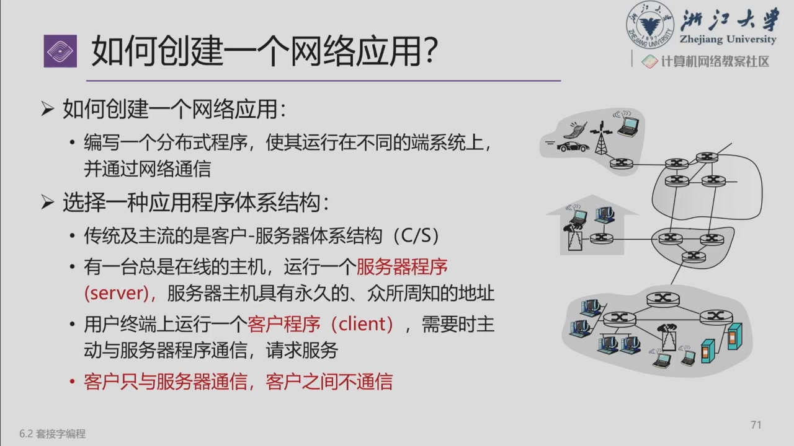

# Socket 编程：引入与续写起点

!!! info "目前只记录课堂引入"
    来源：2026-09-16 第 3–5 节录像 **146:01–148:24**，课件 `ppt_099`–`ppt_100`（切换到第六章 6.2 套接字编程）。老师只解释了 C/S 与连接服务的基本思路，尚未逐个讲解 Socket 函数或代码。

## 网络应用是运行在哪里的？

网络应用由运行在不同端系统上的程序通过网络交换消息来完成任务。可以把问题拆成两层：

1. **应用要交换什么？**例如客户端请求一个文件，服务端返回相应内容。
2. **应用怎样把信息交给网络？**通过 Socket 等接口使用通信服务。

Socket 不是一种新的线缆或交换方式，而是程序使用通信端点的接口抽象。补充参考：[Linux socket(2)](https://man7.org/linux/man-pages/man2/socket.2.html)。

## Client / Server（C/S）结构

| 角色 | 课堂例子中的行为 |
| --- | --- |
| Server（服务端） | 保存文件等资源，等待请求并提供服务 |
| Client（客户端） | 主动联系服务端，提出请求并接收结果 |

一个服务端可以服务多个客户端。在课件的简单 C/S 模型中，客户端通过服务端交换信息，不需要彼此直接连接；这不表示所有网络应用都必须采用这一结构。

例如“我要文件 A”是**应用层请求**，其内容与格式需要应用协议定义。网络连接建立成功，并不表示服务端已经知道客户端需要什么文件。

## 面向连接与无连接

### 面向连接的思路

**建立连接 → 在连接上交换数据 → 释放连接。**课堂用电话类比，并将其与后续套接字实验联系起来。

连接建立时，通信端点维护必要状态；数据交换的规则取决于采用的协议。不要把“连接”直接想成两台主机之间临时拉起一根独占电线。

### 无连接的思路

发送方把带有必要寻址信息的数据交给网络，不必先完成同样的连接建立过程。接收方可以处理并回复请求。

“无连接”不等于“应用不能回复”，也不等于“上层不能设计确认与重传”。是否建立连接、是否保证可靠交付、应用采用请求响应还是单向发送，是需要分别判断的问题。

!!! note "补充辨析：以 TCP / UDP 帮助定位概念"
    TCP 提供面向连接、可靠有序的字节流；UDP 提供数据报服务，不提供同样的连接建立与可靠交付保证。TCP 仍运行在 IP 分组网络之上，不为连接自动预留沿途带宽。参见 [RFC 9293](https://www.rfc-editor.org/rfc/rfc9293.html) 与 [socket(2)](https://man7.org/linux/man-pages/man2/socket.2.html)。

## 下次从哪里继续？ {#next}

**录像 148:24：老师明确说下节课继续 Socket 编程。**目前续写起点是第六章 6.2 的 C/S 引入之后。

后续记录时需要关注：

- 端点如何标识，地址与端口各自承担什么角色。
- 客户端、服务端分别调用哪些接口，调用次序是什么。
- 面向连接与无连接程序的代码流程怎样对应上面的抽象。
- 如何处理数据边界、返回值和失败情况。

这些是后续记录提纲，当前不标记为已讲内容。

??? question "引入部分自测"
    连接建立成功后，为什么还需要发送“我要哪个文件”的请求？

    **检查要点**：建立连接解决通信关系，具体业务需求由应用协议表达。底层传输服务不会自动理解文件名或用户意图。
