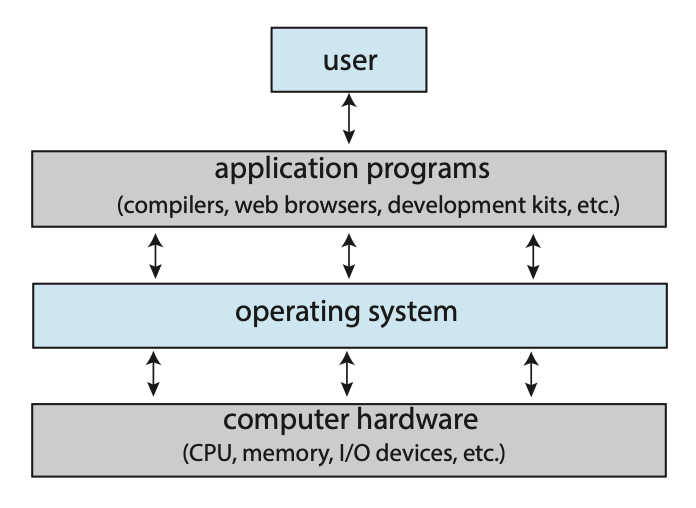
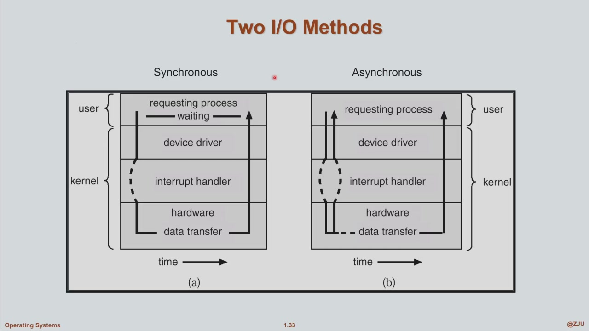
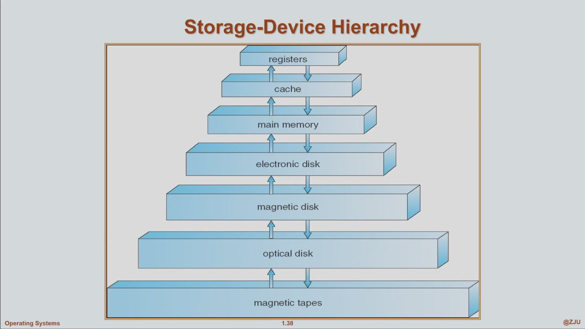

# Introduction

!!! note "参考补充的范围"
    本页标为“参考补充”的段落对照 [NoughtQ：Introduction](https://note.noughtq.top/sys/os/1/) 选题，重新组织解释与例子；具体实现另附一手资料。课堂时间线保持原样，参考笔记中的往年考试范围不作为本学期要求。来源与许可见[页末](#references)。

## what is a OS?

- 硬件 (hardware)：包括 CPU、内存、I/O 设备等，为系统提供了基本的计算资源
- 操作系统(operating system)：控制硬件，并协调其在不同应用程序之间，以及不同用户之间的使用
- 系统程序 (system programs) 和应用程序 (application programs)：定义了用硬件资源解决用户计算问题的方法，比如字处理器、电子表格、编译器、网页浏览器等
- 用户 (user)：人、机器或其他计算机

图中的 **operating system**，此时应该称为 **kernel**

- 教科书式的字面定义：**A program that acts as an intermediary between a user of a computer and the computer hardware**（在用户与计算机硬件之间充当媒介的一个程序）
    - 目标：execute user programs and make solving user problems easier；make the computer system convenient to use；use the computer hardware in an efficient manner
    - 这个定义非常抽象、"摸不着"——只说了 OS 是一个程序、是个媒介，没说它到底做了什么

- 一个更直观的理解：**把其他所有程序都关掉，还始终在运行的那个程序**，就是操作系统
- 它干两件事：一方面给用户提供**方便性**，另一方面把计算机的**资源管理起来**——最大程度地利用内存、处理器、硬盘、各种 I/O 设备，以高效的方式向用户提供服务
- 更精确一点的定义（OS 包括什么）：
    - **resource allocator（资源分配器）**：管理计算机硬件的各种资源（有时甚至包括软件资源）
    - **control program（控制程序）**：控制程序的运行与停止，控制用户对计算机的使用（如你点了一下鼠标，应用程序怎么知道？是操作系统的一种服务告诉它的）
- 注意：OS 没有公认的定义 (no universally accepted definition)；"厂商发行操作系统时给你的一切"是个不错的近似，但差异很大

### Kernel

- 教材用 **the one program running at all times on the computer** 描述内核的持续存在；应理解为系统运行期间内核持续承担管理职责，**不是 CPU 每时每刻都在执行内核指令**。应用程序也会直接在用户态执行。
    - 常驻的系统服务也可以长期存在，但“是否一直存在”并不足以区分它与内核。
- Kernel 与 Operating System 的关系
    - 前文对 operating system 的定义（控制硬件，并协调其在不同应用程序之间、不同用户之间的使用）描述的是这一层的**职责**；真正直接与硬件打交道、承担这些职责的核心程序就是 **kernel**
    - 广义 operating system = **kernel + system programs**：内核之外还包括随系统发行的系统程序（shell、窗口系统、文件管理工具等），其中一些服务也会常驻
    - 狭义 operating system = **kernel**：图 1.1 中间那层 "operating system"，实际画的就是 kernel（所以图中称 operating system，此时应称为 kernel）
    - 对比总结
        - kernel：在受保护的特权模式下管理资源的核心；具体权限层次与代码规模取决于体系结构和内核设计
        - operating system：更宽泛的概念，通常按"厂商发行了什么"界定，以 kernel 为核心

- "kernel 是一个 program"只是暂时的说法：随着逐步去开发一个 kernel，你会发现它**更像是一种服务 (service)**——kernel 里有大量代码和数据结构，可供外部程序调用

### Boot
- bootstrap program is loaded at power-up or reboot
    - Stored in ROM or EPROM, known an firmware
    - Initialize all aspects of system
    - Loads operating system kernel and starts execution
- 启动过程可以有多个阶段：固件先执行，再由引导加载程序加载内核；不能把所有阶段都理解成同一段固化在 ROM 中的代码。详细流程留到 System Boot。

### Computer Organization

- **memory**：所有指令和数据都存放在内存；指令从 memory 加载到处理器执行（取指, fetch）
- **CPU**：里面有一大堆**寄存器 (register)**——放指令、放操作数、维护 stack pointer 等关键信息；程序切换运行时要更新寄存器组 (register set)
- **I/O 设备**：显卡/GPU（最早用于绘图，"阴差阳错"变成通用 AI 计算）、USB 外设（鼠标、键盘）、硬盘等
    - 设备本身提供各种资源：磁盘是存储资源、内存是内存资源、鼠标键盘是 I/O 资源、GPU 含处理资源——连同处理器本身，都需要 OS 来管理
- **device driver（设备驱动程序）**：设备的控制器由软件来驱动管理，这个软件就是 device driver，是 OS 的一部分；装一个新设备，OS 里就多一个对应驱动
- CPU 本质上做的事情很简单：不停地在 memory ↔ register 之间搬数据、运行指令、给设备控制器发指令让它工作
- **中断 (interrupt)**：设备完成操作后通过中断通知 CPU——"我做完了，数据给你了，你来处理"；但中断打断的是**正在运行的程序**，所以 OS 必须及时介入，判断是哪个设备发出的中断、接下来干什么——**中断处理由 OS 提供**

### 设计哲学
- **Sharing（共享）**：OS 把计算资源分享给不同的用户、不同的程序（以后称为进程）
    - 例如处理器调度：CPU 定期或不定期地**释放自己正在处理的任务**，转去运行一段无关的代码，由这段代码选择下一个占用处理器的程序——以此实现 CPU 在多个程序之间的共享
- **Isolation（隔离）**：我的程序就是我的程序，你的程序就是你的程序；kernel 与 everything else 划清界限，但外部程序可以调用 kernel 提供的服务（如往屏幕输出文字）
- **Abstraction（抽象）**：进程、线程、文件、virtual memory、调度、文件系统……这些概念全是 OS 创造出来的，是人类智慧的结晶——有计算机之前它们并不存在
- Isolation 与 Sharing 是**相冲突**的：隔离 = 不要搞在一起，共享 = 要搞在一起。OS 通过 Abstraction 实现了这对**对立的统一**——既共享资源，又保证有序、互不搅和（现在没感觉没关系，越学越具体）

### 参考补充：用三条主线串起后续章节

| 主线 | 要解决的问题 | 课程中的落点 |
| --- | --- | --- |
| Virtualization（虚拟化） | 怎样让多个程序方便地使用有限的物理资源？ | 用进程和调度分享 CPU，用虚拟地址空间组织和隔离内存 |
| Concurrency（并发） | 多条执行流交错访问共享状态时，怎样保持正确？ | 线程、锁、同步与死锁 |
| Persistence（持久化） | 程序退出、重启甚至崩溃后，怎样保留数据？ | 文件、目录、文件系统与恢复机制 |

这里的虚拟化比“运行一台虚拟机”更宽泛。并发问题在单核交错执行时也会出现，并不要求多核同时运行。三条主线与课堂的 sharing / isolation / abstraction 是观察同一系统的不同角度。参见 [OSTEP 第 2 章](https://pages.cs.wisc.edu/~remzi/OSTEP/intro.pdf)。

## Interrupt & Trap

- 中断处理流程（微观视角）：
    1. 中断发生，控制转到 OS——具体就是处理器跳转到**中断向量 (interrupt vector)**：一张存有所有中断服务程序地址的表，用下标 (index) 定位到对应表项
    2. 控制转到该地址指向的代码，即**中断服务程序 (interrupt service routine)**
    3. 以 I/O 中断为例：输入数据暂存在 kernel 里，中断从 kernel 返回用户程序时，再把数据拷贝给用户程序
- **An operating system is interrupt driven**——中断是 OS 极其重要的组成部分
- 中断的分类：
    - **interrupt（硬中断）**：由硬件触发
    - **trap（软中断）**：由软件引起，又分两种：
        - **error/异常**：例如非法访问；异常可能被修复后继续执行，也可能导致程序收到信号或终止。按需分页产生的缺页异常不一定是程序错误
        - **system call（系统调用）**：用户程序**故意**调用系统提供的服务（如输出一段文本到 terminal）——这个词要牢牢记住，以后要自己实现
- **RISC-V 术语对照**（实验基于 RISC-V，看手册别被术语迷惑）：
    - **Trap** 是控制权转移的总称，原因分为 **interrupt（异步中断）**与 **exception（同步异常）**；`ecall` 属于后者
    - 用户态系统调用通常通过 **environment call (`ecall`)** 请求执行环境服务；`ecall` 也能用于其他执行环境调用，不能脱离运行模式把它一概等同于用户态系统调用。术语依据：[RISC-V 特权架构导论](https://docs.riscv.org/reference/isa/priv/priv-intro.html)

### 参考补充：中断与轮询

**Polling（轮询）**由 CPU 主动检查设备状态；**interrupt（中断）**由事件通知 CPU 进入处理入口。比如等待磁盘完成时，可以反复读状态寄存器，也可以先运行别的任务，待完成中断到来再收尾。

轮询可能消耗 CPU 时间，中断也有保存现场与处理开销，因此两者可以结合使用。不要将“中断驱动”理解为所有 I/O 都只用中断，也不要将“同步 I/O”直接等同于“CPU 忙等”。

### 中断控制器与 IRQ（x86 示例）

- CPU 之外有一块专门的芯片：**中断控制器 (interrupt controller)**，老 Intel 架构中就是 **8259**
- 把 CPU 想象成特别忙的明星：不可能亲自接所有通告，它只与"助理"（中断控制器）对接；外部各种中断请求通过 **IRQ（interrupt request，中断请求线路的编号）** 汇入，不同中断类型有不同的 IRQ 编号
- 两次中断应答的握手流程（**8259A 的 8086/8088 模式**）：
    1. 设备（如打印机）任务完成，8259 向 CPU 发中断请求："数据搬运好了，你要不要接管继续处理？"
    2. **第一次 INTA**：8259A 确定被响应的请求，设置相应的 in-service 位并清除 pending 位；这一周期不向数据总线输出向量号
    3. **第二次 INTA**：8259A 将中断向量号放到数据总线上，供 CPU 读取
    4. CPU 开始正式执行中断服务程序 (ISR)

!!! note "应答中断不等于处理完成"
    非自动 EOI 模式下，处理程序还需要发送 **EOI（End of Interrupt）**，清除控制器的相应 in-service 状态。设备侧的中断原因也需按设备协议处理。第二次 INTA 不能概括为“撤销 IRQ、处理完毕”。核对依据：[Intel 8259A 数据手册，第 7、9 页](https://www.cs.cmu.edu/~410/doc/8259A.pdf)。

## I/O

- I/O 与中断密切相关，宏观上由 OS 管理（也存在不牵涉具体物理设备的 I/O，以后会见到）
- 流程：用户程序通过 **system call** 发起 I/O 请求 → 设备执行 I/O → 完成后设备发起中断 → 控制转到中断处理程序 → 中断返回，用户程序拿到 I/O 结果继续运行
- 两种 I/O 模式：
    - **同步 (synchronous)**：I/O 操作**完成后**控制才返回调用程序（C 语言里的 `read` / `fread` 就是同步的）
    - **异步 (asynchronous)**：I/O 操作还没完成，控制就已经返回调用程序
- 课堂演示（同步 vs 异步）：`read()` 同步读 4 秒——期间 UI 完全冻结、无任何更新；换成 `POSIX aio_read()` 异步读——UI 持续保持响应
- 这里演示的是在执行 UI 更新的线程里等待 I/O 的情形；不能据此认为同步 I/O 一定会让整个系统停下来，也不能据演示的吞吐数字判断异步总比同步快。

!!! note "9 月 17 日补记的依据"
    原笔记停在同步/异步 I/O；下文补到 Process Management，与[第二章开头的内存、存储和 I/O 管理](char2.md#memory-management)衔接。依据为智云课堂 2026-09-17 第 7–8 节的 PPT 截图 `ppt_037`–`ppt_052`（课件页码 1.34–1.50）。该录像约 07:03–50:30 的字幕混入了其他课程内容，这一段按课件整理，不作为老师口述的逐字记录。

### Device-Status Table

- **设备状态表**为每个 I/O 设备保留一个条目，记录设备类型、地址和状态（如 idle / busy）。
- 忙碌设备还可以关联等待处理的请求队列；请求里包含操作类型、数据地址、长度等信息。
- 区分三个容易混淆的对象：**interrupt vector** 用于找到中断处理入口；**device-status table** 用于管理设备及请求；**CPU context** 保存被打断程序的 PC、寄存器等执行状态。

### DMA：批量搬运数据

**Direct Memory Access（直接内存访问）**用于高速 I/O：CPU 设置传输任务后，由控制器在设备缓冲区与主存之间搬运数据块，CPU 不必逐字节参与搬运。

1. CPU / 驱动准备缓冲区并设置传输方向、地址和长度。
2. 控制器完成数据传输，CPU 可以处理其他工作。
3. 传输完成后通知 CPU，由 OS 做后续处理。

课件用“每块一次中断，而非每字节一次中断”说明减少 CPU 开销的思路。**DMA 仍需要 CPU / OS 配置与收尾**；它解决的是谁搬数据，同步/异步解决的是调用何时返回，两者是不同维度。

## Storage Structure 与 Hierarchy

- **Main memory（主存）**：CPU 可直接寻址的大容量工作存储，程序的指令和数据要进入这一层才能执行、处理。
- **Secondary storage（二级存储）**：提供较大容量、非易失的存储，如硬盘、SSD。CPU 访问磁盘文件通常需要通过 I/O 将数据送入主存。
- 机械磁盘的盘面按 **track（磁道）**、**sector（扇区）**组织；disk controller 负责与主机的交互。不要把机械磁盘结构直接套用到 SSD。

### 存储层次与缓存

典型层次是 **register → cache → main memory → secondary storage**。越靠近 CPU，通常访问越快、容量越小、每字节成本越高；易失性也是区分存储层次的重要维度。

- **Caching**：把较慢一层的数据复制到较快的一层，以便后续访问更快；主存也可以用来缓存二级存储中的内容。
- 同一份数据可能同时出现在磁盘、主存、cache、register 中，因此必须考虑**哪一份是有效值，以及修改如何对其他使用者可见**。
- 多处理器可能各有 cache，需要 **cache coherence（缓存一致性）**机制协调副本。它不替代程序中的同步：共享数据仍可能发生竞争。
- 课件性能表的容量和延迟是示例，学习重点是层次间的数量级差异，不把表中数字当成所有机器的固定参数。

## Multiprocessor、Multicore 与 NUMA

### 参考补充：先区分芯片、核心和执行上下文

- **Processor / package** 常指一颗物理处理器芯片；一颗芯片可以包含多个 **core（核心）**。
- OS 可调度的 **logical CPU（逻辑处理器）**不一定与核心一一对应；支持 SMT 的核心可呈现多个硬件执行上下文。
- RISC-V 的 **hart（hardware thread）**指硬件执行线程；不要与软件创建的线程混淆。“CPU”在教材和工具中可能指不同层次，要看上下文。

因此，“8 个逻辑 CPU”不能直接推出“8 颗芯片”，也不能推出任意程序一定能加速 8 倍；任务可并行的程度、同步和内存带宽都会限制收益。

| 概念 | 课件中的结构 | 对 OS 的影响 |
| --- | --- | --- |
| SMP（对称多处理） | 各处理器有自己的寄存器，通过互连共享物理内存 | 在处理器之间分配任务，协调共享数据访问 |
| Multicore（多核） | 一块芯片包含多个执行核心；课件例子中各有 L1，共享 L2 | 可并行执行，片内通信通常比跨芯片通信更便宜 |
| NUMA（非一致内存访问） | 不同 CPU / 节点连接各自的本地内存，也能经互连访问远端内存 | 远端访问较慢，调度和内存分配要一起考虑数据局部性 |

NUMA 的关键是**访问不同位置的内存，代价不同**。例如一个任务的数据主要位于某节点，调度时让它尽量靠近该节点，可以减少远端访问。多核并不规定所有机器都采用课件中的 cache 共享方式。

## Multiprogramming 与 Multitasking

来源：9 月 17 日课件 1.45–1.46；9 月 20 日 12:03–14:30 的随堂题再次解释了两者目的。

| 概念 | 核心目标 | 基本做法 |
| --- | --- | --- |
| Multiprogramming（多道程序设计） | **提高 CPU utilization**，尽量让 CPU 有活干 | 内存中保留多个作业，一个等待 I/O 时切换到另一个可运行作业 |
| Timesharing / Multitasking（分时 / 多任务） | **改善 interactivity**，让用户及时得到响应 | 更频繁地切换任务，使多个程序都能持续取得进展 |

- 一个任务等待 I/O，不意味着 CPU 必须跟着空闲；OS 可以调度其他任务。
- 单核上通过交替运行实现**并发**；多核才可能让多个任务在同一时刻真正**并行**执行。
- 多个任务同时准备好时，需要 **CPU scheduling**；任务的数据放不下时，需要内存管理、换入换出等机制。
- **Virtual memory** 允许进程在并非全部内容都驻留物理内存的情况下运行，后续内存管理章节会展开。

## Dual Mode 与 Timer

### 用户态和内核态

OS 需要保护自身和其他程序，防止用户程序任意访问资源或修改系统状态。

- **User mode**：应用程序通常执行的权限级别。
- **Kernel mode**：内核处理受保护操作时使用的权限级别；某些 **privileged instructions（特权指令）**只能在相应高权限下执行。
- 区分模式需要硬件支持，不能仅靠程序自觉遵守。课件用 mode bit 表示两种模式；具体体系结构可能有更多特权级。
- 用户程序主动请求内核服务时使用 **system call**；硬件中断和异常也可能把控制权交给内核。**进入内核并不只有系统调用这一种原因**。

### 参考补充：模式切换不等于进程切换

| 操作 | 改变的是什么？ | 例子 |
| --- | --- | --- |
| Mode switch（模式切换） | CPU 执行的权限级别 | 进程 A 发起系统调用，由用户态进入内核态 |
| Context switch（上下文切换，此处指调度切换） | 当前运行的线程 / 进程及其执行现场 | A 等待磁盘，调度器改为运行 B |

一个立即完成的系统调用可以按 **A 用户态 → 内核为 A 服务 → A 用户态**返回，期间没有调度到 B。若 A 阻塞，才可能发生 **A 进入内核 → 切换到 B → 日后恢复 A**。两者经常出现在同一路径上，却不是同一个动作。

### Timer：OS 怎样重新拿回 CPU？

用户程序即使执行死循环、从不主动系统调用，OS 也必须能重新获得控制权。因此，OS 在交出 CPU 前设置定时器，由硬件在到期时触发中断。

**运行用户程序 → 定时器到期 → 进入内核的中断处理 → 根据调度策略继续当前任务或切换任务。**

定时器提供“到期打断”的能力，调度器决定“接下来运行谁”。不要把时间片到期直接等同于终止进程，也不要把课件的倒计时示意理解为 OS 必须占着 CPU 不断递减计数。

## Process Management

- **Program 是静态的程序，process 是程序的一次执行**。进程需要 CPU、内存、I/O、文件等资源，结束时 OS 要回收可复用的资源。
- 单线程进程只有一条执行流，可用一个 PC 描述其下一条指令位置；多线程进程中的每个线程各有执行位置和上下文。
- OS 的进程管理职责包括创建与删除、挂起与恢复、调度，以及提供同步、通信和死锁处理机制。
- 多个进程可以共享 CPU 时间，但不能因此随意访问彼此的数据；这里同时体现 **sharing 与 isolation**。

内存管理、存储管理与 I/O 子系统的概述接在[第二章笔记](char2.md)开头，保留原有课堂记录的顺序。

## 参考来源与许可 {#references}

- **选题与补充参考**：NoughtQ，[Introduction](https://note.noughtq.top/sys/os/1/)（[Markdown 源文件](https://github.com/NoughtQ/notebook/blob/master/docs/sys/os/1.md)），访问日期 2026-09-22。
- 原仓库采用 [CC BY-NC-SA 4.0](https://github.com/NoughtQ/notebook/blob/master/LICENSE)。本页参考补充对相关内容作了重组、改写并加入辨析；其中改编内容按[同一许可](https://creativecommons.org/licenses/by-nc-sa/4.0/)提供。
- 一手核对资料见对应段落中的 OSTEP、RISC-V 手册与 Intel 数据手册链接。
