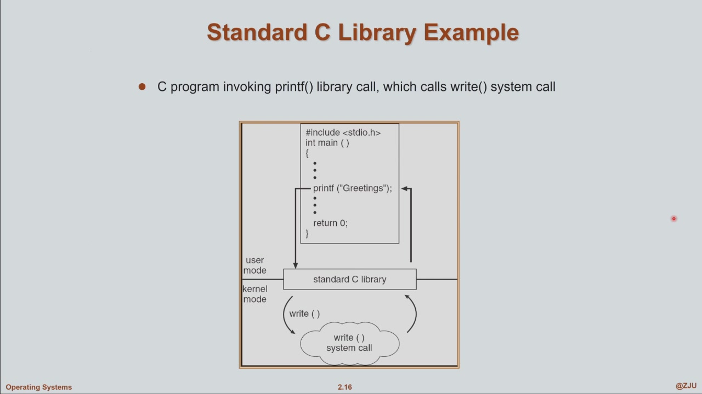
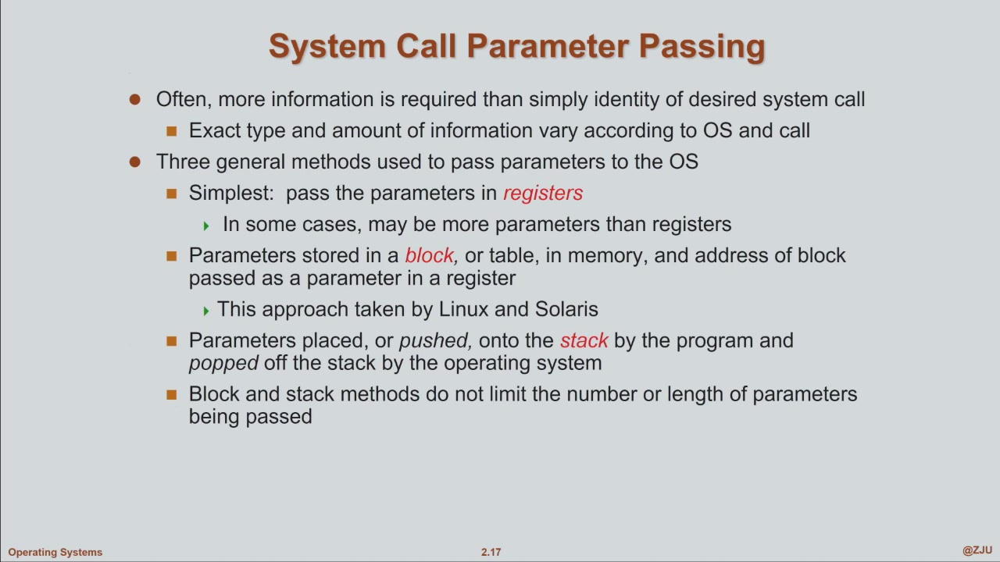
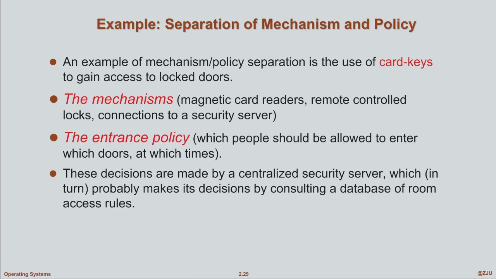
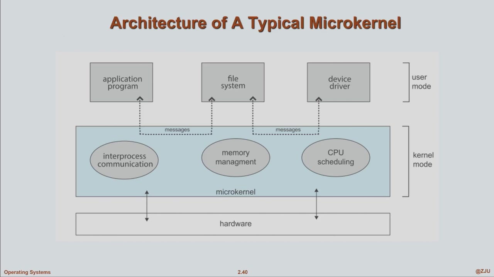
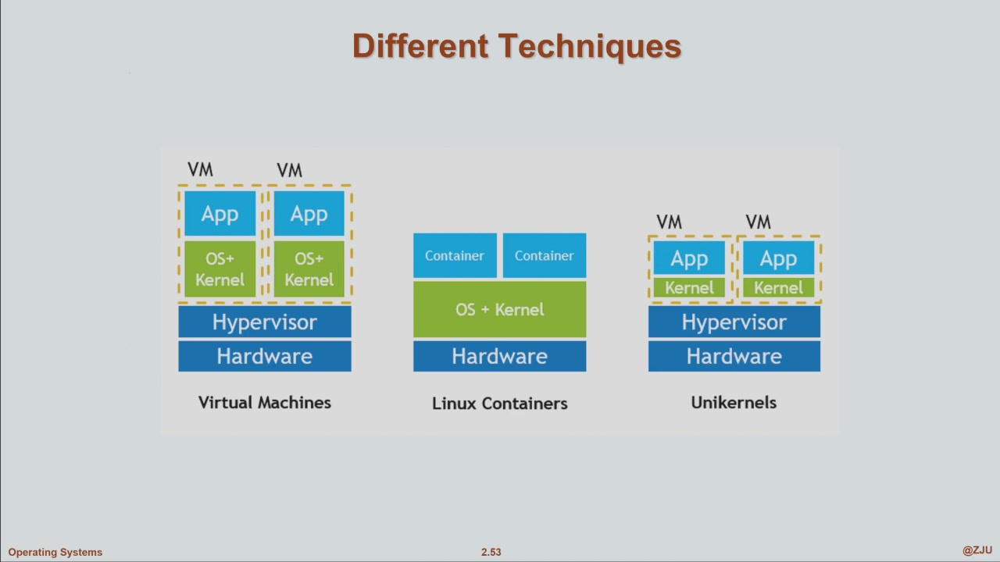

# Operating-System Structure

> 该章节貌似是概念大杂烩

!!! info "课堂进度与续写位置（截至 2026-09-20）"
    原笔记已覆盖 9 月 17 日第 7–8 节末尾的 `printf → write`（约 97:21–99:22）。9 月 20 日第 9–10 节在 17:16–18:32 复习 API，**18:43 起开始新内容：System Call Parameter Passing**，本次从这里续写到虚拟机与容器。老师在 99:05 明确将 **Operating System Generation / System Boot** 留到下次，下一次从这里接着记。

    来源：智云课堂“操作系统 - 寿黎但”，course ID `86696`；9 月 17 日 sub ID `1969190`，9 月 20 日 sub ID `1970348`。下文时间均为录像内时间；“补充辨析”用于区分课堂简化说法与具体实现。

!!! note "参考补充"
    本页另对照 [NoughtQ：Operating-System Structures](https://note.noughtq.top/sys/os/2/) 补充 I/O 概念、进程通信、shell、链接与加载、API / ABI。标为“参考补充”的内容用于串起概念，不代表本次课堂已讲完，也不改变下次续写起点。来源与许可见[页末](#references)。

## 第一章收尾：三大部件与 I/O 的关系

- 课程三大部件：**process management、memory management、storage management**（massive-storage management 与 storage management 是同一回事）
- **I/O subsystem 不属于三者任何一个**：它与 process、memory、storage 都有关系，相对独立，放在章节最后
- 设计哲学应用：**process synchronization（进程同步）归哪类？** isolation 和 sharing 都有成分——正因为共享 (share) 数据才会产生同步问题，同步是为了防止共享过程中发生冲突，即"有序的共享"

## Memory Management

两大核心问题：

- **memory allocation**：每个进程怎么从 OS 分配到内存（kernel 视角：怎样给每个进程分配一块区域，让它完成任务）
- **free memory 管理**：kernel 管理整块内存里剩余的可用资源

**Virtual memory（虚拟内存）**

- 虚拟地址空间 (virtual address space) **不是物理内存**：物理内存是芯片上编好号的真实存储；OS 把所有物理内存管起来，**映射**成给每个进程使用的虚拟内存
- **按需分配**：申请一段虚拟地址范围，不一定立即为其中每一页分配物理页；实际访问时可能通过缺页异常建立映射。
- 好处一：不必让全部虚拟页同时驻留物理内存；未使用的区域可以不占对应物理页。但进程实际需要的物理内存仍取决于工作负载。
- 好处二：虚拟地址空间可以大于物理内存，例如在 32 GiB RAM 的机器上管理更大的虚拟地址范围；是否能申请、访问成功还取决于地址空间、资源限制、后备存储与系统策略。
- 抽象简化了地址管理，**没有消除资源上限**。过大的实际工作集仍可能造成频繁换页、分配失败或 OOM。

!!! note "补充辨析：申请成功不等于物理内存已经备齐"
    Linux 默认的乐观分配策略下，`malloc()` 返回非空不保证后续实际访问时一定有足够内存。程序仍须检查分配结果、控制工作集并处理失败。参见 [malloc(3)](https://man7.org/linux/man-pages/man3/malloc.3.html)。

## Storage Management

storage 与 memory 的区别：storage 是**存储介质**（磁盘等二级存储），讨论的是存在文件系统里的东西。

- **file 抽象**：普通文件通常呈现为有名字的**字节序列**，可以存放文本或二进制数据；文件系统负责将逻辑内容映射到存储介质。盘片、磁道、扇区是机械磁盘的结构，不适用于所有介质
- 分区（partition）上 `mkfs` 创建文件系统（即"格式化"，现在出厂都格式化好了）
- **文件系统**：简单理解 = 一个分区上所有文件和目录结构形成的整体（严格定义后面讲）
    - 种类繁多：ext2/3/4、XFS、tmpfs、Windows 的 FAT/exFAT/NTFS、macOS 的 APFS……具体特点在文件系统章节比较，不能仅凭名字推断对某类工作负载的性能
    - 为什么这么多？用途不同：通用、海量小文件、以及保证突然断电后数据仍能正常访问的稳定性/安全性
- storage management 的双向职责：
    - 对上：提供 file + directory 的统一视图
    - 对下：**屏蔽存储设备的多样性**——历史上硬盘厂商有过上千家，参数、结构、速度各不相同，OS 必须以接近统一的方式接纳它们
- 深入 kernel 内部（massive-storage management）要解决：
    - **storage allocation**：文件的逻辑字节序列是怎么分配到存储块上的
    - **free space 管理**：与内存的空闲管理相仿
    - **disk scheduling（磁盘调度）**：多个进程同时向磁盘上的多个文件发 I/O 请求，磁盘要并发地高效且正确地服务——**系统慢，很多时候是 disk scheduling 不行，而不只是 CPU 不行**；文件系统设计对系统 performance 有重大影响

## I/O Subsystem

- 程序做的事情说来说去就两件：**计算 + I/O**
- I/O 最核心要解决的问题：**隐藏设备多样性**——设备品牌型号千千万，OS 必须提供统一的使用界面：换一个品牌的键盘/鼠标不需要"重新教育用户"，插上就和之前一模一样
- 设备速度、传输粒度各不相同，需要 **buffer（缓冲区）**暂存传输中的数据，协调生产者与消费者；缓冲区并非只供慢速设备使用。
- **Device driver（设备驱动程序）**把通用请求转成设备能理解的操作。宏内核中的许多驱动在内核空间执行；也有用户态驱动，具体边界取决于系统结构。

### 参考补充：Buffer、Cache 与 Spooling

| 概念 | 主要目的 | 例子 |
| --- | --- | --- |
| Buffering（缓冲） | 暂存传输中的数据，适配速度或传输粒度 | 网络数据先进入接收缓冲区，应用随后读取 |
| Caching（缓存） | 保留已取得的数据，降低重复访问代价 | 文件内容留在内存中，后续读取可能避免磁盘访问 |
| Spooling（假脱机） | 将作业排队，协调对设备的使用 | 多个进程提交打印任务，由后台服务依次交给打印机 |

区分依据是**用途**。一块内存可能兼有缓冲与缓存作用，不必认为它们一定是三种不同硬件。

## 仙之人兮列如麻：OS Services

第二章讲 OS structure，其实就是一堆概念。从 OS 提供的服务讲起，最重要的关键概念是**系统调用 (system call)** 和 **OS 结构**。

- OS 结构图只是**抽象**：分层结构在真实代码里是看不到的，它是程序员内心的一种抽象——理解了"为什么要分层"，下次自己设计时自然拿出分层结构，这就算学到了
- 服务从两个视角分类：

### 用户角度

- **User interface**：CLI（command line interface）与 GUI。CLI 曾"面目可憎"，AI 时代突然变好用了，很多时候比 GUI 还好用一点——学 OS 要多用 CLI
- **Program execution**：面向 OS 编写的程序需要装载、地址空间与运行环境；动态链接程序还需要相应的共享库。为裸机专门编写的程序则可以不依赖通用 OS
- **I/O operations**：同步 I/O 与 aio 异步 I/O 都是 OS 提供的服务
- **文件操作**：fopen / fread / fwrite / fclose
- **Communications**：同一台机器或不同机器上的进程交换数据，可使用共享内存或消息传递等机制
- **Error detection**：检测并处理硬件故障、非法访问等异常；OS 不一定能识别所有程序错误，例如数组越界仍落在合法映射内时，未必触发硬件异常

### 参考补充：进程怎样通信？

| 方法 | 数据如何传递？ | 还要解决什么？ |
| --- | --- | --- |
| Shared memory（共享内存） | OS 建立映射，让多个进程访问同一片内存 | 访问权限、同步和数据布局；共享不代表自动有序 |
| Message passing（消息传递） | 通过发送 / 接收接口交换数据，如管道、消息队列、socket | 消息边界、缓冲容量，以及阻塞与唤醒 |

两者都需要协调；不能把共享内存理解成“完全绕过 OS”，也不能把消息传递限定为网络通信。共享内存的实际读写通常不必每次系统调用，但创建映射与权限管理仍需要内核支持。

### 系统角度

- **Resource allocation**：OS 对整个系统负责，把系统里所有资源统统管理起来
- **Isolation & protection（隔离与保护）**：隔离要运用到所有该用的地方——两个进程的内存不能轻易交叉；用户程序与 kernel 空间不能交叉。保护被隔离的区域，既实现程序的安全性，也实现 kernel 自身的安全性（代码跑着跑着跑到别的进程里、user code 变成 kernel 的一部分，都不允许）
- **Accounting / logging**：记录资源消耗与系统事件，辅助统计、诊断和管理。
- **Protection 与 security**：保护强调“谁可以怎样访问资源”的控制机制；安全涵盖身份认证、抵御攻击和维护机密性、完整性、可用性等更广泛目标，不能只等同于登录验证。

## System Call 与 API

- **system call**：user program 刻意地、主动地请求内核服务，通过体系结构规定的入口进入 kernel 代码。课堂将其类比为“软件中断”；RISC-V 的 `ecall` 属于同步异常。
- 关键原则：用户程序不能通过普通函数跳转任意进入内核执行受保护操作；**system call 是受控的服务入口**。但 API 调用不一定每次都陷入内核，例如库函数可能先使用用户态缓冲区。
- system call 通常以类似 C 语言入口函数的方式提供，但接口底层、难用：完成一个复杂任务要组合很多事情，从软件工程角度不是好设计 → OS 把 system call **封装成 API / 库函数**给用户程序直接使用
- 例：`open / read / write` 提供文件访问接口；C library 的 `printf / fprintf` 进一步提供格式化与缓冲。库函数与系统调用属于不同层次，并不是同一个接口



- 调用关系：图中黑线之上是 **user mode**（用户代码和 standard C library 都运行在 user mode）；library 调用 system call（`write()`）的那一刻**陷入 kernel mode**，执行 kernel 里的代码，执行完 return 回 library 的 user mode 代码，再返回真正的用户代码
- library 本身是一个 interface：它的代码都运行在 user mode，只有调用 system call 的瞬间陷入 kernel mode

## 学习方法：拒绝"认知外包"

- **认知外包 (cognitive offloading)**：把书丢给 agent 生成 wiki 结构 + 知识点清单 + 习题，烧点 token 一小时"学完"一本书，本地只存下一个概念列表就以为学完了——一小时后脑子还是空的，显然不行
- 可以用大模型**帮助**掌握概念，但学过系统课程和没学过的本质区别在于**视角**：从 application developer 自上而下看系统 → 从 **system developer** 的角度深入系统内部
- 这必须靠大量时间"浸泡" + 亲手实验：比如 context switch 课堂上 20 分钟就讲完了（把寄存器集塞进 PCB），但寄存器集有哪些、哪些要存哪些不需要——只有亲手做实验、遇到错误再纠正，才能真正具备系统的能力

## System Call Parameter Passing

> 9 月 20 日 18:43–36:04；课件 2.17。

知道“调用哪个系统调用”还不够，内核通常还需要参数。例如读文件，需要知道**读哪个文件、数据放在哪里、最多读多少字节**。

```c
char buffer[1024];
ssize_t n = read(fd, buffer, sizeof buffer);
```

- `fd` 是文件描述符；`buffer` 指向**用户空间**缓冲区；第三个参数是本次最多读取的字节数。
- 返回值 `n` 告诉调用者实际读取了多少字节；数据本身写入 `buffer`。**返回值和通过指针返回的数据是两件事**。
- 在课堂讨论的普通缓冲读取路径中，数据从内核管理的缓冲区复制到用户缓冲区。内核必须处理用户地址的有效性与访问权限，不能把任意用户指针当作可信内核地址使用。

### 三种一般方法

| 方法 | 怎样传递 | 需要考虑什么 |
| --- | --- | --- |
| Registers | 参数值放进约定的寄存器 | 简单，但可用寄存器数量有限 |
| Memory block / table | 把参数组织在内存块中，用寄存器传块的地址 | 能传复杂数据；内核需要校验、访问或复制所指内容 |
| Stack | 调用者将参数压栈，内核按约定读取 | 依赖 ABI、栈布局和地址空间访问方式 |



寄存器传值和内存传数据可以配合使用：`read` 的缓冲区地址可以放在寄存器里，实际数据仍位于内存。不要把“传指针”和“把整个缓冲区塞进寄存器”混为一谈。

!!! note "补充辨析：Linux 的传参方式取决于 ABI"
    课件把 Linux 列为 memory block 方法的例子，应当理解为一种可采用的方法，而不是所有 Linux 系统调用都统一传一个参数块。以 **Linux / RISC-V** 为例，`a7` 放系统调用号，`a0`–`a5` 放参数，`ecall` 进入内核；参数本身可以是指针。具体规则见 [Linux man-pages：syscall(2)](https://man7.org/linux/man-pages/man2/syscall.2.html)。

### Trapframe 与上下文保存

> 课堂延伸：27:57–36:04。下面结合课程实验相关的 xv6/RISC-V 作更精确的理解。

陷入内核后，内核也要使用寄存器。如果不保存用户程序的现场，返回时原程序就无法继续正确执行。**Trapframe 是保存陷入时寄存器状态的数据结构**，其中也可能包含传递系统调用参数的寄存器值。

1. **硬件完成最小的 trap 处理**：记录返回位置、原因等必要状态，并跳到配置好的入口。
2. **入口汇编保存通用寄存器**：例如 xv6 的 `uservec` 将用户寄存器存入当前进程的 trapframe，再准备内核栈、切换页表。
3. **内核处理请求**：系统调用分发代码从保存的寄存器中取出调用号和参数，执行对应处理函数。
4. **恢复并返回**：把结果放入约定的位置，恢复现场，返回用户态。

硬件负责固定的必要步骤，软件决定怎样组织和保存其余上下文，这样才能兼顾实现的灵活性与开销。可对照 [xv6 的 trampoline.S](https://github.com/mit-pdos/xv6-riscv/blob/riscv/kernel/trampoline.S) 和 [syscall.c](https://github.com/mit-pdos/xv6-riscv/blob/riscv/kernel/syscall.c) 阅读。

!!! warning "Trapframe 不是用户任意读写的共享参数区"
    不同进程各有自己的 trapframe。xv6 将它映射在各进程用户页表的同一虚拟地址，供**已进入 supervisor mode 的入口代码**保存现场；映射没有 `PTE_U` 权限，因此用户态代码不能直接访问它。“出现在用户页表中”不等于“用户态可读写”。用户缓冲区、参数块、trapframe 也不是同一个对象。依据：[xv6 的 proc_pagetable()](https://github.com/mit-pdos/xv6-riscv/blob/riscv/kernel/proc.c)。

## Types of System Calls

> 9 月 20 日 36:11–38:43；课件 2.20–2.21。

按提供的服务分类，比背系统调用总数更有用；总数会随版本和体系结构变化。

| 类别 | 典型用途 | 课堂表格中的 UNIX 接口示例 |
| --- | --- | --- |
| Process control | 创建、结束进程，等待子进程 | `fork`、`exit`、`wait` |
| File management | 打开、读写、关闭文件 | `open`、`read`、`write`、`close` |
| Device management | 控制设备、执行设备 I/O | `ioctl`、`read`、`write` |
| Information maintenance | 查询标识、设置时间相关行为 | `getpid`、`alarm` |
| Communications | 管道、共享内存等进程间通信 | `pipe`、`shm_open`、`mmap` |
| Protection | 修改权限、所有者和默认权限掩码 | `chmod`、`chown`、`umask` |

课件的 Windows / UNIX 对照表用于说明**功能对应关系**，其中包含库/API 接口，不能把每个函数名都看成与某个底层系统调用一一对应。调用链仍需结合前文 API 与 system call 的区别理解。

## System Programs 与 Pipe

> 9 月 20 日 39:08–44:54；课件 2.23。

**System programs（系统程序）**利用内核提供的接口，为程序开发和执行建立方便的环境：文件操作、状态查看、文件编辑、语言工具、装载运行、通信等。用户对 OS 的日常感受，很大一部分来自这些程序。

课堂强调 UNIX / Linux 工具的一种设计思路：每个工具完成相对集中的功能，再通过组合完成复杂任务。很多外部命令本身就是独立程序，shell 也包含一些内建命令。

### 管道怎样组合命令？

```sh
command1 | command2 | command3
```

- 前一个命令的**标准输出**连接到后一个命令的**标准输入**。
- 各阶段可以并发运行，生产的数据通过管道流向后续阶段；管道不是必须等前一阶段全部结束才开始下一阶段。
- 每个程序只需要遵守输入输出约定，不必知道上下游内部怎样实现。

课堂用“学生成绩文本表的排序与统计”举例。下面是对应的练习示例（假定文件无表头，每行一个整数分数）：

```sh
sort -n scores.txt | uniq -c
```

`sort -n` 按数值排序，`uniq -c` 统计相邻相同分数的出现次数。程序间数据流由管道衔接，统计逻辑由工具分别完成。

### 参考补充：Shell、内建命令与后台服务

Shell 是解释命令的用户态程序，通过 OS 接口创建进程、连接管道、重定向输入输出。

- **外部命令**：例如运行一个编译后的程序，可以在独立进程中执行。
- **内建命令**：例如 `cd` 要改变当前 shell 的工作目录，通常由 shell 自己完成。若只让子进程改变目录，父 shell 的目录不会随之改变。
- **后台服务 / daemon**：例如提供打印服务的进程。它可以长期运行，仍是系统程序；长期运行不等于属于内核。

## 参考补充：Linkers 与 Loaders

这节把“磁盘上的程序”与“正在运行的进程”连接起来。参考学长第二章的 Linkers and Loaders；不作为本次课堂时间线的一部分。

```text
源文件 → 编译 / 汇编 → 可重定位目标文件
                           ↓ 链接器：组合目标文件、解析符号、处理重定位
                       可执行文件
                           ↓ 装载：建立进程的程序映像，准备运行环境
                         开始执行
```

- **Linker（链接器）**解决“这个函数或变量的定义在哪里、引用怎样连接”的问题；目标文件并不等于已经可以独立运行的程序。
- **Loader（加载器）**按照可执行文件描述建立代码、数据等映射并准备执行，不要求把整个文件一次性读入物理内存。
- **Relocation（重定位）**修正与最终地址有关的引用；具体在哪个阶段完成，取决于文件类型和链接方式。

| 方式 | 库代码如何参与程序？ | 需要注意 |
| --- | --- | --- |
| 静态链接 | 链接时将需要的目标代码纳入可执行文件 | 不意味着运行时不再需要 OS 或系统调用 |
| 动态链接 | 可执行文件保留共享库依赖，由动态链接器装载、连接 | 需要兼容的库；“动态链接”不等于所有库都等到首次调用才加载 |

在 Linux 中，动态 ELF 可执行文件可通过 `PT_INTERP` 指定动态链接器，由它处理所需共享库。**延迟符号绑定**与**延迟加载整个库**也是两回事。参见 [ld.so(8)](https://man7.org/linux/man-pages/man8/ld.so.8.html)。

!!! example "运行 ./hello 时发生什么？"
    用传统 UNIX shell 的 `fork + exec` 路径理解：shell 创建子进程，子进程用 `exec` 家族接口装入 `hello`，父 shell 对前台命令通常等待其完成。实际实现也可能使用其他进程创建接口。

    **`fork` 创建进程，`exec` 替换当前进程的程序映像**。`execve()` 成功后不会返回原程序的下一条语句，进程 PID 仍保持不变；它不是“再创建一个进程”。参见 [execve(2)](https://man7.org/linux/man-pages/man2/execve.2.html)。

### API、ABI 与可移植性

| 层次 | 约定什么？ | 对兼容性的意义 |
| --- | --- | --- |
| API（应用程序接口） | 源代码可调用的函数、类型与行为 | 相同 API 有助于源代码移植，通常仍需重新编译 |
| ABI（应用二进制接口） | 寄存器使用、参数与返回值、栈布局、数据表示等二进制约定 | 已编译代码要满足目标环境的 ABI 才能正确协作 |
| ISA（指令集架构） | CPU 能执行的指令及其行为 | CPU 架构相同仍不足以保证跨 OS 运行 |

例如普通 C 函数调用的寄存器约定与 Linux 系统调用约定不能直接混用。RISC-V 的 [ELF psABI](https://riscv-non-isa.github.io/riscv-elf-psabi-doc/) 规定了过程调用等规则；系统调用入口还需要遵循 OS 自己的约定。

因此，同为 x86-64 的 Linux 和 Windows 程序不能仅凭 CPU 相同就直接互换；还涉及可执行文件格式、系统服务、库与 ABI。解释器、语言虚拟机或标准 API 能帮助移植，但无法自动消除平台专属依赖。

## OS Design：Policy 与 Mechanism

> 9 月 20 日 44:55–64:02；课件 2.27–2.29。老师强调这是本章应当用到日后软件设计中的思想。

设计首先明确需求，并写成 **specification（spec）**。在实现时，一个重要原则是：**策略与机制分离**。

| 概念 | 回答的问题 | 酒店房卡的例子 |
| --- | --- | --- |
| Policy（策略） | **What will be done?** 决定做什么、允许什么 | 张三能开 201；李四能开 301；工作人员能开哪些门 |
| Mechanism（机制） | **How to do it?** 提供执行决定的能力 | 读卡器读取身份、查询规则，电子锁执行开门 |



**分离的收益**：入住者、房间或授权时段改变时，可以修改规则，不必重新设计读卡器和门锁。

- 配置文件是常见落点：把**容易变化的规则与参数**放在独立配置中，由稳定的执行代码读取。
- 课堂还以系统调用表举例：入口与分发机制保持稳定，调用号到处理函数的对应关系可通过表表达。增加新服务仍然需要实现处理函数，不能只改一条配置就凭空增加功能。
- 联系第一章的 timer：**中断与上下文切换**提供机制；**时间片多长、下一步调度谁**体现策略。
- 分离的重点是明确变化边界，并非机械地把所有代码都拆成配置。规则可以由表、独立模块或可替换算法表达。

## Operating-System Structure

> 9 月 20 日 64:14–85:35。

### 分层结构（Layered Approach）

把复杂系统拆为功能明确的层：下层提供基础能力，上层利用这些能力构造更综合的功能。理想示意图从最底层硬件到最上层用户接口。

- 好处：便于分工、理解、调试和约束依赖关系。
- 代价：划分层次并不总是容易，过多层次会增加调用路径与接口开销。
- 分层是理解和设计系统的抽象，并不意味着源代码一定按图画成相同数量的目录，也不意味着一次跨层调用必然切换特权级。

### Monolithic Kernel（宏内核 / 巨内核）

传统 UNIX 将主要 OS 服务集中在一个内核中。文件系统、驱动、内存管理等在内核空间协作，内部通常可以直接调用函数。

- 优点：服务间调用路径直接，不必每次都通过独立用户进程的消息通信。
- 代价：内核中的错误影响面可能很大，组件间隔离较弱。
- “Monolithic”描述内核组织方式，**不表示没有模块划分**。支持可加载模块的 Linux 仍属于宏内核设计。

### Microkernel（微内核）

内核保留必要的调度、基本内存管理、进程间通信等机制，文件系统、设备驱动等服务尽量放到用户空间。



例如应用请求文件服务时，向文件系统服务进程发消息，由内核的 **IPC / message passing** 支持通信。

- 内核代码规模更小，用户态服务的边界更明确，有利于维护、移植和故障隔离。
- 跨服务通信可能增加模式切换、调度与数据传递开销。课堂用它与内核内部函数调用对比；实际性能仍取决于具体实现和工作负载，不能只按结构名称判定快慢。

!!! note "补充辨析：macOS 的 XNU 是混合内核"
    课堂口述用 macOS 举微内核的例子，严格分类应补充：Apple 将 **XNU** 定义为 **hybrid kernel**，结合 Mach、FreeBSD 组件与 IOKit。它包含微内核思想，但不是上图那样的纯微内核。来源：[Apple XNU README](https://github.com/apple-oss-distributions/xnu)。

### Loadable Kernel Modules（可加载内核模块）

以设备驱动为例，暂时不用的功能可以不装入内存，需要时再加载。Linux 的模块文件常见后缀是 **`.ko`（kernel object）**。

关键区别：**模块加载后属于内核，在内核空间执行**，可以使用内核内部接口；微内核中的文件系统服务则可能是独立的用户态进程。

这种设计兼顾按需扩展与直接函数调用，但不能由“分成模块”推导出“模块崩溃不会影响内核”。

### Exokernel 与 Unikernel

| 结构 | 主要思想 | 理解重点 |
| --- | --- | --- |
| Exokernel（外核） | 内核提供较底层的资源保护与分配，应用通过定制 library 构造需要的抽象 | 给应用更多定制空间，但库开发和兼容性成本较高 |
| Unikernel | 将一个应用与它实际需要的 OS / 库代码静态链接，形成专用系统镜像 | 可裁剪无关功能，适合功能集中的服务；启动和维护方式与通用 OS 不同 |

课堂将 unikernel 与 **library OS** 的思路联系起来：按应用需求组合 OS 功能。两者有联系，但不必在所有上下文中当作同义词。课件列出的启动速度是示例；unikernel 仍需启动和初始化，并非完全没有 boot 过程。

## Virtual Machines 与 Containers

> 9 月 20 日 85:41–99:05；课件 2.48–2.53。

### Virtual Machine（虚拟机）

VM 将计算资源抽象成一台虚拟计算机。**VMM（Virtual Machine Monitor / Manager），也称 hypervisor**，负责管理虚拟 CPU、内存和设备，使多个 guest OS 可以使用同一台物理机。

- **Sharing**：多台 VM 分享物理 CPU、内存和 I/O 资源。
- **Isolation**：一台 VM 的执行和内存访问不能任意干扰另一台 VM。
- **Abstraction**：guest OS 看到虚拟硬件接口，进而在其上管理自己的进程。

### 两类 Hypervisor

| 类型 | 简化的层次关系 | 主要特点 |
| --- | --- | --- |
| Type 1 / Bare-metal | Hardware → Hypervisor → Guest OS | 直接管理硬件资源，常用于专门的虚拟化平台 |
| Type 2 / Hosted | Hardware → Host OS → Hypervisor → Guest OS | 借助宿主 OS 的驱动与管理环境，便于在现有系统上使用 |

分类依据是 **hypervisor 与硬件、host OS 的关系**，不能仅凭界面上“看到一个 OS”就分类，也不能据类型直接断言价格或所有负载下的性能。

课堂还提到云主机资源的 **overcommit / 超售**：提供商利用不同 VM 负载不同时达到峰值的特点复用资源。如果大量 VM 同时繁忙，就会争用实际资源；购买的虚拟资源份额不一定等于独占物理资源。

### VM、容器与 Unikernel 的区别



| 方式 | 隔离 / 组织的对象 | 内核关系 |
| --- | --- | --- |
| VM | 虚拟硬件及其上的完整系统 | 每个 guest 可以有自己的内核 |
| 普通 Linux container | 进程及其文件系统、资源等视图 | 多个容器共享运行它们的 Linux 内核 |
| 图中的 unikernel VM | 专用应用与所需 OS 功能组成的镜像 | 以专用镜像运行在 hypervisor 上 |

容器里可以看到不同的发行版文件和库，但这不等于每个容器都有独立内核。Docker 官方也将普通容器解释为具有隔离环境、共享内核的进程。来源：[What is a container?](https://docs.docker.com/get-started/docker-concepts/the-basics/what-is-a-container/)。

!!! note "补充辨析：跨指令集与跨内核是两回事"
    课堂提到 Docker 与 QEMU 可以结合。QEMU 可用于执行其他 CPU 架构的程序，Docker 的多平台构建也能使用它；但这种用户态指令模拟不等于容器自动获得另一个 OS 内核。需要不同内核的完整系统时，要另有虚拟机或整机模拟等机制支撑。参见 [Docker 多平台构建文档](https://docs.docker.com/build/building/multi-platform/)。

## 下次从哪里继续？

**Operating System Generation（SYSGEN）与 System Boot**。9 月 20 日末尾课件翻到 2.55，但老师在 **99:05** 说“下次再说”，因此这里只记为下一次起点，不把该页当成本次已讲完的内容。

??? question "本次自测"
    1. `read(fd, buffer, n)` 中，参数、返回值和读取的数据分别通过什么位置传递？
    2. Trapframe 出现在用户页表里，为什么用户态程序仍然不能访问它？
    3. 用时间片调度举例，哪些是 mechanism，哪些是 policy？
    4. 为什么 `.ko` 模块不等同于微内核的用户态服务？
    5. 容器内的发行版不同，为什么仍然可能使用同一个内核？

    **检查要点**：按 ABI 传值/指针，返回值与 buffer 分开；页表映射与访问权限分开；定时器/切换机制与调度决策分开；内核模块与用户进程的权限边界分开；用户空间文件与内核分开。

??? question "参考补充自测"
    1. 进程调用 `read()` 后立即获得数据，是否一定发生进程切换？
    2. 为什么 `malloc()` 成功不能证明所有内存都已实际分配？
    3. 为什么 `cd` 通常要作为 shell 内建命令？
    4. `execve()` 成功后，PID 和正在执行的程序分别发生什么变化？
    5. 使用相同 API 的源代码，能否直接保证编译产物跨 OS 运行？

    **检查要点**：模式切换与调度切换分开；虚拟地址与物理资源分开；子进程不能替父 shell 改目录；PID 保留、程序映像被替换；源代码兼容与二进制兼容分开。

## 参考来源与许可 {#references}

- **选题与补充参考**：NoughtQ，[Operating-System Structures](https://note.noughtq.top/sys/os/2/)（[Markdown 源文件](https://github.com/NoughtQ/notebook/blob/master/docs/sys/os/2.md)），以及第一章的 I/O 概述；访问日期 2026-09-22。
- 原仓库采用 [CC BY-NC-SA 4.0](https://github.com/NoughtQ/notebook/blob/master/LICENSE)。本页参考补充对相关内容作了重组、改写并加入例子与辨析；其中改编内容按[同一许可](https://creativecommons.org/licenses/by-nc-sa/4.0/)提供。课堂记录与外部补充的来源分别标注。
- 具体实现另核对了 Linux man-pages、RISC-V psABI，以及前文所列 xv6、Apple、Docker 的官方资料。
