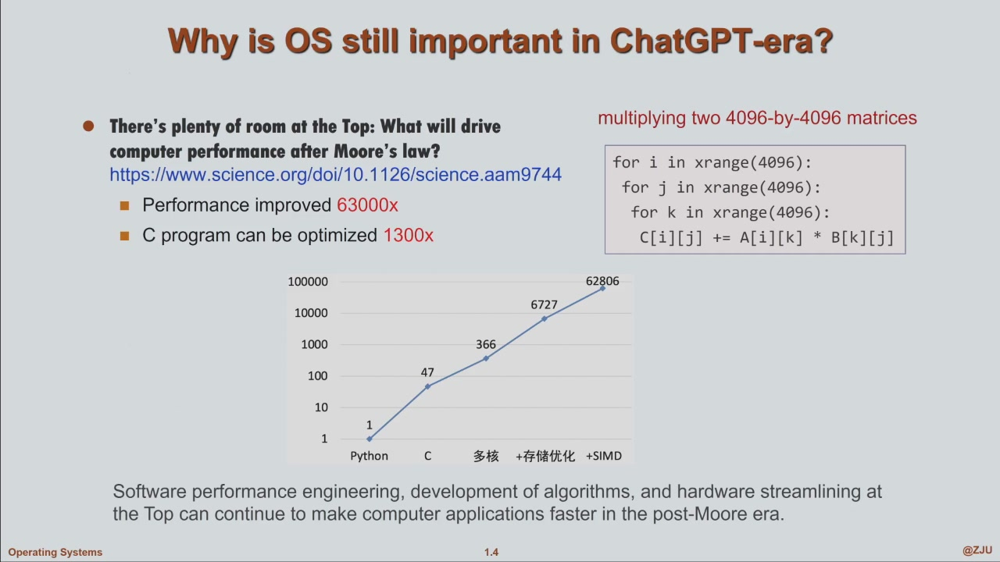

# Operating System

> sld: 上过这门课你就知道什么是系统了

## 笔记进度

- 已对照智云课堂补记至 **2026-09-20 第 9–10 节**：系统调用参数传递、策略与机制、内核结构、虚拟机与容器，见[第二章](char2.md#system-call-parameter-passing)。
- [第一章](char1.md#device-status-table)补齐 9 月 17 日 I/O 之后至进程管理的缺口。该段原始字幕存在串课，采用实际 PPT 截图整理，来源说明保留在页面中。
- **下一次从 Operating System Generation / System Boot 开始**：9 月 20 日 99:05 老师明确留待下次。
- 已参考 [NoughtQ 的 OS 笔记](https://note.noughtq.top/sys/os/)补充第一、二章：概念主线、模式与上下文切换、I/O 与 IPC、shell、链接与加载、API / ABI。各页标明参考补充和来源，课堂进度仍以上述录像为准。

## Course Overview

- Program execution
    - share processors?
    - threads coordinate safely?
    - virtual memory?
    - files stored?
    - systems recovery from crashes?

- Systen ddsign and explanation
- Software and handware
- Prerequisities

## 课程信息（第一次课）

- 这是一门比较"硬"的课：学分多、工作量大；**系统 = 软件和硬件的集成**，算法、数据结构都不能称之为系统——这门课培养的就是系统能力
- 教材：恐龙书 *Operating System Concepts*（OS Concepts 第 10 版），只需看**第 15 章之前**的章节；slides 会分享，课件在学在浙大
- 推荐补充：**xv6**——MIT OS 课的实验系统（RISC-V 体系结构，与我们一致），100 多页小册子，口语化，想对概念理解更透彻强烈建议看
- 前置要求：C 语言（必须，否则 project 很难上手）、数据结构；了解一点 RISC-V 汇编有帮助但不强求（课内掌握必要指令即可）；熟悉 Linux 工具做 lab 效率高

- 课堂目录 (Main Contents)：
    - Overview：Intro、OS structure
    - Process Management：Processes、Threads、CPU scheduling、Process Synchronization、Deadlocks
    - Memory Management：Main memory、Virtual memory
    - Storage Management：File-system interface、File-system implementation、Mass-storage structure、I/O systems
- 课程主线就三大块：**进程管理、内存管理（memory）、存储管理（storage，即硬盘等二级存储）**——注意 memory 与 storage 的区分

### Projects

- lab0 ~ lab6 共 7 个：lab0 是只读实验（编译 kernel + qemu 基本操作，不写代码）；lab1–6 是开发任务，每个实验有任务书，**每一句话都有用**
- 今年新变化：**全部单独完成**（往年 lab3 起可两人组队）；代码 commit 到 git 仓库（仓库地址带学号），不提交 = 没完成
- lab 有**递进关系**：上一个 lab 的代码是下一个 lab 的 code base，增长式开发——前面埋下的 bug 可能后面才爆，代码要写干净
- 课程进度会落后于实验进度（如文件系统 11 月底才讲，但实验必须提前做）——这是刻意的，靠递进关系顶住
- **抄袭检测**：用算法做相似度检测，悄悄进行，抄袭 = 实验 0 分（实验占 30 分，0 分基本不可能 pass）
- **验收（demo）**：lab1–6 每个都要给助教演示，从任务书末尾"验收要求"的问题里随机抽一两个现场操作
- 实验报告要写遇到的问题与解决过程；建议养成 **debug 习惯**（gdb 难用但功能强大，有 tui 文本界面；后面 project 复杂了"一把过"是不可能的）——能做出设计还要能**解释为什么这样设计**

### 评分构成

| 项目 | 占比 | 说明 |
| --- | --- | --- |
| Final exam | 50% | 期末笔试 |
| Lab Exam（上机考试） | 10% + Bonus | **今年新增**（所有班），12 月下旬、期末考前；形式类似 ACM/拼题 A，内容是 OS；与实验强相关，做得好可拿 bonus 加平时分 |
| Lab Reports（实验报告） | 10% | |
| Lab Demos（实验验收） | 20% | |
| Homework | 5% | 学在浙大线上提交，要及时，不要拖到学期末补交 |
| In-class Quiz | 5% | 小纸片随堂做 |

- 助教 3 位（都是上一届成绩好的同学），批改作业 + 辅导 projects，在钉钉群
- 实验教室：朝西 503（台式机 80+ 个位置）；实验课每周一次

## 为什么大模型时代还要学 OS？

- **差异化竞争力**：所有人都会用 ChatGPT / DeepSeek / 千问，coding agent 谁都会用，语言差异也已经很小——专业人员要有自己的切入点，**从系统层思考问题**才能形成别人替代不了的能力
- 后摩尔定律时代：制程密度上不去，靠堆 core 提算力；MIT 教授发表在 Science 的论文 *There's Plenty of Room at the Top* 指出：性能提升靠**软件层优化**——4096×4096 矩阵乘法，Python 基准 1 → 换 C 提升 47x → 多核 366x → +存储优化 6727x → +SIMD 达到 **62806x**；仅考虑 memory 优化与否，效率差**上千倍**——这些技能就来自本课程

- OS 思想在 AI / 云计算中正当红（SOSP / OSDI 顶会）：
    - **vLLM**（SOSP 2023）：用**虚拟内存与分页**的思想管理 GPU 上的 KV Cache（非连续块存储 + copy-on-write 共享），吞吐提升 2–4x
    - **Llumnix**（OSDI 2024）：跨模型实例的**调度与迁移**，降低尾延迟
    - **Dirigent**（SOSP 2024）：沙箱与调度，每秒 2500 次沙箱启动
- 道理很简单：application（AI、云计算）不断冒出新需求，底下的系统软件层就永远有活干——所以 OS 这门老课至今仍在蓬勃发展
