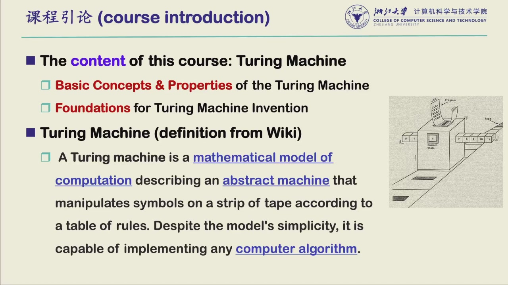
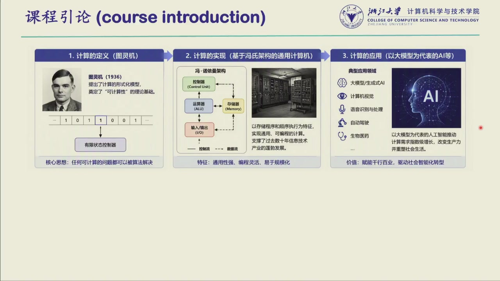
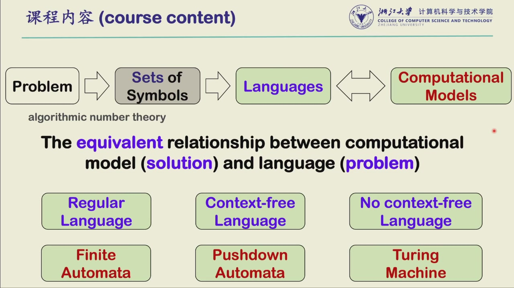

# 课程引论

> 说是引论数大模型教不来的

## 每个学科的基本问题

- Physics：探寻世界运行的最底层规律
- Chemistry：原子如何组成物质
- Biology：生命如何演化
- Medicine：如何理解、治疗与干预疾病
- Mathematics：形式化证明，以及证明与结构的极限

**Computer Science 的基本问题：**

- 什么是算法？(**algorithm**)
- 什么是可计算？(**computable**)
- 我们如何对计算的复杂度形式化表达？(**difficulty of computation**)

> 直觉上"什么都能算"（打游戏、大模型……），但跳出来看：人心能不能计算？一百年前"计算"这个词本身都还没有定义。这门课就是回到计算机科学最初的基石——**计算的本质**。

## 这门课的两个核心问题

1. 能不能算——可计算性 (computability)
2. 能算的话，是难是易——计算复杂度 (difficulty of computation)

这门课的目的：

- Introduce a formal and rigorous definition of these concepts
- Turing Machine!!!

## 图灵机：一把"尺子"

- 判定标准：一个问题若能被图灵机形式化描述、并且图灵机最终停机 → **可计算**；不能被图灵机建模 → **不可计算**
- 图灵机是**人造的数学模型**，而"问题"是客观存在的东西——两者"等价"这件事既无法证明、也无法证伪（找不到反例，但也证不了普适），这正是图灵机厉害的地方
- 尽管形式极其简单，它是**一切**计算机算法最本质的抽象模型：大模型、自动驾驶、王者荣耀……最终都可以抽象成这么一个"玩具"；你的笔记本、手机都是图灵机的一种具象化实现

- 具象化对照：纸带 ≈ 硬盘，磁头当前读到的格子 ≈ 内存，上方控制器 ≈ CPU
- 内部维护一个状态机，按规则表动作，例如：读到字符 $a$ 且当前状态为 $q_0$ → 改写为 $b$、磁头左/右移一格、转入状态 $q_1$
- 磁头可读可写，纸带可左右移动——非常简单的机制，却足以描述一切计算

## 计算的三个层面

**定义（图灵机，1936）→ 实现（冯·诺依曼架构的通用计算机）→ 应用（以大模型为代表的 AI）**

- 箭头是**单向**的：图灵机不一定非要用冯·诺依曼架构实现
- *Hardware lottery*（DeepMind）：AI 的成功很大程度押注在 GPU 这种图形渲染芯片上——恰好发现它能训神经网络，是历史路径依赖（"左脚踩右脚"），不是必然
- 先进计算（存内计算、量子计算、光计算、生物计算、脑机计算等）的动机之一：换一种载体去实现计算

## 历史背景

- 二战破译 Enigma：图灵基于图灵机的思想参与设计破译机器（Bombe），把"按固定规则人工套模板"变成自动化枚举——图灵机最早的落地应用之一
- 图灵 1936 年论文 **《On Computable Numbers, with an Application to the Entscheidungsproblem》（论可计算数及其在可判定问题上的应用）**，时年 24 岁；原始动机之一：想造一台机器自动枚举实例来验证黎曼猜想 → 计算数论 (computational number theory) 的先驱
- 当代回声：OpenAI 声称用下一代模型 88 小时证明了 Navier–Stokes 方程相关难题（百万美元问题之一）——本质仍是"基于图灵机去证明数学问题"，只是实现的版本能力强了很多；由此引出的 AI 创造力界定、训练数据泄露、学术伦理是**开放问题**

## 课程主线

**Problem → 形式化 (Sets of Symbols) → Language ↔ Computational Model**

- 本课中 **language 就是 problem**：把自然语言问题形式化成 01 字符串，字符串的集合就是一个 language，也对应一个问题
- 语言难度与模型能力**恰好对应**（exactly solve：既能解决，且问题再难一点就解决不了）：

| 语言的性质 | 恰好解决它的模型 |
| --- | --- |
| Regular Language | Finite Automata (FA) |
| Context-free Language | Pushdown Automata (PDA) |
| 不满足 context-free 的更难语言 | Turing Machine（可计算的边界） |

- 看懂一门课的逻辑：拿到问题 → 形式化成 language → 看它满足哪类语言的性质 → 判断能否计算/怎么算

!!! tip 图灵机
    图灵机是这门课最重要的内容，重点考察：
    - Basic Concepts & Properties
    - Foundations for its Invention

> 图灵机实在是太抽象了，所以课程会花**超过一半的讲课时间**在 foundation（FA、PDA 和数学基础）上；但**考试的重点在图灵机本身**。前面讲得多、考得少，反而越要掌握——不然第四、五章跟不上。

## 课程考核

- 总评 = **平时 30% + 期末闭卷 70%**（三个平行班考核标准一致）
- 平时：随堂限时测试，例如 10 分钟 20 道判断/选择（约 30 秒一题，来不及查大模型）；迟交按迟到时间乘 0.5~0.8 的系数
- 期末：闭卷、**英文题目**，选择 + 判断 + 大题，题量大、时间紧（2 小时）
    - 重在理解课程思想，只背公式和推导拿不到高分；理解的基础上能背多少背多少
- 教材：*Elements of the Theory of Computation*（Lewis & Papadimitriou，1981 第一版 / 1995 第二版），推荐读**英文原版**——中文版可辅助理解，但最终要回归英文的严谨表述

## 课程安排（16 次课）

- 正式讲课 14 次：每章约 3 次课，**考试重点在第四章与第五章**（图灵机相关），前三章是基础
- 9/20（周日）按国庆调休加课；10/6 停课
- 期末前留 2 次：一次习题课、一次以 QA 为主
- 资源：国外名校的公开课与 PPT、求是潮/4798 的历年试题（考前一定要看，感受范围、题型与题量）
