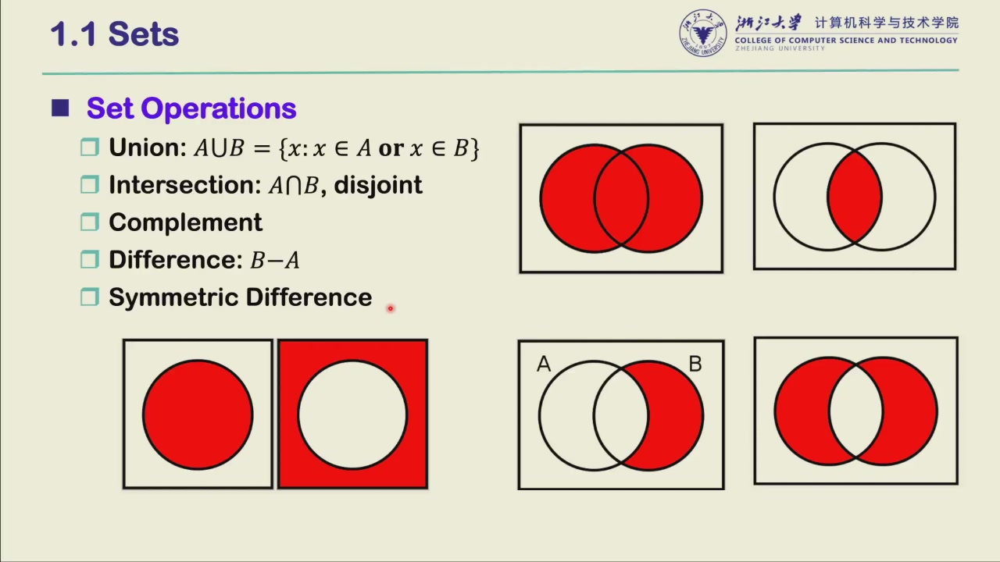
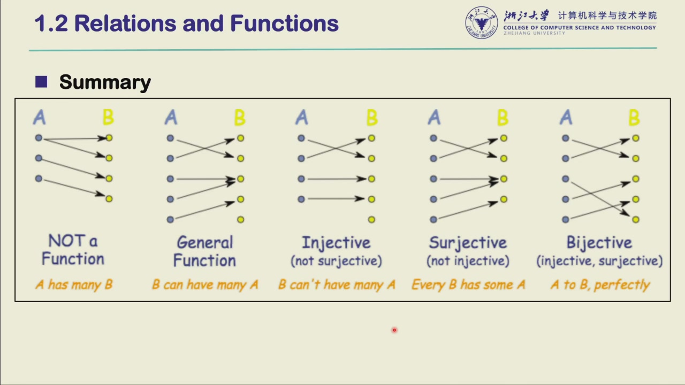

# Ch1 . Set, Relation, and Language

>离散数学复习课
>
> 核心思想：problem 用自然语言描述 → 形式化成 01 字符串 → **字符串的集合就是一个 language**，language 就是 problem。集合是这门课一切讨论的地基。

## Set

- 集合
    - 元素不重复，且顺序无关：$\{1,2,3\}$ 与 $\{3,2,1\}$ 是同一个集合
    - 空集 $\emptyset$
- 子集与真子集
    - Subset：$S \subseteq T \iff \forall x \in S \Rightarrow x \in T$
    - Proper Subset：$S \subset T$，即 $S \subseteq T$ 且 $S \neq T$
    - Equal：$S = T \iff S \subseteq T$ 且 $T \subseteq S$（互相包含）
        - 若没有子集概念，只能把"$\forall x \in S \Rightarrow x \in T$"正反各写一遍来定义相等；有了 $\subseteq$ 一行就够——**用基本定义简洁地表达抽象思想**，这正是课程先讲基础的原因
        - 课堂小问题：$\{1,2,3\}$ 与 $\{3,2,1\}$ 是同一个集合吗？$\{1,2,3\} \subseteq \{1,2,3\}$ 吗？是真子集吗？（同一集合；是子集；不是真子集）

- 集合运算
    - 交 (intersection)：$A \cap B = \{x \mid x \in A \land x \in B\}$；两集合无公共元素称 disjoint
    - 并 (union)：$A \cup B = \{x \mid x \in A \lor x \in B\}$
    - 差 (difference)：$A - B = A \setminus B = \{x \mid x \in A \land x \notin B\}$
    - 补 (complement)：$\overline{A} = U - A$，其中 $U$ 为全集
    - 对称差 (symmetric difference)：$A \triangle B = (A \cup B) - (A \cap B)$，"只属于其中一方"

<figure class="paper-figure" markdown>

<figcaption markdown="span">课件截图 · [1.1 Sets，五种集合运算的 Venn 图](assets/slides_0915/ch1_set_operations.png)。</figcaption>
</figure>

- 集合的性质
    - Idempotent Law（幂等律）：$A \cup A = A$ ；$A \cap A = A$
    - Commutative Law（交换律）：$A \cup B = B \cup A$ ；$A \cap B = B \cap A$
    - Associative Law（结合律）：$(A \cup B) \cup C = A \cup (B \cup C)$ ；$(A \cap B) \cap C = A \cap (B \cap C)$
    - Distributive Law（分配律）：$A \cap (B \cup C) = (A \cap B) \cup (A \cap C)$ ；$A \cup (B \cap C) = (A \cup B) \cap (A \cup C)$
    - Absorption Law（吸收律）：$A \cup (A \cap B) = A$ ；$A \cap (A \cup B) = A$
    - De Morgan's Law（德摩根律）：$\overline{A \cup B} = \overline{A} \cap \overline{B}$ ；$\overline{A \cap B} = \overline{A} \cup \overline{B}$
        - 课件写作差的形式：$A - (B \cup C) = (A - B) \cap (A - C)$，本质相同
        - **注意**：一旦有"取反"操作（补/差）要把运算挪进括号，$\cap$ 与 $\cup$ 必须互换

!!! tip Why some problems can be solved by employing computational models ?
     - Problem <--> Sets or Languages
     - Automated solution <--> Problem can be Identified <--> The problem is computable

- 为什么用集合描述问题
    - 集合的性质与逻辑运算的性质是统一的：$\cup \leftrightarrow$ or，$\cap \leftrightarrow$ and，补/差 $\leftrightarrow$ not（如 $1 \land 0 = 0$ 对应 $A \cap \emptyset = \emptyset$）
    - 解决问题必须基于逻辑一步步推导，而逻辑操作的核心就是 and / or / not
    - 所以"集合 ↔ 问题"的对应是自然的：**集合的性质符合逻辑，而解决问题要基于逻辑**
- Power Set (幂集)：$2^A = \{S \mid S \subseteq A\}$；若 $|A| = n$，则 $|2^A| = 2^n$
    - power set 本身是集合，它的每个元素也是一个集合（$|A|=3$ 时恰有 8 个元素）
- Partition（划分）：由 $A$ 的一族非空子集 $\Pi = \{S_1, S_2, \ldots\}$ 构成，满足
    - $S_i \neq \emptyset$（各部分非空）
    - $S_i \cap S_j = \emptyset,\ \forall i \neq j$（两两不交）
    - $\bigcup_i S_i = A$（并起来覆盖全集）
    - 例子：$\{1,2,3\}$ 恰有 5 种划分：$\{\{1\},\{2\},\{3\}\}$、$\{\{1,2\},\{3\}\}$、$\{\{1,3\},\{2\}\}$、$\{\{2,3\},\{1\}\}$、$\{\{1,2,3\}\}$

## Relations and Functions

- Ordered Pair（有序对）：$(a, b)$，顺序不可调换（二维坐标就是典型的有序对），满足 $(a,b) = (c,d) \iff a = c \land b = d$

- Binary Relation
    - Cartesian Product（笛卡尔积）：$A \times B = \{(a,b) \mid a \in A \land b \in B\}$——可理解为"全集"
    - Binary Relation（二元关系）：$A \times B$ 的一个子集 $R \subseteq A \times B$，从全集里挑出一部分组合来描述某种关系，记作 $a R b \iff (a,b) \in R$
    - domain（定义域）：关系中箭头出发一侧的元素集合
    - range（值域）：the set of **output values** of the relation——是**箭头指向的那些元素**，不是 $B$ 全集（易错点！）

- Ordered Tuples and n-ary Relations
    - ordered tuple（有序 $n$ 元组）：$(a_1, a_2, \ldots, a_n)$，有序不可调换；两个同长度元组相等 $\iff$ 各分量对应相等（$\forall i,\ a_i = b_i$）
    - sequence（序列）：有序的元素排列，允许重复元素，可以是无限长；与 tuple（有限）相对
    - n-folds Cartesian product（$n$ 重笛卡尔积）：$A_1 \times \cdots \times A_n$，由每个 $A_i$ 各取一个元素组成的 $n$ 元组全体（$a_i \in A_i$）；当 $A_i = A$ 时记作 $A^n$
    - n-ary relation（$n$ 元关系）：$R \subseteq A_1 \times \cdots \times A_n$；$n=2$ 时即上面讲到的 binary relation

- Operations of Relations
    - inverse（逆关系）：$R^{-1} = \{(b,a) \mid (a,b) \in R\}$——类比反函数，定义域与值域互换

    - Composition（复合）：若 $R \subseteq A \times B,\ S \subseteq B \times C$，则

        $$
        S \circ R = \{(a,c) \mid \exists b \in B,\ (a,b) \in R \land (b,c) \in S\}
        $$

        - **注意是 $\exists$（存在）而不是 $\forall$**：只要存在一个 $b$ 能把 $a$ 连到 $c$ 即可
        - 技巧：把 $A, B, C$ 画成三列点、按关系连线，看起点到终点有没有路径——比逐项枚举快得多
        - 误区：$R \circ R^{-1}$ **不是**恒等关系（对角阵）——例如 $aR4$、$4R6$，则 $a\,(R \circ R^{-1})\,6$ 也成立

- Function
    - Def：function 是一个 relation $f \subseteq A \times B$，且 $\forall a \in A$ **恰有一个** $b \in B$ 与之对应，记 $f(a) = b$

    - Note：不允许 $f(a) = b_1$ 且 $f(a) = b_2$（一个输入不能对应两个输出）；但不同的 $a$ 可以对应同一个 $b$

    - One-to-one（injective，单射）：$f(a_1) = f(a_2) \Rightarrow a_1 = a_2$，不同的输入不指向同一输出

    - onto（surjective，满射）：$\forall b \in B,\ \exists a,\ f(a) = b$，值域覆盖整个 $B$

    - One-to-one correspondence（bijective，双射）
        - one-to-one + onto

!!! tip memorize with figure
    用图记三类函数，一眼分清（黄色注释是课件原话）：

    

    - NOT a Function：某个 $a$ 射出两条线（A has many B）
    - General Function：$B$ 可以被多个 $a$ 指向（B can have many A）
    - Injective：$B$ 不能被多个 $a$ 指向（B can't have many A）
    - Surjective：每个 $B$ 都被指到（Every B has some A）
    - Bijective：完美一一对应（A to B, perfectly）

    另两个判断要点：把某条线砍掉后某个 $a$ 没有任何对应 → 也不是 function（违反 $\forall a$）；neither（是 function 但既非单射也非满射）与 both（即 bijective）都能画出对应图。

## Special Types of Binary Relations

- Directed Graph（有向图）
    - node（节点）+ edge（有向边）；节点间的箭头本身就是一种 relation
    - 后面讲 FA、PDA 时，抽象机器都用图来表示——概念一脉相承

- Matrix（矩阵表示）
    - $R \subseteq X \times Y$ 可用逻辑矩阵 (logical matrix) $M$ 表示：行标对应 $X$ 的元素，列标对应 $Y$ 的元素
    - $$m_{i,j} = \begin{cases} 1 & (x_i, y_j) \in R \\ 0 & (x_i, y_j) \notin R \end{cases}$$
    - 全 1 矩阵对应笛卡尔积全集；部分 1 部分 0 则对应某个具体的 relation
    - 例：用逻辑矩阵描述大陆与四大洋是否邻接

!!! note 下节课
    关系的特殊性质（reflexive、symmetric、transitive 等）。
